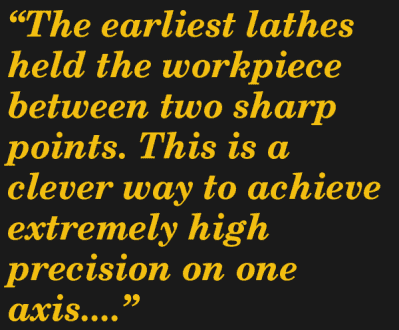

# 机床之王

> 原文：<https://hackaday.com/2018/02/21/the-king-of-machine-tools/>

车床被称为机床之王是有原因的。用一个做不出来的东西很少。事实上，人们喜欢说一句老话，车床是唯一能自己制造东西的机床。虽然朗朗上口，但我认为这有点言不由衷。更准确地说，所有机床中都有(可以说)只有车床才能制造的零件。从这个意义上说，车床是最“基础”的机床。然而，在你怀有自我复制的梦想之前，要知道早期车床的大部分是通过手工刮削所需的平面制成的。所以，不，一台车床不能真的自己制造，但是一台车床和一个熟练的手动铲运机工匠肯定可以。事实上，如果你读过大卫·j·金格里的《金属车床》*,你就会知道，当你还在加工 的时候，一台车床在打造自身 ***的过程中发挥了重要作用。****

 *通过这一系列的文章，我们将在加工领域进行一次旅行。在上一篇文章[中，我们回顾了机床](https://hackaday.com/2018/01/23/the-precision-upon-which-civilizations-are-built/)的历史。现在让我们切入正题，帮助一些感兴趣的人进入爱好加工的世界，好吗？正如我们上次看到的，第一台机床是车床，这也是你应该开始的地方。

### 精确初始

抛开那些迂腐的话题，让我们来谈谈为什么车床是最基本的。还记得我说过机床巧妙地制造出比它们本身更精确的零件吗？车床是这方面的主要例子。

首先，也是最重要的，当刀具保持静止时，机器旋转工件。这看似武断，但肯定不是。最早的车床将工件夹在两个尖角之间。这是在一个轴上实现极高精度的聪明方法。以至于当需要最大精度时，在“中心之间”转动仍然是当今最常用的技术。两点形成一条直线，通过这种方式支撑工件，我们消除了驱动机构中所有“跳动”或不精确的来源。这反过来减少了计算如何来回移动工具同时保持与工件良好控制距离的精度问题。这是一个比机床可能使用的任何其他机械几何更容易解决的问题，因此车床是王道。

车床是开始把机加工作为一种爱好的地方，因为它教会你适用于所有机床的基础知识，同时也是最普遍有用的。你越是深入车工行业，你就越会意识到没有什么是它做不到的。大多数其他机床的存在不是为了做车床做不到的事情，而是为了使这些操作更容易设置或更快执行。

### 评估你的第一台车床

好吧，所以你做出了明智的决定，买了一台车床。你应该从哪里开始？要做的第一个决定是尺寸。顽固的老机械师们的经验法则是，你必须买你有空间的最大的机器。俗话说，大车床可以做小东西，小车床做不了大东西。像大多数古语一样，这只是一点点事实。使用适合你工作规模的机器是有意义的。如果你想做钟表，遥控车，或者模型，找一个小的台式机器。如果你想为一辆赛车设计一个引擎，或者修理该镇历史悠久的蒸汽机车，那就买一台大型落地式机器。

车床是以“摆幅”和床身长度来衡量的。像“7×20”这样的名称意味着直径为 7 英寸的东西可以在不碰到床的情况下旋转，床本身有 20 英寸长。像大多数应用于消费品的数字一样，这两个数字都有误导性。虽然一个 7 英寸的物体在技术上可能是合适的，但这台机器可能没有马力或刀架在那个极限下实际工作。类似地，20 英寸的床身长度很快就被尾座、钻头和其他需要在你的工作范围内的工具吃掉了。从这个意义上说，老话是对的——买一台你认为你能适应你想做的工作类别的大机器。

我现在让你想想你的机器应该有多大。下一次，我们将讨论在机器中寻找什么，如何购买，把它放在哪里，等等。敬请期待！*