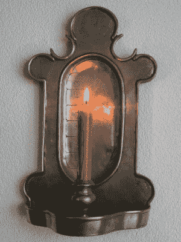
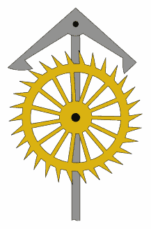
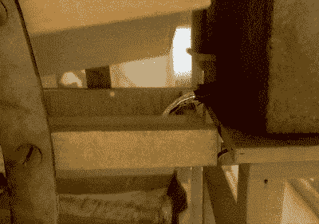
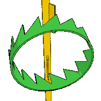
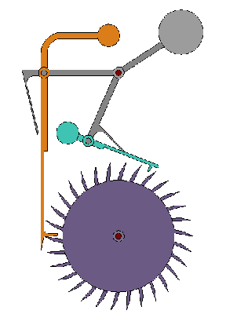
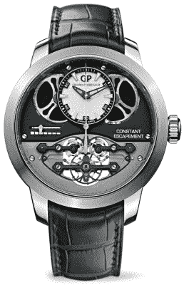

# 使精确计时成为可能的小装置

> 原文：<https://hackaday.com/2016/11/15/the-little-mechanism-that-made-precise-time-keeping-possible/>

很少有什么事情像时间的流逝一样值得我们如此关注。我们不想上班或约会迟到。更重要的是，我们不想衰老和死亡。保持良好的时间是一项非常重要的人类活动，一旦我们放弃了狩猎采集的生活方式，农业和商业出现，我们就开始担心这个问题。

A candle clock

测量时间需要两件事:一个重复的过程来标记相等的时间增量，以及一种跟踪和显示结果的方法。第一个计时装置当然是依靠太阳的运动。大约在公元前 3500 年，古埃及人建造了方尖碑，通过在地面不同位置投射阴影，给出了大概的时间。接下来是一些以固定速度消耗的媒介的使用:蜡烛、熏香、水和沙钟就是例子。机械钟的出现带来了巨大的进步，这就是擒纵机构出现的地方。

Anchor escape mechanism.

![By Carra de Vaux, B. - Carra de Vaux, B. (1903): "Le livre des appareils pneumatiques et des machines hydrauliques de Philon de Byzance d'après les versions arabes d'Oxford et de Constantinople", Academie des inscriptions et des belles lettres: Notices et extraits des mss. de la Bibliothèque Nationale, Paris 38, 27–235 (163), depicted in: Lewis, Michael (2000), "Theoretical Hydraulics, Automata, and Water Clocks", in Wikander, Örjan, Handbook of Ancient Water Technology, Technology and Change in History, 2, Leiden, pp. 343–369 (356, fig. 5), ISBN 90-04-11123-9, Public Domain, https://commons.wikimedia.org/w/index.php?curid=7173402](img/1f2e6ad2fe9cd28f9b30da89add61487.png)

Earliest known escapement in a Greek washstand automaton.

时钟需要能量才能工作。把擒纵机构想象成一种以恒定的间隔释放少量能量的方式。在右边的动画中，轮子连接到能量源:弹簧或重物。轮子自身会尽可能快地连续旋转，直到储存在弹簧中的能量耗尽。但是如果我们加上锚形的部分，轮子每次旋转几度，以恒定的时间间隔，这正是我们测量时间所需要的。

公元前 3 世纪，拜占庭的希腊工程师菲洛描述了已知的最早的擒纵机构。来自[维基百科条目](https://en.wikipedia.org/wiki/Escapement):一个由水箱提供的配重勺子，装满水后在盆中倾斜，在这个过程中释放出一个球形浮石。一旦勺子空了，它会被配重再次拉起，通过拉紧的绳子关闭浮石上的门。

Escapement mechanism of Su Song’s clock uses buckets on a water wheel

另一种早期的擒纵装置是由中国著名发明家苏颂于 1094 年发明的。它用一个大水车来计时。车轮由一个机械装置停止，该机械装置仅在当前正在填充的铲斗的重量达到一定水平时才会释放。只要水以恒定的速度流动，轮子也以恒定的时间间隔旋转。它被称为天文钟塔，非常大。虽然已经失传了，[这幅最初在历史频道的*古代发现栏目中展示的*](https://vimeo.com/43772707)建筑的动画效果图很好地展示了这座建筑的样子和运作方式。

多亏了边缘擒纵机构，第一批全机械钟才成为可能。它出现在 14 世纪的机械钟中，在欧洲的大型塔中发现，其起源不明。也许它的精确度并不比水钟好多少，但至少它们在冬天不会结冰。四个世纪以来，边缘擒纵机构一直是计时之王，直到 1657 年发明了摆锤和摆轮游丝，将精确度从每天几小时提高到每天几分钟。

Verge Escapement

摆钟发明后，大量(300 多个！)的擒纵机构设计。当然，只有少数仍在使用。一些最重要的类型是:

*   托马斯·汤比恩和佐治·格拉咸于 1695 年至 1726 年发明的圆柱形擒纵机构。
*   [双重擒纵机构](https://www.youtube.com/watch?v=ISC9jbQke9I)，罗伯特·胡克制作，1700 年。
*   [杠杆擒纵机构](https://www.youtube.com/watch?v=ejgyCZELQ64)，托马斯·穆奇，1750 年。
*   [计时器/擒纵机构](https://www.youtube.com/watch?v=Z-bSZ1VTq8Q)，约翰·阿诺德，1775 年。

一个非常有趣的设计是约翰·哈里森在 1722 年发明的 grasshooper 擒纵机构。它有一个非常不寻常的，近乎催眠的动作。它的主要优点是它是一种摩擦非常小的机构。

Grasshopper escapement.

机械钟的发展仍在继续，在精确度和小型化方面都取得了巨大进步，擒纵机构是每只钟的核心部件。但是电钟的出现用产生时钟所需的规则脉冲的电动装置取代了擒纵机构:螺线管、同步电机和音叉振荡。最终，我们得到了完全没有发条部件的钟表。

1927 年，第一个石英钟在贝尔电话实验室建成。这些时钟利用石英晶体的有规律的振荡来测量时间间隔。精工在 1969 年推出了第一款石英钟 Astron。十年后，市场由石英主导。石英钟的低成本和准确性的结合导致了“[石英危机](https://horahalus.com/2016/05/22/watch-lore-the-quartz-crisis/)”，机械表几乎从市场上消失。

最终的改进来自原子钟，它使用原子的电子跃迁频率来测量时间。这带来了无与伦比的计时精度。它们存在于 GPS 网络中使用的卫星中，任何与它们同步的设备都将受益于这种高精度计时。在不久的将来，你的手表里可能会有一个，因为它们已经被缩小到芯片尺寸。

This beautiful watch incorporates the constant escapement, developed by Girard Perregaux in 2008.

今天，使用擒纵机构的机械表仍在生产。当然，我们不需要他们。毕竟，现在我们都有手机，甚至石英手表也变得多余了。然而，这种微型机械有一种内在的美。它们代表了工艺对精度的胜利。

> 机械表完全没有必要。每一个对自己来说都是一个微型世界，一个微小的功能*机制，*一堆微小而神秘的*运动部件。*活动部件！因此，从某种意义上说，这些手表是活的。他们有心跳。他们似乎对“爱”做出了电子鸡般的回应，这种“爱”通常是由专业技术人员提供的昂贵服务。就像古老的蒸汽拖拉机或文森特摩托车一样，它们可以从几乎任何阶段的废墟中费力地修复。
> 
> — [威廉·吉布森](https://www.wired.com/1999/01/ebay/)

现代机械表是现存机械艺术中最复杂、最美丽的部分。他们可以达到数十万美元的价格，当然，是收藏品。即使在今天，钟表工程师仍在继续研发擒纵机构，希望提高精确度和可靠性。

【特色图片来源:Christoph Laimer 的 [3D 打印机械钟](http://www.thingiverse.com/thing:328569)带锚式擒纵机构。这一直是我们最喜欢的时钟黑客[之一，我们最初在 2014 年](https://hackaday.com/2014/05/24/the-hour-of-the-3d-printed-clock-draws-nigh/)报道过