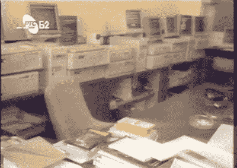

# 塞尔维亚漫长而坎坷的互联网之路

> 原文：<https://hackaday.com/2016/04/22/the-long-and-bumpy-road-to-internet-in-serbia/>

互联网是理所当然的。如今，你以为有互联网，只是想知道是否有免费 WiFi 上网。但在早期，连接到网络可能很困难，这在塞尔维亚尤其如此。该国的互联网革命因技术和政治而变得复杂，但技术社区的活力总能找到办法。

Dejan Ristanovic 在贝尔格莱德会议上分享了一个有趣的故事。他现在是电脑杂志 *[PC Press](http://pcpress.rs/)* 的主编，在为塞尔维亚提供全球电子邮件接入方面发挥了不可或缺的作用。请欣赏下面他的演讲视频，休息后和我一起欣赏一些精彩片段。

 [https://www.youtube.com/embed/5iznM75-X5Q?version=3&rel=1&showsearch=0&showinfo=1&iv_load_policy=1&fs=1&hl=en-US&autohide=2&wmode=transparent](https://www.youtube.com/embed/5iznM75-X5Q?version=3&rel=1&showsearch=0&showinfo=1&iv_load_policy=1&fs=1&hl=en-US&autohide=2&wmode=transparent)

这个演讲不是关于政治的。然而，它有助于考虑塞尔维亚作为一个国家的一个非常基本的历史框架。二战后，塞尔维亚成为新成立的南斯拉夫的一部分，直到该国于 1992 年解体。南斯拉夫的两个残余部分——塞尔维亚和黑山——组成了一个联盟，称为南斯拉夫联邦，一直持续到 2006 年，当时该国解体，我们最终拥有了我们现在知道的塞尔维亚。

互联网超越国家和政治，但同时受到两者的巨大影响。最早的塞尔维亚互联网始于 1986 年，当时还是老南斯拉夫。德扬在读大学，拥有最早的电子邮件地址之一。它只允许他与同一所大学的其他人交流，但到了 1989 年，该系统已经与 Bitnet 相连，开启了与环绕全球的大学计算机系统网络的通信。

到 1992 年，前南斯拉夫解体，南斯拉夫联邦成立，国家处于战争状态。世界上许多地方将该国视为这场冲突中的“坏人”，并因此切断了所有网络连接。德扬的反应是在全国范围内增长本地网络选项，当时最好的答案是 BBS 系统。

Sezam running on DOS machines

他是 Sezam 的创始人之一，实际上他和其他几个创始人一起编写了公告板系统的原始代码。它从一个单一的电话线 BBS 开始，不久就发展到 15 个。主机运行在运行 DOS 的康柏电脑上，专门用于“会议”,类似于我们所知的在线论坛。

社区在他们的交流中是多产的，不久 330 MB 的硬盘就满了。专有连接器的问题导致了第二台带有~~太字节~~千兆字节驱动器的机器联网(如果你愿意，可以称之为早期的 NAS)的解决方案，并且随着流量的增长，十五台 DOS 机器被添加到系统中以服务输入线路。

这项服务发展壮大了，在平均月薪约为 10 美元的时候，考虑到每年 80 美元的费用，这是令人惊讶的。原因是一些让 Sezam 连接到世界其他地方的黑客攻击一直在进行中。南斯拉夫分组网络(JUPAK)被用来拨出并接入[字节信息交换](https://en.wikipedia.org/wiki/Byte_Information_Exchange) (BIX)。这是通过巧妙利用[的外拨](https://en.wikipedia.org/wiki/Internet_outdial)实现的。当他们的活动被发现时，系统管理员会寻找另一种方式，但需要找到一个更健壮的解决方案，它将在加利福尼亚的一所公立大学的计算机系统中。

塞尔维亚人米兰·米吉奇在加州州立大学有一间办公室，他用自己的电脑建立了一个电子邮件服务器，为整个塞尔维亚提供服务。电子邮件地址是大学子域、Sezam 服务器标识符和用户名`username%sezam.yu@moumee.calstatela.edu`的混搭。但这比以前让 BIX 系统工作所需的多次地址破解要好得多。

战争结束后，随着塞尔维亚重新获得了自己的国家身份，该地区再次与更广阔的互联网直接相连。一开始连接速度很慢，但后来变快了。Sezam 成为该国最早的三家 ISP 之一，发展到 250 条拨入线路，通过多条 ISDN 线路接入互联网。他们的 DOS 机退役了，取而代之的是 Windows NT 服务器，因为这个国家加入了连接的前沿。

互联网、电子邮件和论坛是当时反抗压迫性政府斗争的一部分。那段经历，以及围绕着连接塞尔维亚和世界其他地方而成长起来的社区，形成了紧密的联系。Sezam 对话板已迁移到虚拟机，但仍然存在。那里的社区至今仍很活跃。我可以确定贝尔格莱德现在有非常快的互联网。