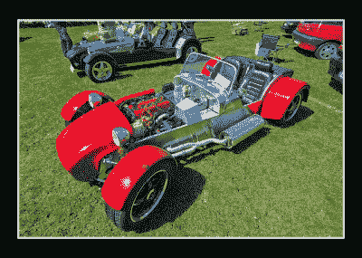

# Lotus Sevens:真正最容易被破解的汽车

> 原文：<https://hackaday.com/2016/10/31/the-lotus-sevens-the-real-most-hackable-cars/>

20 世纪 40 年代末和 50 年代初，欧洲仍在努力从战争的后遗症中恢复过来。在英国，这被称为“紧缩时期”，食物仍然定量配给，而“凑合着过日子”是最常见的。20 世纪 50 年代末和 60 年代的消费热潮离现在还很遥远，如果你是一名硬件黑客，你的原始资料仅限于你能从战争剩余物资中找到的任何东西，或者任何战前的垃圾。这是一个大多数成年人刚刚从战争服役归来的时期，在此期间，他们通过战争的必需品获得了实用技能，他们在和平时期寻求出路。

受益于这种意想不到的创造力开花结果的一个领域是赛车。战前，这是一项独家追求，定制汽车出现在著名的赛道上，比如萨里郡布鲁克兰兹的倾斜赛道。作为战后更广泛的社会变化的反映，战后几年的汽车赛车手来自更卑微的背景，他们在战时机场周边的赛道上比赛用破旧的战前汽车制成的自制赛车，比如今天仍然举办一级方程式赛车的银石赛道。

[![A typical Austin Seven Special. Probably a lot shinier than my dad's one. Barry Skeates [CC BY 2.0 ], via Wikimedia Commons.](img/fc4288cf35f730cb9d9ce2c4c1a739cd.png)](https://hackaday.com/wp-content/uploads/2016/10/640px-steam_extravaganza_2012_7734489732.jpg) 

典型的奥斯七特。可能比我爸的要亮得多。Barry skeets[CC BY 2.0]，通过[维基共享](https://commons.wikimedia.org/wiki/File:Steam_Extravaganza_2012_(7734489732).jpg)。

我父亲在这期间参赛了一辆奥斯汀-7 衍生的特别款。年纪太轻，不可能成为一名战士，20 世纪 50 年代初，他是一家大型卡车制造商的工程学徒。他讲述了为侧阀 750cc 奥斯汀发动机自制气流歧管的故事，以及用焊接建立起来的疯狂的凸轮轮廓，然后研磨并硬化。战前的奥斯汀存货丰富，价格低廉，因此制造了许多这样的交通工具。

然而，像奥斯汀 7 这样的汽车被证明不太适合作为高速赛车:最初的 A 形底盘和悬架是为 20 世纪 20 年代的道路和速度设计的。特殊汽车制造商社区以他们自己的底盘设计对此做出了回应，从他们的行列中诞生了今天的一级方程式赛车和英国赛车行业以及现代套件汽车行业的根源。

[![An early Lotus Seven. Thesupermat [CC BY-SA 3.0], via Wikimedia Commons.](img/daed2c4c9632e99ab85bef372f466b5e.png)](https://hackaday.com/wp-content/uploads/2016/10/paris_-_retromobile_2013_-_lotus_seven_-_001.jpg) 

一个初莲花七。超级用户[CC BY-SA 3.0]，通过[维基共享](https://commons.wikimedia.org/wiki/File:Paris_-_Retromobile_2013_-_Lotus_Seven_-_001.jpg)。莲花是那个时代的一个名字，它同时代表了一级方程式赛车和赛车。其创始人[Colin Chapman]从 20 世纪 40 年代末到 50 年代初生产了一系列赛车特辑，该公司最终成为量产跑车的制造商，这些跑车也作为套件出售。今天，莲花是一个 21 世纪的制造商，总部设在诺福克，制造处于技术前沿的汽车，但当时他们只是北伦敦一个车间里的小本经营。我父亲陪一个朋友去取他新买的莲花 Mk VI，他记得看到(查普曼)趴在一辆原型车 Mk VIII 的引擎盖上，引擎盖上覆盖着小块的羊毛，在路上开来开去，这样他就可以观察车身上的湍流。

这个时期的标志性莲花是莲花 7。这是一款 20 世纪 50 年代的福特汽车的传动装置，其 1.1 升侧气门发动机很受欢迎，置于极简主义的双座敞篷空间框架底盘中，采用双叉臂前悬架和活后轮轴。它要么以预组装的形式出售，要么作为一个套件出售，以避免随后适用于组装汽车的购置税，它取得了巨大的成功。直到 20 世纪 70 年代，莲花继续生产各种版本的发动机越来越大的现代汽车，当他们停止生产时，莲花经销商[卡特汉姆汽车](http://www.caterhamcars.com/)购买了其生产权。卡特勒姆从他们的 Sevens 建立了一个非常成功的业务，你仍然可以从他们那里购买一个带有非常最新的传动装置和悬挂的各种型号的预建或套件。

### 历史讲够了，带我去车里！

[![Just one of Caterham's many takes on the Seven. Steve Marsh, Lotus 7 Club of Great Britain [CC-BY-SA-3.0], via Wikimedia Commons.](img/d20f92956cb6d31e46e004d748db05d1.png)](https://hackaday.com/wp-content/uploads/2016/10/640px-caterham_7_roadsport_sv.jpg) 

只是卡特勒姆的众多作品中的一部。史蒂夫·马什，英国 Lotus 7 俱乐部[CC-BY-SA-3.0]，通过[维基共享资源](https://commons.wikimedia.org/wiki/File:Caterham_7_Roadsport_SV.jpg)。你可能会说，这一历史教训很好，但一辆小批量生产的跑车有什么资格成为最容易被黑客攻击的汽车呢？毕竟，像大众甲壳虫这样的汽车有数百万辆，而且[我们已经证明了这种车型是最容易被黑客攻击的汽车](http://hackaday.com/2016/05/03/volkswagen-beetle-the-most-hackable-car/)。答案不是来自“官方”的莲花和卡特汉姆 Sevens，尽管它们像其他任何例子一样可以被黑客攻击，而是来自许多受原始设计启发或完全复制它的汽车。

自 20 世纪 70 年代以来，数量惊人的各种各样的制造商生产了基于莲花七号设计的未经授权的汽车，在许多情况下，他们的产品几乎与真品无法区分。然而，仅凭这一点还不足以将这些汽车定性为最容易被黑客攻击的汽车，因为我们必须看看它们的最终制造来源。这是一辆足够简单的汽车，几乎任何能够焊接并找到所需捐赠零件的人都可以为自己制造一辆，这正是许多爱好者在过去几十年中所做的。得益于一本[海恩斯手册的流行，这本手册详细描述了一个七人克隆体的设计](https://books.google.co.uk/books/about/Build_Your_Own_Sports_Car.html?id=ymosAAAACAAJ&redir_esc=y&hl=en)，一个由供应商组成的家庭手工业出现了，提供从底盘到下面几乎任何需要的零件。这些计划在网上对任何准备搜索它们的人来说都是[容易获得的](http://www.google.co.uk/search?q=locost+plans)，并且可以很容易地修改成个人建筑者的计划。所谓的“机车”出现了惊人的各种各样的发动机和传动装置，从小型汽车发动机到 V8 发动机和超级摩托车等等。例如，在我的朋友中，我可以列举出福特、西亚特和本田汽车的车主。它们在夏天的周末是非常常见的景象，至少从我写这篇文章的地方来看，离银石赛道不到 7 英尺。

### 究竟是什么让它如此容易被黑客攻击？

[![A Locost rolling chassis. Super-seven [Public domain], via Wikimedia Commons.](img/ba98be7d300bd38f7cf3e58c25493eda.png)](https://hackaday.com/wp-content/uploads/2016/10/640px-bja_n.jpg) 

一辆 Locost 滚动底盘。超级七[公共领域]，通过[维基共享](https://commons.wikimedia.org/wiki/File:Bja_n.JPG)。

值得更详细地看一看这款车，找出是什么使它成为如此好的平台，为此，最好从提醒开始，这是一款如此简约的跑车，几乎没有其他钢架车辆重量更轻。这意味着，作为一台驱动机器，它可以从最小的发动机中提取最多的能量。一个个人的观点是，它最纯粹的形式是最好的:一个引擎，你必须工作才能释放它的动力，配以薄轮胎。事实上，卡特勒姆目前的基本模型遵循这个公式，带有一个小的 3 缸铃木单元。

Haynes 手册和其他资料中描述的底盘本身是一个由箱形截面焊接而成的空间框架，中间有一个传输通道，两侧是两个座椅。对基本设计进行了各种修改，包括为比例更大的车手设计的更宽版本，带有更多加固的更硬版本，以及赛车版本的翻车保护杆和笼子。

前悬架是一个双叉骨，垂直来源于任何一个可能的捐助车和叉骨本身由制造商制造。对于一个建造者来说，在这里有相当大的空间来创造他们自己的悬挂几何形状，尽管我个人对朋友建造的 Locosts 的观察告诉我，把它做好可能是一个漫长的过程。

A Locost with a Toyota 1600 engine. Stefan Båging (CC BY-NC 2.0), via [Flickr](https://www.flickr.com/photos/baging/4637015778/).

我们已经提到了发动机选择的广度，但变速器可以来自几乎任何较小的直列发动机后轮驱动捐赠车辆。原型是福特 Escort Mk1 和 2，然而随着 Locosts 的流行，这些汽车的供应很快就枯竭了。最近的捐助者一直是马自达 mx5，或任何几个小型商用车。

在车尾，最初的汽车配备了一个活动轴。然而，护送单位曾经是最受欢迎的，但供应已经枯竭，所以必须找到替代品。例如，许多设计采用了源自福特 Sierra 或马自达 MX5 零件的独立悬架。

### 那么…你什么时候建你的？

正如你所看到的，这不仅是一个便于修改单个建筑商规范的设计，也是一个正在经历持续发展过程的设计。仍然有可能制造出与[查普曼]原车相似的汽车，但制造商并不局限于这种选择。有一件事是肯定的，[查普曼]自己肯定会在过去几十年里推动这项设计。

如果你提名最容易被黑客攻击的汽车，它不一定要达到高产量，甚至不一定要有最好的整体设计。没有人声称 Seven 是有史以来设计的最好的汽车。取而代之的是，一辆其构造的每个方面都可以根据制造商的判断进行修改的汽车将汽车黑客技术提升到了一个全新的高度，而在这一点上，Seven 表现得非常出色。很简单，没有其他的汽车设计完全一样。

现在你知道了，莲花七代车是世界上最容易被破解的车。我的车库里有一辆 1960 年的凯旋先驱报(顺便说一句，这辆车的前悬架让莲花获得了一级方程式的成功)，这已经够忙的了，那么你什么时候开始造你的车呢？

标题图片:AxelKing [CC-BY-SA-3.0]，via [Wikimedia Commons](https://commons.wikimedia.org/wiki/File:Lot012.jpg) 。