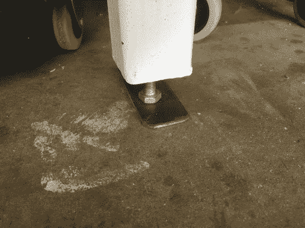
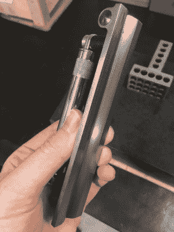
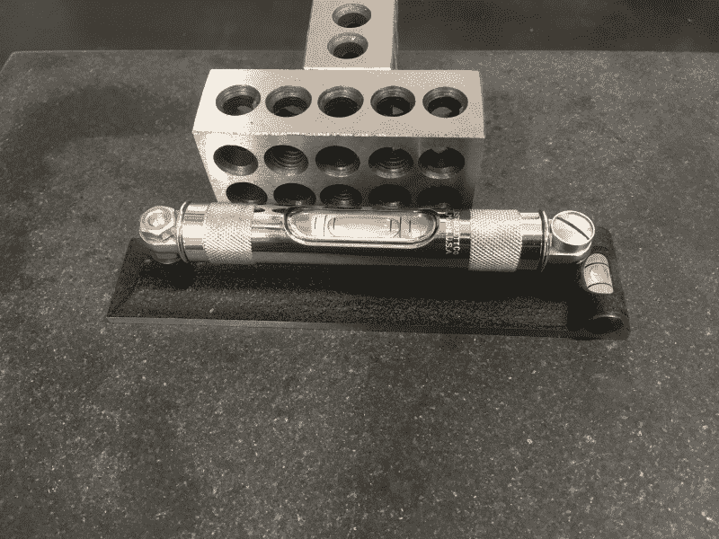
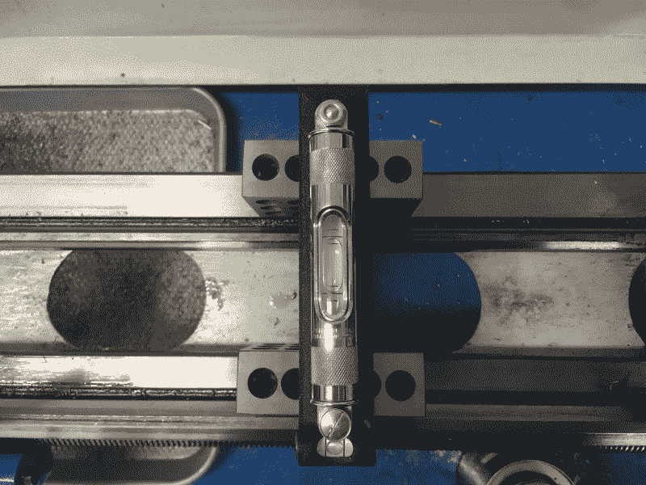
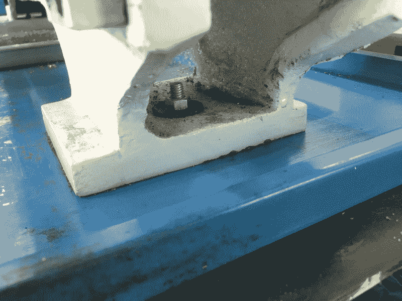
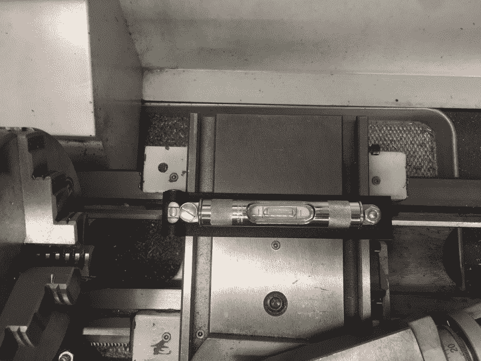

# 机械师的口头禅:调平你的车床

> 原文：<https://hackaday.com/2018/07/10/the-machinists-mantra-level-thy-lathe/>

假设你去给自己买了一台可爱的金属车床。也许它是一种新的注重价格的亚洲车型，或者也许它是你在一家取消抵押品赎回权的机械商店后面发现的一只可爱的旧铸铁兽。你[遵循了所有的建议](http://hackaday.com/2018/06/04/preparing-for-a-lathe/)来设置它，现在你准备好制造芯片了，对吗？嗯，没那么快。不同于其他大型电动工具，如带锯或人们用来修饰枯树的任何东西，机床需要*适当的*水平。不是“Hurr hurr 我的木匠水平说泡在中间”，而是像*真的*水平。

对于车床来说尤其如此，但调平实际上是其他东西的代理。你真正做的是把整个机器放在一架飞机上。调平是消除结构扭曲的一种原始方法。看起来一块巨大的铸铁不可能扭曲，但是在非常小的范围内它会扭曲！一切都是弹簧，当你的车床本应加工完美的圆柱体，却转动了千分之二的锥体时，机器中难以察觉的扭曲就会显现出来。这一切都是说，在制造芯片，水平你的车床。让我给你带路。

  Bolt adjustments on legs  A proper machinists’ level

如果你有一台台式机器，先把工作台调平到可怜的木匠的标准。也就是说，用旧的气泡水平仪把它调平，这样铅笔就不会掉下来。我个人所有的板凳都是用 8 级螺栓当脚，这让调平变得轻而易举。

下一步是获得一个优质机械师的水平。这些在几个关键方面不同于硬件商店的泡沫水平。首先，它们非常敏感，通常每英尺读数不到千分之五英寸(或每米不到 0.5 毫米)。其次，它们可以自我校准。第三，它们至少在三个面上有精确的研磨表面，以及 V 形的底部，以尽量减少与机器表面配合的误差。

My level is a Starrett 98-6, which has a double-nut system on one end for calibration. This is not the most convenient thing (compared to a single calibration screw), but these levels can be had second-hand for reasonable prices. Make sure it has been stored properly and not abused.

## 校准水平

每次你使用机械师的水平，你需要校准它。一个级别最酷的地方在于它们是“自我证明”的。这就是工作原理。

首先，将水平仪放在干净干燥的花岗岩台面上。旋转水平仪，直到找到水平的轴。总会有一个，因为花岗岩板块是一个平面(无论如何是人类能制造的最好的一个)，任何平面都有一个轴表示水平。

接下来，将一个沉重的直尺放在水平仪上，例如 1-2-3 的木块或角板。这是你的参考。现在，您可以将标高翻转 180°，靠着参考边放置，然后再次检查。使用水平仪上的校准螺丝，将差值分开，使气泡读数位于两个读数的中间。你需要来回几次。尽量少碰关卡。你手上的热量会使它升温，并使它充分变形，从而失去你的校准。

目标是让水平仪在两个方向上都显示“零”。当你接近这一点时，你需要找到新的更水平的轴作为参考。一旦你在两个方向都得到零，它已经自我证明和校准完成。

## 调平您的机床

接下来，将水平仪放在机器的*导轨*(尾座滑动的加工零件)上，靠近尾座。确保通道清洁、干燥且没有凸起的毛刺。可能需要一个 1-2-3 的垫块来使水平仪保持水平。如果为此使用木块，首先测量它们以确保它们是相同的。便宜的 1-2-3 块可能没有！精密研磨的量块更好，如果你有的话。

对于落地式机器，调整支脚，直到获得水平读数。如果你的机器有很多脚，试试“三点”法。让机器只靠三只脚支撑(或两只脚和一个螺旋千斤顶)。三角形更容易变平。一旦水平，小心地降低剩余的脚，直到他们承担重量，但不要打乱水平。

A typical bench-top machine foot. Shim stock is placed between the edges of the foot and the chip pan for leveling.

对于台式机器，通常需要在机器的底部垫上垫片。各种厚度的钢垫片在这里是有用的，或者牺牲一个旧的塞尺。

对靠近主轴箱的导轨进行同样的操作，并在导轨上纵向放置水平仪。你可能需要来回几次，直到每个位置读数都是水平的。

另一个学派认为，不要把水平仪放在滑道上，你应该把它放在十字滑道上，因为那是切割工具所在的地方。就我个人而言，我认为这只是引入了新的错误来源，但我喜欢在方法水平后仔细检查交叉幻灯片。

## 对重新变平保持禅心

均衡不是一次性的交易，所以要适应它。机器在任何时候移动都需要重新调平，并且在地板移动或沉降时需要定期重新调平。即使混凝土移动，所以检查你的机器不时和重新水平的需要。你还应该在使用新机器几周后检查它，因为机器的铸件会在使用振动下“沉淀”。当您怀疑机器正在加工锥度时，例如您正在努力加工一个长零件的尺寸时，请再次检查。旧机器更灵活，需要更频繁地重新调平。

一旦你的机器是水平的，下一步是通过切割一个测试条来真正地拨入它。这是未来文章的主题，请继续关注。同时，远离那些木匠类型的人。很明显那些“木头”被大火烧毁了。为什么会有人为此烦恼呢？