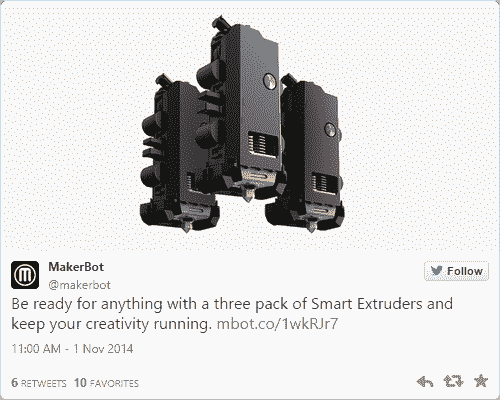

# MakerBot 的讣告

> 原文：<https://hackaday.com/2016/04/28/the-makerbot-obituary/>

MakerBot 没有死，但它连接着生命维持系统，等待一个仁慈的灵魂拔掉插头。

本周，MakerBot 宣布将裁员，将所有 MakerBot 打印机的生产外包给中国。几周前，MakerBot 的母公司 Stratasys 发布了 2015 年的财务报告，指出 MakerBot 的销售收入急剧下降。MakerBot 品牌现在的价值远远低于 Stratasys 花 4 亿美元收购它的价格。MakerBot 是一家死气沉沉的公司，很难想象 MakerBot 还会像 2010 年那样风光无限。

这是怎么发生的？对 MakerBot 失宠最常见的解释是，Stratasys 在收购该公司后，摧毁了该公司的工程和商誉。诚然，MakerBot 在从 Stratasys 收购后遇到了最大的问题，但这些问题在更早的时候就开始了。

### MakerBot 的历史

今天，MakerBot 有两个确切的名声。最慷慨的声誉来自饱受信息匮乏之苦的技术爱好者，他们将 MakerBot 视为 3D 打印的面巾纸和阿斯普林。随着越来越多的机器上市，这种声誉正在消退。

第二个名声是设计糟糕的 3D 打印机之一。由于几年前推出的 MakerBot 智能挤出机的可怕故障，这一声誉是当之无愧的，但也触及了 2010 年 3D 打印机所基于的技术。任何去过黑客空间的人都见过 MakerBot 打印机，但那台打印机坏了。

五年前，这第二个名声是完全不正确的。MakerBot 是开源硬件运动的宠儿。MakerBot 是新经济的典型代表，在新经济中，任何人都可以大规模制造硬件，并将其运送给全球成千上万的消费者。未来将会把 3D 打印机放在每个办公室，如果不是每个桌面的话。MakerBot 会出售这些打印机。

2009 年推出的第一台 MakerBot 打印机——Cupcake CNC——是首批消费级 3D 打印机之一。与几年后的打印机相比，纸杯蛋糕不是最好的打印机，但它改变了游戏规则。这款纸杯蛋糕售价 900 美元，已经进入了全球黑客空间和车库。MakerBot 在 2010 年纽约皇后区的首届 Maker Faire 上发布了他们的第二款打印机，Thing-O-Matic。鉴于我从未见过*制作*纸杯蛋糕的事实，Thing-O-Matic 是一款大幅改进的打印机，具有更大的生产量。自动售货机是桌面制造业的未来。[是印刷工【Bre Pettis】带来了*科尔伯特报告*](http://on.aol.com/video/makerbot-industries-ceo-bre-pettis-on-the-colbert-report-517282045) 。在很短的时间内，MakerBot *就是* 3D 打印，任何想要为他们的车间配备 3D 打印机的人都有两个选择:购买 MakerBot 套件，或者用可能在 MakerBot 上制造的打印部件制作一个 RepRap。

2010 年末和 2011 年初，MakerBot 处于世界之巅。没有一家公司能够赶上，由于他们对开源和开放硬件运动的支持给 MakerBot 注入了善意，MakerBot 被树立为一种新的商业模式。以 MakerBot 为例，你*可以*通过构建开源硬件和你的用户群的贡献而变得富有和出名。虽然[Bre Pettis]不是最雄辩的演说家，但他在 2012 年的一个视频中非常清楚地阐述了开源的理由[:](https://www.youtube.com/watch?v=54X28qSbKf4)

> 当我们开始 MakerBot 时，我们知道我们将成为开源硬件。我们受到 Arduino 的启发，我们是开源软件爱好者。所以，我们知道，如果我们能制作并分享它，我们会从中获得更多回报。我认为这是我们小时候学到的东西，分享是好的，如果你分享一些东西，你会从中获得更多，但我们成年后忘记了这一点。所以，有了开源硬件，我们又回到了原点。当你得到一个 MakerBot 时，你得到的不仅仅是一台机器，你还得到了它如何工作的知识。你得到了所有相关的信息。所以如果你想修改，或者只是想了解一下，想黑，都可以。
> 
> -布雷·佩蒂斯

当然，即使作为开源和开放硬件的支持者，MakerBot 之家也有麻烦。[扎克·霍肯·史密斯]和[亚当·梅尔]，[Bre]的工作顾问，[被赶出了公司](http://www.hive76.org/hoeken)。只有一个人的空间，尽管有点奇怪的做作，[Bre]成为了 MakerBot 的公众形象和开源的支持者。MakerBot 在 2011 年获得了 1000 万美元的风投资金，前途无量。有一个庞大的、热情的社区愿意为硬件开发改进，没有一家公司能比得上 MakerBot 的潜力。

### 忘记开放硬件

向任何东西扔钱，秃鹫就会开始盘旋。MakerBot 和 RepRap 社区有着友好的关系，MakerBot 为当时最流行的 3D 打印机主机软件做出了贡献。MakerBot 为 3D 打印机创造了新的工具头，包括一个可以打印糊状物的设备[。这些设计是开源的，我们都变得更加富有。MakerBot 的贡献一次又一次地被举为开源硬件可以成功的例子。](http://www.makerbot.com/blog/2009/11/02/rd-frostruder-mk2)

2012 年 8 月，MakerBot 将 3D 打印大众化的决心将受到挑战。TangiBot 在 Kickstarter 上发布，从任何角度来看，它都是 MakerBot 复制器的直接克隆。因为 MakerBot 复制器的设计文件是开源的，这个 Kickstarter 的创建者可以简单地将文件发送给合同制造商，用他们自己的设计击败 MakerBot。公平地说，TangiBot 的创造者确实改进了复制器的设计，使 PCB 符合 FCC 标准并使用了锁紧螺母，但总的来说，这是 MakerBot 复制器的直接克隆。

![MakerBot's Automated Build Plate. Once available as Open Source Hardware, the Automated Build Plate has been expunged from MakerBot literature, patented, and apparently forgotten. [MakerBot CC-BY]](img/b3757ef6451dd193571768019e9567f7.png)

MakerBot 的自动构建板。一旦作为开源硬件可用，自动构建
板已经从 MakerBot 文献中删除，获得专利，并且显然被遗忘。
【图片来源:[MakerBot](https://commons.wikimedia.org/wiki/File:Automated_Build_Platform_for_Thing-O-Matic.jpg)CC-BY】

虽然 TangiBot Kickstarter 没有成功，但是 MakerBot 认真对待了这个威胁。即使 TangiBot 的创造者忽略了开源硬件的潜规则，MakerBot 也认为开源是一种负担。以前的开源设计，如自动构建板，一种在开始新的打印之前将打印从床上移除的设备，被从 MakerBot 主页上删除，获得两次专利，并被遗忘。

MakerBot 拒绝开源。TangiBot 推出仅一个月后， [MakerBot 宣布他们最新的打印机 Replicator 2 将被关闭源代码](http://www.makerbot.com/blog/2012/09/24/lets-try-that-again)。

2013 年 6 月，MakerBot 被 Stratasys 以 4.03 亿美元收购。随着 Stratasys 更早收购 Objet，它将成为世界上最大的 3D 打印机制造商。[Bre Pettis]将需要担任 MakerBot 的首席执行官几个月，并于 2014 年 9 月卸任。MakerBot 创始人的总收入中，[扎克]和[亚当]各约 1 亿美元，[Bre]约 1.4 亿美元。虽然 Stratasys 收购 MakerBot 经常被认为是开源受挫的原因，但这是不正确的。早在 Stratasys 提出之前，MakerBot 就拒绝了开源软件。

### Stratasys 垮台了

根据截至 2013 年 12 月 31 日的 Stratasys 年度报告，在被 Stratasys 收购之前，MakerBot 售出了令人印象深刻的 40，550 台打印机。根据 Stratasys 发布的 2014 年年度报告，截至 2014 年底，MakerBot 品牌已售出 79906 台打印机。在 Stratasys 的管理下，MakerBot 仅一年就售出了近 4 万台打印机。一年后的 2015 年，MakerBot 仅售出 18673 台打印机，是 2014 年数量的一半。

当然，2016 年的销售数字还不清楚，但是 4 月 4 日, [MakerBot 庆祝了他们卖出的第 100，000 台打印机。从 2015 年 12 月 31 日到 2016 年 4 月 4 日——三个月零四天——MakerBot 只卖出了 1421 台打印机，平均每天约十五台。](http://www.makerbot.com/blog/2016/04/04/makerbot-reaches-milestone-100000-3d-printers-sold-worldwide)

暗示 MakerBot 在 2016 年全年只会销售 5000 或 6000 台打印机是不负责任的。3D 打印机的销售具有明显的季节性，这要归功于学校获得拨款和返校购买。然而，2016 年似乎将是 MakerBot 自 2010 年或 2011 年以来最糟糕的一年。书写在墙上，MakerBot 将很快成为 3D 打印历史上的一个脚注。但是这是怎么发生的呢？

虽然 MakerBot 在被 Stratasys 收购之前改变了对开源硬件的立场，但这还不足以杀死一家公司。Stratasys 带来了什么？糟糕的工程技术，道德上有问题的做法，以及对他们能得到的一切申请专利。

在 2014 年的最初几天，Stratasys 赞助设计的第一批 MakerBots 问世。这些都是第五代 MakerBots，在传统的所有硬件制造商在新技术的先锋，提供了三种产品。“好的”打印机 Replicator Mini 是一台没有多余装饰的机器，其制造面积与最初的 MakerBot 纸杯蛋糕差不多。“更好”的型号，即更新的 MakerBot 复制器，显示了早期第四代打印机的巨大影响。“最好的”型号 Z18 是一个体积超过一立方英尺的庞然大物。第六代的三款打印机都配备了智能挤出机，这是一种通过喷嘴挤压细丝的专有设备。

MakerBot sold the Smart Extruder – a part that should not fail – in packs of three.

从任何角度来看，智能挤出机都是一个糟糕的设计。在所有其他基于 RepRap 的打印机中，挤出机是一个永远不会损坏的部件。喷嘴是消耗品，是的，但智能挤出机是一个彻底的失败。MakerBot 智能挤出机的平均故障前时间估计在 300 至 500 小时之间。假设一次打印需要一整天，175 美元的智能挤压机只能打印十几次。

智能挤出机工程的彻底失败是对 Stratasys 提起集体诉讼的源头。Stratasys 的投资者声称，第五代 MakerBots 被匆忙投入生产，产生了一系列负面反馈、保修索赔和退货。该诉讼称，关于 MakerBot 打印机可靠性的误导性正面声明被用来人为抬高 Stratasys 的股价。

尽管智能挤压机的问题是最明显的，但 MakerBot 在其他几个方面都失败了。纽约市、波士顿和格林威治的 MakerBot 店面在过去的 12 个月里关闭了。在被 Stratasys [收购后，MakerBot 采取的第一批行动之一就是为几项基于上传到 MakerBot 的对象库 Thingiverse](http://hackaday.com/2014/05/24/makerbot-files-patents-internet-goes-crazy/) 的设计申请专利。尽管在 Stratasys 掌舵之前很久放弃开源就失败了，但新的所有者肯定没有改变方针。MakerBot 和 Stratasys 现在受到整个 3D 打印社区的唾骂，不仅因为在[Bre]的领导下继续开放源代码，而且还在 Stratasys 下加倍下注。

### MakerBot 现在的位置

2015 年对 MakerBot 来说是艰难的一年。2015 年 4 月，MakerBot [解雇了其约 500 名员工中的 100 人](http://3dprint.com/59177/makerbot-layoffs/)，并关闭了其在曼哈顿、波士顿和格林威治的所有三个零售点。去年 10 月， [MakerBot 又裁员 80 人](http://wp.me/pk3lN-J37)，并关闭了其在布鲁克林的一个办公场所。本周，MakerBot [解雇了剩余的制造员工](http://www.engadget.com/2016/04/25/makerbot-outsourcing-3d-printers/)，并将开始将制造业务外包给中国。

Stratasys 和 MakerBot 是一家上市公司。因此，每个季度都必须向公众发布财务报表。财务和销售数据已经过时，但更糟糕的是 MakerBot 品牌的价值。像企业的每个方面一样，品牌和声誉的价值作为一项资产被追踪，在公司报告中被称为“商誉”。收购 MakerBot 后，Stratasys 发布的每一份季度报告都记录了商誉减值支出(MakerBot 品牌价值的减值)。包括 2015 年年度报告在内，Stratasys 已经为 MakerBot 支付了近 10 亿美元的商誉减值费用。请记住，Stratasys 以 4.03 亿美元的股票价格收购了 MakerBot。Stratasys 通过 MakerBot 品牌的失败注销了近两倍的价值。

MakerBot 是一个行尸走肉的公司。是的，最新版本的智能挤出机更可靠，大多数挤出机在 1200 小时后都能成功打印。MakerBot 公司旗下的 Thingiverse 仍然是互联网上最受欢迎的对象共享库，但是包括 YouMagine 在内的其他公司也在入侵。MakerBot 的未来会怎样？它将作为消费者 3D 打印机的 Stratasys 部门继续存在，但 MakerBot 是否会像 2010 年和 2011 年那样受到高度重视是非常值得怀疑的。