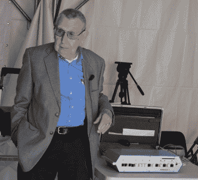
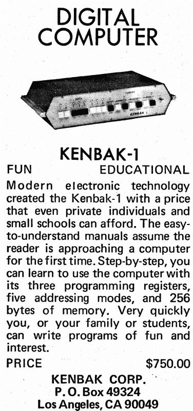

# 没有发明个人电脑的人

> 原文：<https://hackaday.com/2016/05/23/the-man-who-didnt-invent-the-personal-computer/>

[约翰·布兰肯贝克]没有发明个人电脑。当博物馆、计算机历史学家和作家说[约翰]的发明 KENBAK-1 是第一台电子的、商业上可获得的计算机，而不是一个套件，并提供给普通大众时，他们想到的是其他现实。

在某种程度上，它被贴上了第一台个人电脑的标签，这几乎对肯巴克不利。毕竟，这是一台微处理器时代之前的电脑。这可能是有史以来销售的最简单的机器，也是一种结构独特的机器，与过去三十年里制造的任何其他机器相比，它与 ENIAC 有更多的共同点..

这台古代计算机的创造故事直到现在才被讲述。[John]是一位令人惊讶的 80 多岁的老人，他在上个月的东部老式计算机节上讲述了他的职业生涯和第一台个人计算机的开发。这是他没有发明个人电脑的故事。

###  从事小型计算机系统的职业

[John]以在华盛顿特区的国家标准局实习开始他的职业生涯。他被分配到 SEAC，该项目是在一台更大的计算机完成之前为美国政府制造一台相对较小的计算机。

SEAC 是一台小型计算机，但它绝不简单。机架中有超过 700 个真空管，所有逻辑电路都需要数万个非常昂贵的二极管。存储器是一组水银延迟线——装满液态水银的管子，两端各有一个声学传感器。这些传感器将通过水星发送脉冲，代表 0 或 1。由于声音通过这个水银的速度，少量的信息可以被存储，就像一个巨大的移位寄存器。

这台计算机只有少数几条指令可用——加、减、乘、除、比较，以及一条输入和输出指令。说明不多，但足够了；SEAC 是美国第一台存储程序计算机，也是华盛顿特区唯一的一台计算机。从洛斯阿拉莫斯所需的计算到新罗兰网络的导航表，一切都是在 SEAC 上创建的。

在国家标准局工作后，[约翰]转到休斯飞机公司。他在 SEAC 上的工作使他对另一台小型计算机——1952 年制造的机载计算机——具有极大的价值。这仅仅是晶体管开发和商业化后的几年，因此这种机载计算机使用了最新的真空管，可以说是有史以来技术最先进的真空管。所有的存储器都装在一个旋转的磁鼓里，大部分的逻辑是用二极管实现的，这些二极管非常昂贵，以至于被存放在一个保险箱里。

这是计算机时代的开端，因此半导体供不应求。在设计中增加一个触发器意味着这台电脑的成本会增加 500 美元。那是小型计算机系统的时代，早期计算机的架构限制并不是因为它们无法构建更大的系统；这些计算机很小，因为任何大的都太贵了。

### 建造肯巴克

1970 年，[约翰]发现自己失业了，他的银行账户里有 6000 美元的遣散费。他决定，如果他要制造一台小型电脑，现在正是时候。他想要一台教育电脑——一台可以教人们如何使用电脑的机器。它必须便宜，而且一个人就能操作。一台个人电脑，如果你愿意的话。

[John]选定了一台非常基础的计算机，其架构与他 20 年前建造的 SEAC 没有什么不同。将有三个寄存器，A、B 和 x。五种寻址模式补充了一些指令——加、减、加载、存储和或，一些跳转、条件、I/O，当然还有一个 NOP。这种存储器将是两个移位寄存器，配置为串行存储器，是 SEAC 水银延迟线存储器的一个更小、毒性更小的版本。

The first ad for a personal computer, from Scientific American’s September 1971 issue

有了合适的架构，[约翰]开始建造他的计算机。为了保持低成本，他使用现成的零件。有 132 个标准 TTL 逻辑 ic，配有两个 1024 位 MOS 移位寄存器。这台机器有 256 字节的内存(虽然字长不是 8 位)，没有只读存储器。它速度不快，功能也不强大，但任何人都可以通过在面板上输入 1 和 0 来编程。

通过对电路的设计和一些调整，[约翰]有了一台电脑。我们的计划一直是制造这台电脑。这意味着销售，意味着市场。

回顾近五十年的计算机历史，很容易看出最早的计算机的理想市场是科学家、学者和工程师。毕竟，大学是数字设备公司仅次于政府的最大市场。[John]将 KENBAK 设计成一台计算机训练器，并决定教师——高中和社区大学教师——将成为个人计算机效用明显的市场。

1971 年 5 月，[约翰]推着他的摊位去参加附近高中数学老师的会议。电脑工作了，他在内存中加载了一些程序，其中最令人难忘的程序可以给出 20 世纪任何日期的星期几。肯巴克的正面有八个灯，只需一点点代码，这台计算机就会在周一闪烁第一个灯，在周二闪烁第二个灯，一直到无效日期点亮第八个灯。

显然，让[约翰]大为吃惊的是，高中数学老师不知道日历的规则。尽管如此，他确实得到了许多个人、学院和大学的关注。肯巴克被运往全国各地，法国，意大利，墨西哥和加拿大。只卖出了 40 辆左右的肯巴克，其中 7 辆最终流入了新斯科舍的一所技术学院。加拿大。

### 被公认为第一台个人电脑

20 世纪 80 年代中期，在卖掉他的库存并横跨全国搬到宾夕法尼亚州很久之后，波士顿的计算机博物馆——加州山景城计算机历史博物馆的前身——宣布他们正在试图寻找第一台个人电脑。这些意见书(或者更愤世嫉俗；这些对博物馆的捐赠)将由一个技术专家小组来评判，其中包括[沃兹]、[大卫·邦内尔]、[个人电脑世界]、和[奥利弗·斯特林佩尔]的出版商。

当然，任何寻找第一台个人电脑的尝试最终都变成了形容词的争论。计算机在 1970 年之前就已经存在了，可以追溯到[康拉德·楚泽]的 Z3，布莱奇利公园的庞然大物，或者后来的可编程 ENIAC。这些计算机都是各自的第一，从技术上来说，计算机博物馆为他们的“第一台计算机”竞赛产生了两个获胜者；1973 年的法国 Micral 被称为“第一台基于商用微处理器的计算机”

根据波斯顿计算机博物馆、计算机历史博物馆和[沃兹]本人的说法，肯巴克是第一台*电子、* *商用*计算机，而不是*工具包*并面向普通大众。

当然，[约翰]永远不会说他发明了个人电脑。他说在他之前有人已经用逻辑芯片制造了计算机。那些人只是没有把他们的电脑商业化。在肯巴克之前也有出售给公众的电脑。[John]记得 FAO Schwartz 出售的一台计算机，它有一个带钉和孔的滚筒，可以自动完成操作。

“人们有时会说这是我发明的。我总是说没有发明，这只是逻辑，只有 1 和 2，这就是全部，”[约翰]在老式计算机节结束他的讲话时说，“我没有发明任何激进的东西。我只是给电脑编了个程序。”