# 中西部说唱音乐节壮观

> 原文：<https://hackaday.com/2017/03/28/the-midwest-reprap-festival-spectacular/>

每年，在印第安纳州歌珊的集市上，在猪肉拍卖和牛肉拍卖之间，都会举行世界上最大的 3D 打印聚会。中西部 RepRap 节吸引了世界各地 3D 打印领域最优秀的人才，团队从布拉格、牛津和香港飞来。今年比任何一年都重要。超过 1，000 人冒险走进乡村，参加这个致力于 DIY 打印机的盛大节日。

今年我们看到了什么？SeeMeCNC 的 18 英尺高的 delta 打印机出现了。[我们看到了来自 E3D 的新挤压机](http://hackaday.com/2017/03/25/mrrf-17-e3d-introduces-combination-extruder-and-hotend/)，以及开源细丝[即将成为现实的公告](http://hackaday.com/2017/03/25/mrrf-17-lulzbot-and-ic3d-release-line-of-open-source-filament/)。用五灯丝 CMYKW 系统[进行真彩色打印很奇怪，也很酷](http://hackaday.com/2017/03/26/mrrf-17-true-color-3d-printing/)。使用[激光二极管和 galvos](http://hackaday.com/2017/03/26/mrrf-17-laser-resin-printers/) 的 DIY 树脂打印机现在已经成为现实。[易拆烤箱没坏](http://hackaday.com/2017/03/27/mrrf-17-a-working-makerbot-cupcake/)。[现在存在无限构建容量的打印机](http://hackaday.com/2017/03/25/mrrf-17-the-infinite-build-volume-printer/)，它也绕过了 MakerBot 的专利。

在 MRRF 要看的东西比一个周末所能看到的还要多。来自 BeagleBone 的 Jason Kridner 在那里谈论最新的花式单芯片 Linux 计算机。黑客空间在那里谈论他们最酷的产品，并进行必要的计算，以将模型火箭引擎与 3D 打印的火箭捆绑在一起。一些当地大学派出团队，谈论他们为将增材制造引入他们的项目所做的努力。YouTube 名人也在那里。看看我们在下面看到的其他好东西。

### 如火如荼时的全景

[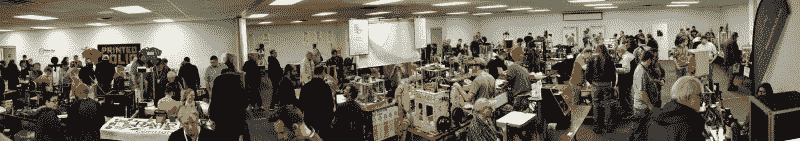](https://hackaday.com/wp-content/uploads/2017/03/21.jpg)

[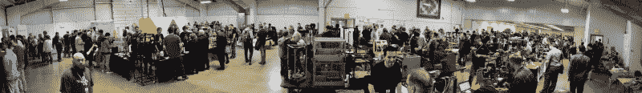](https://hackaday.com/wp-content/uploads/2017/03/11.jpg)

单击以嵌入

### 让你 200 美元的单价打印机的容量翻倍

这个周末，[比尔·斯蒂尔]推出了他的未命名的[无限构建卷打印机](http://hackaday.com/2017/03/25/mrrf-17-the-infinite-build-volume-printer/)。这是迄今为止，我们在 MRRF 看到的最令人难以置信的创新。不过，这台打印机只是一个实验。[比尔]的主要工作是 [Polar3D](http://about.polar3d.com/#whypolar) ，一个非笛卡尔也非德尔塔的打印机制造商。

[Bill]看到了现在著名的 200 美元 Monoprice MP Select Mini 打印机，并认为这是一个很好的实验平台。他移走了床，在 Y 轴电机上安装了一个齿轮，并在当地的工艺品商店买了一面圆形镜子。结果是一台单价打印机被改装成极坐标打印机。它起作用了，它使这台打印机的生产量翻倍了。

[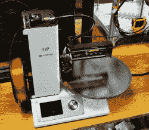](https://hackaday.com/wp-content/uploads/2017/03/mppolar1.jpg)[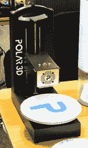](https://hackaday.com/wp-content/uploads/2017/03/polar3d.jpg)[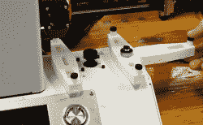](https://hackaday.com/wp-content/uploads/2017/03/polarcarriage.jpg)

将单价打印机改造成极坐标打印机实际上非常简单——只需要几个 3D 打印零件来支撑床，床上的驱动齿轮可能*很可能*是打印零件。困难的部分是将普通的笛卡尔 g 代码转换成极坐标 g 代码，但是多亏了 Polar3D 打印机，[Bill]已经有了这些脚本。

转换过程相对简单，比尔说他可以以大约 100 美元的价格出售一套工具。对于一台 200 美元的打印机来说，这并不经济，但这将是一个很好的 DIY 项目。

### 斯奎希尔 Ninjaflex

如果你想要一个黏糊糊的角色，你可能会拿起一卷 Ninjaflex。然而，Ninjaflex 和其他 TPE 和 TPU 细丝并没有那么粘糊糊，这意味着可印刷塑料的拉伸阿姆斯特朗是有市场的。在 MRRF，它叫做 [X60](https://flexionextruder.com/shop/x60-ultra-flexible-filament-black/)

[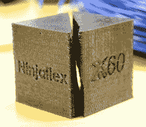](https://hackaday.com/wp-content/uploads/2017/03/nx60.jpg)[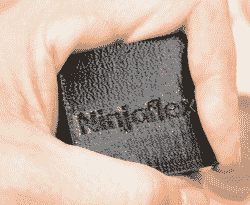](https://hackaday.com/wp-content/uploads/2017/03/ninja.jpg)[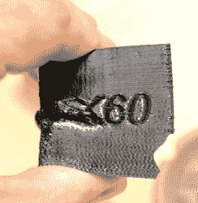](https://hackaday.com/wp-content/uploads/2017/03/x60.jpg)

从一个简单的握力压碎测试来看，X60 细丝的可压缩性要高得多。这比 Ninjaflex 更令人满意，也是你对真正柔韧的细丝的期望。X60 的唯一问题是打印。Ninjaflex 在一些挤压机上不容易打印，X60 更是如此。显然，你只能用[弯曲挤压机](https://flexionextruder.com/)打印 X60。不过，它很有趣而且黏糊糊的。

### Wubba Lubba Dub Dub

从瑞克和莫蒂身上拿出了他们六英尺高的瑞克。草很难吃。

[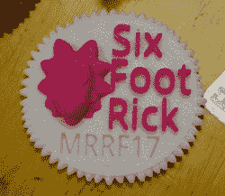](https://hackaday.com/wp-content/uploads/2017/03/button.jpg)

### MRRF 有一个跳蚤市场

去年，我们在 MRRF 注意到一些新的东西。人们在卖备件。在 3D 打印机大会上，跳蚤市场或旧货交易会不可避免地会自发形成。这里有一些很棒的交易，包括 150 美元的 MP Mini Select，200 美元的 MendelMax 2.0，75 美元的旧款 i2，以及一些四轴飞行器。如果你想买一台便宜的好打印机，MRRF 是个好地方。以下是图片:

 [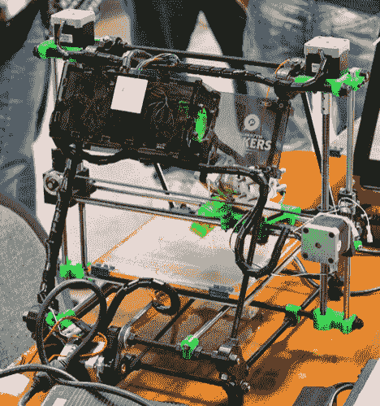](https://i0.wp.com/hackaday.com/wp-content/uploads/2017/03/prusai275.jpg?ssl=1) A Prusa i2, $75 [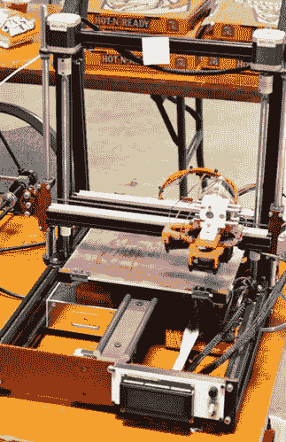](https://i0.wp.com/hackaday.com/wp-content/uploads/2017/03/makertoolworksmm2200.jpg?ssl=1) MakersToolworks MendelMax 2.0, $200 [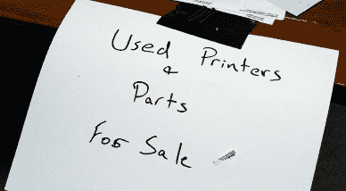](https://i0.wp.com/hackaday.com/wp-content/uploads/2017/03/sign.jpg?ssl=1)  [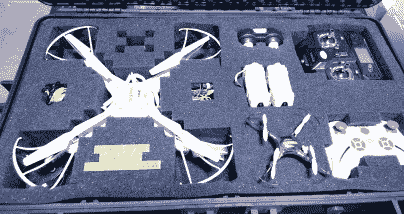](https://i0.wp.com/hackaday.com/wp-content/uploads/2017/03/simadrones200.jpg?ssl=1) A few Sima drones with case, $200 [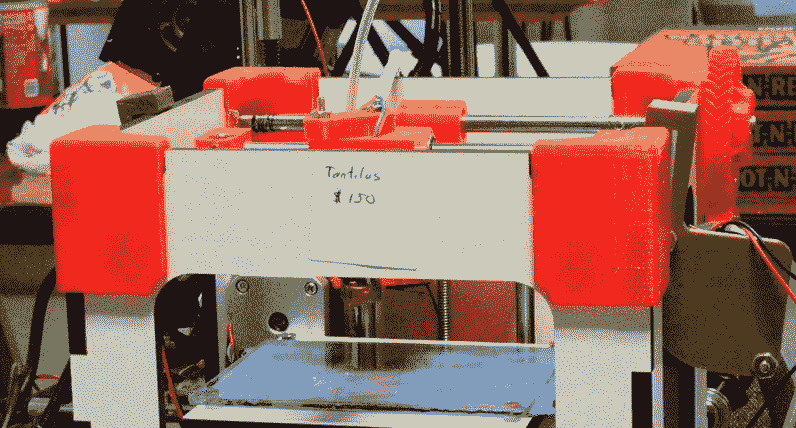](https://i0.wp.com/hackaday.com/wp-content/uploads/2017/03/tantilus150.jpg?ssl=1) A Tantilus. $150\.

### MRRF 第二高的打印机

河城实验室的乔·斯巴涅尔给 MRRF 带来了一台巨大的打印机。这张床并没有那么大，但是垂直的体积才是它真正的亮点。这台打印机能打印七八英尺高的东西。打印机是由中密度纤维板制成的，一个巨大的 2 毫米喷嘴一次喷出大量细丝。这里的大字是[【机甲】的单周长火箭飞机](http://www.thingiverse.com/thing:492176)，在 Z 轴上放大了一点。

 [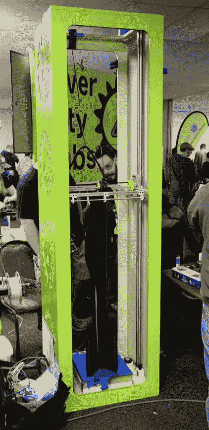](https://i0.wp.com/hackaday.com/wp-content/uploads/2017/03/12.jpg?ssl=1)  [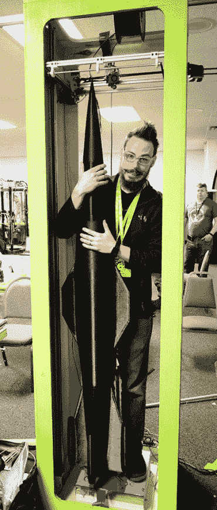](https://i0.wp.com/hackaday.com/wp-content/uploads/2017/03/22.jpg?ssl=1)      [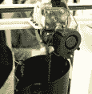](https://i0.wp.com/hackaday.com/wp-content/uploads/2017/03/5.jpg?ssl=1)  [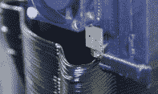](https://i0.wp.com/hackaday.com/wp-content/uploads/2017/03/nozzle.jpg?ssl=1) 

### 不能等到明年

MRRF 的面积比去年几乎翻了一番。中西部 RepRap 节正在迅速成为桌面 3D 打印的定义性事件，我们预计事情会变得更大。MRRF 已经超出了它的场地，但是不要担心——埃尔克哈特乡村游乐场有更大的建筑可供出租。

MRRF 17 很棒，明年会更好。我们在那里见。