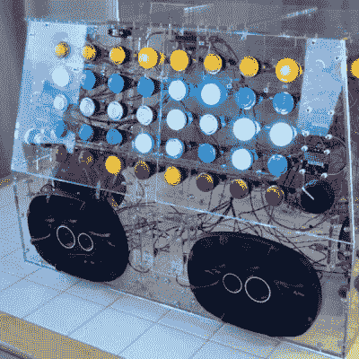

# 巨石带来了制造者集会的繁荣

> 原文：<https://hackaday.com/2017/06/10/the-monolith-brings-the-boom-to-maker-faire/>

[Ross Fish]、[Darcy Neal]、[Ben Davis]和[Paul Stoffregen]创造了“the Monolith”，这是一个互动合成器雕塑，旨在展示 Teensy 3.6 微控制器的功能。

整块石头由一个透明的丙烯酸盒子组成，盒子上覆盖着 LED 照明的拱廊按钮。前面的 40 个按钮用作具有五种不同声音的 8 步音序器，而左右面板上的触摸传感器分别用作复音自动琶音器和预设控制器。

为了控制所有这些按钮，团队设计了[分线板](https://oshpark.com/shared_projects/jiW2r6f5)，配备了端口扩展器、16 通道 PWM 驱动芯片和 N 通道 MOSFETs，允许从单个 Teensy 3.6 控制整个合成器。

在软件方面，[Paul]对 [Teensy 音频库](https://www.pjrc.com/teensy/td_libs_Audio.html)进行了改进以适应硬件，改进了信号控制 PWM 波形的处理方式并增强了包络的工作方式。最终，他们将三张 Arduino 草图合并成一张，得到了完整的代码。

在展示了在[测试](https://www.youtube.com/watch?v=gL5llIO3NcU)的项目后，该团队在 Maker Faire Bay 区的 Kickstarter 展台搭建了这个庞然大物。该项目在博览会上大受欢迎，赢得了令人垂涎的红丝带，并激励了无数的成年人和孩子去看看。我们喜欢激发如此多互动的项目。三个人不仅可以同时玩这个独石，而且他们可以看穿这个透明的盒子，知道发生了什么。

如果你想了解更多，你可以从[Paul]的 GitHub 下载项目文件。与此同时，看看我们在 Hackaday 上发布的其他一些 synth 项目:我们已经在一个 [synth-violin](http://hackaday.com/2017/02/13/its-a-synthesizer-its-a-violin-its-a-modulin/) 、一个 [3D 打印 synth](http://hackaday.com/2017/05/12/3d-printing-a-synthesizer/) 和一个[单 PCB synth](http://hackaday.com/2017/05/09/diy-tiny-single-pcb-synthesizer/) 等许多项目上开槽。

 [https://www.youtube.com/embed/gL5llIO3NcU?version=3&rel=1&showsearch=0&showinfo=1&iv_load_policy=1&fs=1&hl=en-US&autohide=2&wmode=transparent](https://www.youtube.com/embed/gL5llIO3NcU?version=3&rel=1&showsearch=0&showinfo=1&iv_load_policy=1&fs=1&hl=en-US&autohide=2&wmode=transparent)

 [https://www.youtube.com/embed/38M7I6YjyTw?version=3&rel=1&showsearch=0&showinfo=1&iv_load_policy=1&fs=1&hl=en-US&autohide=2&wmode=transparent](https://www.youtube.com/embed/38M7I6YjyTw?version=3&rel=1&showsearch=0&showinfo=1&iv_load_policy=1&fs=1&hl=en-US&autohide=2&wmode=transparent)

