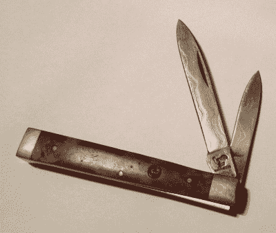
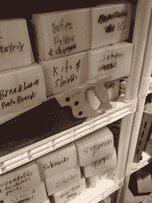
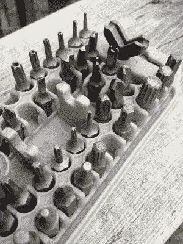
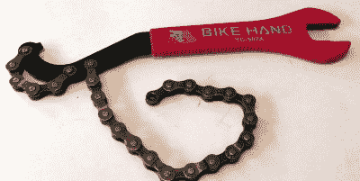

# 你似乎无法舍弃的最无用的工具

> 原文：<https://hackaday.com/2017/10/26/the-most-useless-tools-you-cant-seem-to-part-with/>

我是个工具型的人。无论我多么努力，我最终还是得到了一堆我无法忍受从我的工作室中驱逐出去的工具。为什么？我会 100%保留它:这和囤积背后的情绪是一样的——担心你以后可能需要某样东西，但却不能拥有它。

这些东西需要钱，如果你不得不写脚本来购买一堆与 Project X 相关的工具，你会期望仍然拥有并且可能需要那些非常相同的工具——即使它们不得不在我的架子上的一个盒子里呆上 20 年，每次我不得不把它移到一边时都嘲笑我。盒子的标签上写着“热弯元件”,这是我至少 5 年没用过的工具。我有一堆这样的累赘。我可能很快就需要热弯曲丙烯酸树脂了…是的。

我发现我们人群中的几乎每个人都能产生共鸣。你为一个项目买了一个特殊的工具，它很贵而且非常有用，从那以后它就被闲置了。你当然不能放弃它，如果你又需要它呢？所以你把它存放在你的房子里 20 年，偶尔在找别的东西时会碰到它，但它实际上从未被使用过。

现在和我一起走在无用工具的记忆里。

### 太好的工具

 有一种关于软垫家具太好而不能坐的陈词滥调，所以你的父母用塑料覆盖沙发和扶手椅。我有等效的小刀。这是一把老式的意大利小刀，硬木柄，大马士革钢刃。它实在是太好了，不能用来做任何事情。我把工具打得稀巴烂，如果它被毁了，我会感到很糟糕。因为这次经历，我再也不会买那么漂亮的东西了。

这并不等同于不喜欢一个好的工具，但是昂贵而实用的工具和普通的时髦工具是有很大区别的。花哨的分层钢刀片和胡桃木或任何手柄和黄铜硬件，它不一定是一个更好的工具。我只想让这该死的东西切断，而不是在这样做的时候断裂。

商店推销工具和其他东西的方式很有诱惑力。昂贵、好看的产品是为了满足特定需求而存在的，但目标受众不一定是你。真诚的礼物购买者经常犯这样的错误，他们认为荒谬的模型会自动比下一个更好。

### 让它留在家里

 继承是获得你无法使用或丢弃的硬件的一个好方法。我爸爸有一个带拉丝不锈钢外壳的 badass 半英寸电钻，它很荣耀，也很有男子气概。我想我姐姐最终得到了它。但是总的来说，当你最终拥有一个亲戚的工具时，它通常会变成一个严重的问题。

怀旧是囤积工具的一个重要原因。我得到了某个亲戚的漂亮的钢角尺。我不经常使用它，它也不容易储存。它是那种被设计用来藏在椽子里的东西，我的地下室里没有椽子。这件东西的情感价值超过了它的效用。此外，似乎每个在房子周围做事的人都应该有一个框架正方形，但这一经验法则仍然没有让我在项目中拿出它。每个人都有这种工具——爷爷的钻床放在角落里，上面覆盖着木屑。内疚永远不应该成为你保留什么工具的激励因素。

我从我的岳父那里继承了一个斜接支架，有一次我真的需要它。我在为我的房子切割雪松，这块无用的金属块实际上很有用。我认为很多时候我们都在试图重新捕捉那种微弱的协同效应，这就是为什么我们会执着于我们不再需要的东西。

### 无用的全套工具

 你曾经买过那种价值百万的安全钻头吗？所有东西都在一个工具包里…而且至少有四分之三从来没有用过。我把我的永远放在手边，因为我*可能*需要它——全套的三翼安全钻头，就等着那场史诗般的拆卸，没有这些钻头就不可能。我非常便宜地买了这台电视机，由于潮湿，它开始生锈了。

如果你不是汽车修理工，插座装置会侵占这个领域，但至少它们通常会出现在某种情况下。与你为一个项目所需要的“一个工具”相反，同样有风险的是一整套钻头、刀片等等，其中大部分你都没有用过，但却占据了商店的不动产。另外，如果你的商店有潮湿问题，你会发现你的工具已经生锈了。

当你在组装你的工作室时，能够说“我已经处理好了”真的很好。我有一整套埃克林德六角扳手，形状像钥匙的那种——当然是英制和公制的。我正在采取预防措施防止它们散落或损坏。我在想象一个木箱，可以把它们都放在一个地方，有足够的魅力，可以在上面堆东西，甚至可以堆好几年。我敢肯定，它们随时都会派上用场。

### 专用工具变得尤其被忽视

我发誓我需要一个专门的房间来存放我只为一个项目买的所有特殊工具，并且永远不会再使用。例如，自行车工具，如踏板扳手，断链器，或曲柄臂拆卸工具，在专业领域之外几乎没有用处。

当给干衣机排气时，最便宜的手持式管道压接钳是一个合理的选择。那是几年前的事了，这个工具肯定就在手边的某个地方，但是从来没有理由再去找它。同样的道理也适用于切割金属的曲线锯刀片，以及一桶多用的瓷砖工具。开槽抹子、水泥浆抹子和海绵非常便宜，也不难舍弃，但你知道它们仍然存在。

通过塑料盆的强迫性组织似乎可以阻止堆积，但是这些盆带来了一种特殊的耻辱。我已经好几年没焊接了。我真的需要和那个 Pi 一起玩。他们几乎是在嘲讽你他们是如何被忽视的。

### 你的累赘是什么？

是的，我是一个工具囤积者，但我打赌你也是。你不断碰到但从未摆脱的工具有哪些？我们希望在下面的评论中听到你的白象故事。