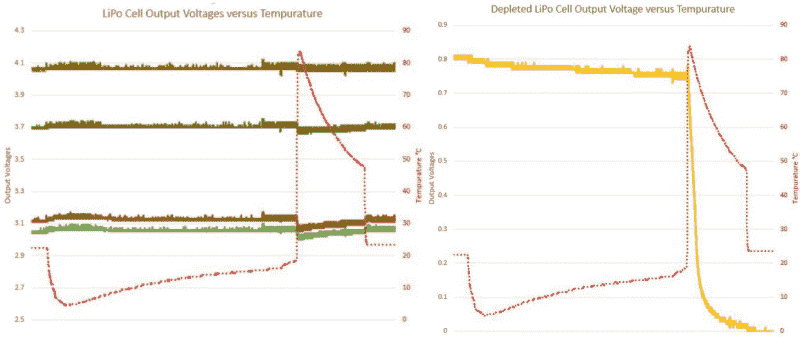

# 沸腾电池的秘密

> 原文：<https://hackaday.com/2016/01/02/the-mystery-of-the-boiled-batteries/>

在制造过程中调试一个奇怪的电池故障时，[Josh] [发现了一个新的(对我们来说)LiPo 电池故障模式](http://wp.josh.com/2015/12/26/boiling-batteries-the-effects-of-extreme-temperatures-on-lipo-voltage/)。

不同的电池化学物质对温度的反应不同。例如，我们已经在高空气球中专门使用了锂，因为它们在寒冷时表现良好。另一方面，锂电池一般不喜欢高温，但是除了燃烧的危险，我们不知道高温会杀死它们。然而，当电池的电压已经很低时，事实证明是可以的。

[Josh]的工艺要求将电池放入塑料模中，这意味着要加热电池。事后，他注意到电池的故障率高得不合理，于是决定测试一下。他把电池放入一个塑料袋，用冰和火折磨它们，每个电池都有不同的初始电荷。(好了，开水。)

当电池变热时，它们的电压会有一点下降，但之后会恢复。虽然初始充电较低的电池电压下降更多，但这与电池在 1V 以下的热水中完全失效相比不算什么——见图中的黄线。

有一百万种方法可以杀死电池，众所周知，锂电池不喜欢完全放电，但深度放电和热量的结合似乎是完全致命的。现在你知道了。