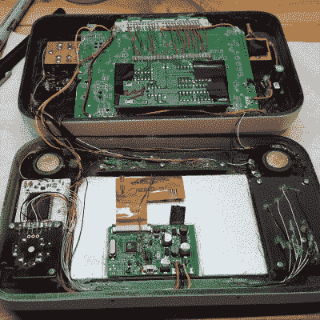

# 手持任天堂 64 只玩时间陶笛

> 原文：<https://hackaday.com/2016/02/04/the-ocarina-of-time-portable-n64/>

介绍 SG-N64——单一游戏任天堂 64 便携式游戏机。你可以玩任何你想玩的游戏，只要是时间的陶笛。

你可能想知道，为什么你要努力去做一个非常棒的便携式 N64 播放器，然后把它限制在一个游戏上？答案其实很简单。“克里斯”想让他最喜欢的游戏——时光陶笛——流芳百世。正如他所说，制造 SG-N64“汲取了永恒经典的伟大之处，并将其保存在专为演奏它而设计的机身中”。

在里面，你会发现原来 N64 的主板，以及游戏卡式印刷电路板，它脱离了外壳，现在硬连线到位。当然，这只是开始。构建的真正挑战是添加所有需要的外围设备:屏幕、音频、控制和电源。他做到了，而且考虑到它是要放在你的客厅里，它的尺寸非常大。

现在**就是你如何向你的孩子或孙子展示一个经典的视频游戏。见鬼，也许你甚至可以说服他们所有的游戏都是这样销售和玩的！没有一点诱惑的父母有什么乐趣？**

 **[https://www.youtube.com/embed/4CdQN_8dOjI?version=3&rel=1&showsearch=0&showinfo=1&iv_load_policy=1&fs=1&hl=en-US&autohide=2&wmode=transparent](https://www.youtube.com/embed/4CdQN_8dOjI?version=3&rel=1&showsearch=0&showinfo=1&iv_load_policy=1&fs=1&hl=en-US&autohide=2&wmode=transparent)

哦，如果一台游戏机一个游戏还不够好，我们猜测你**可以**做一个[便携式 N64，可以玩任何游戏……](http://hackaday.com/2015/07/19/a-beautifully-crafted-n64-portable/)**