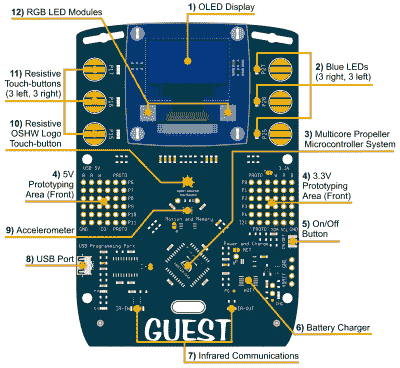
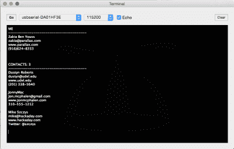
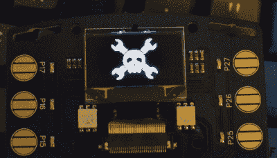

# 开放的、可破解的电子会议徽章

> 原文：<https://hackaday.com/2015/09/14/the-open-hackable-electronic-conference-badge/>

电子会议徽章现在已经存在至少十年了，它们都有同样的缺点。它们实际上只打算使用几天，会议组织者和与会者希望徽章便宜，并且由于会议徽章的性质，代码*只是*起作用，文档很少。肯定有更好的方法。

进入[可黑电子徽章](https://www.parallax.com/downloads/hackable-electronic-badge)。自从 Parallax 开始为 DEF CON 制作电子会议徽章以来，他们已经收到了很多为其他会议制作徽章的请求。生产数以万计的徽章使 Parallax 成为您的会议徽章需求的首选，但徽章的请求总是受到时间太短、价格预期太低以及数量未知的限制。

电子会议徽章有一个市场，这是 Parallax 对一个反复出现的问题的解决方案。他们正在为所有的会议制作一个徽章，以及一个可以(相对)容易修改的平台，同时仍然保留其所有的核心功能。

当然，要建立一个多会议、多功能的徽章，Parallax 首先需要客户。他们在西北大学互联学习中心发现。[科里·布雷迪博士]和[尤里·维伦斯基博士]正在研究人们如何相互交往以及疾病如何传播。他们需要一个电子徽章，研究人员的需求与 Parallax 设计一个开放式电子徽章的愿望相一致。

这种合作产生了可破解的电子徽章。当然，这个徽章上有一个视差推进器。有一个白色的有机发光二极管显示器，加速度计，电阻触摸板，当然还有原型垫，如果有人想用会议徽章建造一个四轴飞行器。电力由定制的充电电路和 AA 型锂离子电池提供，使徽章的运行时间达到 12 到 18 小时。

Terminal window of the badge’s Contact Manager

硬件只是成功徽章的一个方面，对于大多数单项徽章来说，软件通常是弱点。现在 badgemeisters 有了一个稳定的硬件平台，是时候开发一些有用的应用程序了。第一个这样的应用程序叫做联系人管理器。该应用程序使用红外通信 led 和 Propeller 的 32k EEPROM 来存储多达 500 个下次会议时遇到的联系人。交换联系人非常简单，只需在其中一个示例程序中上传您的联系信息，触摸 OSHW 徽标，然后将您的徽章指向另一个徽章。然后，您收到的联系信息被保存在 EEPROM 中，并且可以通过将徽章连接到任何终端仿真器来转储。您可以查看下面[Ken Gracey]的联系人管理器应用程序视频演示。

可破解的电子徽章[将于本周末在费城开放硬件峰会上首次亮相](http://2015.oshwa.org/2015/08/24/ohs-2015-interactive-badge/)。这不是大会的要求——每个人都会得到一个纸质徽章和一根挂绳，电子徽章将额外收取 40 美元——但这是徽章首次在正式的大会上使用。

Calling it. First badge hack.

因为这个徽章将作为未来 con 徽章的原型，~~很可能包括明年的 DEF CON~~ *编辑:不*，这将是徽章黑客首次在活动前几个月拿到硬件。这意味着 badge 黑客将能够在事件发生之前开发奇怪的应用程序，并能够在许多约定之后重用这些代码。这听起来像是欺骗，但这是徽章平台相对于一次性徽章的全部意义；重用代码和布局降低了成本，增加了应用程序的数量。它还可以在活动开始前进行一些徽章黑客活动；[我已经把 Hackaday 的 logo 放在徽章](https://hackaday.io/project/7642-hackaday-hackable-electronics-badge)上了。

就像为开放硬件峰会佩戴徽章一样，整个事情都是开源的，从 Propeller 微控制器到源代码和 DipTrace 文件。所有文件[将在适当的时候在这里](https://www.parallax.com/badge)可用。

对于一个单一的会议投标，这是一个伟大的成就。今年的开放硬件峰会将获得有史以来最先进、最强大的硬件徽章之一。然而，这并没有结束，为其他会议徽章建立一个平台确实让这个项目大放异彩。

 [https://www.youtube.com/embed/7fXuVUFoAXI?version=3&rel=1&showsearch=0&showinfo=1&iv_load_policy=1&fs=1&hl=en-US&autohide=2&wmode=transparent](https://www.youtube.com/embed/7fXuVUFoAXI?version=3&rel=1&showsearch=0&showinfo=1&iv_load_policy=1&fs=1&hl=en-US&autohide=2&wmode=transparent)

