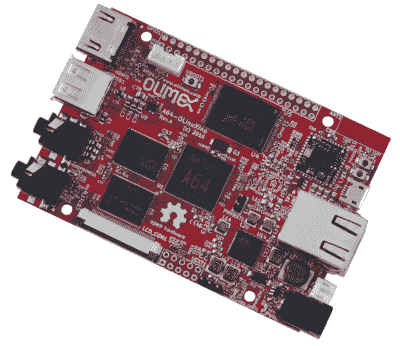

# 开源黑客的笔记本电脑

> 原文：<https://hackaday.com/2016/04/27/the-open-source-hackers-laptop/>

[茨韦坦·乌苏诺夫]担任奥利梅克斯先生已经大约 25 年了，从那以后，他已经换了很多笔记本电脑。还记得电源连接器被直接焊接到主板上的时候吗？[茨韦坦]有，而且他固定了他的笔记本电脑份额。有时候，修笔记本电脑没有任何意义；供应商通常制造难以修复的笔记本电脑，东西只是莫名其妙地坏掉。每年，都会有一些[茨韦坦]的笔记本电脑报废，其余的电池也会因其他磨损而失去容量。尽管主要制造商取得了一些惊人的进步，笔记本电脑仍然是一次性设备。

由于[Tsvetan]生产 ARM 板、带有 duino 后缀的板和其他电子设备，他考虑制造自己的笔记本电脑是很自然的。这是他已经研究了一段时间的东西，但是[Tsvetan]在 [Hackaday | Belgrade](http://hackaday.io/belgrade) 会议上分享了他在开源黑客笔记本电脑上的进展。

 [https://www.youtube.com/embed/1oVS8CCdSAs?version=3&rel=1&showsearch=0&showinfo=1&iv_load_policy=1&fs=1&hl=en-US&autohide=2&wmode=transparent](https://www.youtube.com/embed/1oVS8CCdSAs?version=3&rel=1&showsearch=0&showinfo=1&iv_load_policy=1&fs=1&hl=en-US&autohide=2&wmode=transparent)

和任何项目一样，第一步是好好谷歌一下。通过在母脑中键入“自己动手笔记本电脑”，你会得到一个项目列表，这些项目很难看，甚至没有最大的 MacBook Pro 方便。[这款 2007 年的产品](http://hackaday.com/2007/01/20/make-your-own-laptop/)采用了迷你 ITX 主板，所有的热量和功率都与这种奇怪的硬件选择相称。[你可以走老路](http://hackaday.com/2015/01/27/diy-6502-laptop-computer-looks-and-works-great/)，但这又是一个制造*可用的*笔记本电脑的项目。回到树莓派的世界，[这些笔记本电脑都很笨重](http://hackaday.com/2012/12/21/raspberry-pi-laptop-is-just-a-little-too-big-for-a-pocket/)，而[这款是由一个小小的凯撒盒子](https://www.youtube.com/watch?v=7Hd7cXs7tU4)制成的。

平心而论，并不是所有的 DIY、开源笔记本电脑都动力不足或者沾满了疯狂的面包屑。[【Bunnie】的 Novena 笔记本电脑](http://hackaday.com/2014/04/02/bunnie-launches-the-novena-open-laptop/)是一件电子艺术作品，非常强大，是一台可以作为日常司机的笔记本电脑。不过，Novena 并不是一款方便的笔记本电脑:它相当笨重，显示屏在外面，没有 MacBook Air 或 Thinkpad Carbon X1 的优雅。

[Tsvetan]的笔记本电脑结合了所有这些功能，重量轻，电池大到足以运行一整天，优雅，时尚，最重要的是，开源。这是一种模块化的笔记本电脑，易于维修和升级，并且备件便宜。

 为此，【Tsvetan】花了四个月的时间基于 64 位 Allwinner 芯片构建了一个强大的 ARM 板。有 HDMI、USB、LCD 输出，这是在 KiCad 中制作的，使原理图和电路板文件完全开源。

这款笔记本电脑不仅仅是一台运行 Linux 的 ARM 单板机。由于最近 Lattice iCE40 FPGA 开源工具链的进展，[Tsvetan]正在考虑让这款开源笔记本电脑成为真正的黑客工具，带有逻辑分析仪、DSO 和 DDFS 发生器。

[Tsvetan]的开源笔记本电脑前景如何？他应该——希望——在 7 月初在保加利亚普罗夫迪夫举行的 TuxCon 上有一台原型机运行。还有很多工作要做，但到目前为止[茨韦坦]已经为这个箱子与一家塑料制造商签订了合同，找到了一个漂亮的 eDP 面板、小型摄像头、扬声器、至少可以持续六个小时的电池，以及一个可以工作的键盘和触摸板。

从零开始制造笔记本电脑是我们能想象到的最困难的电子制造挑战之一。这是一份真正的全栈开发工作，技能范围从为 Linux 编写定制驱动程序到复杂的注射成型。幸运的话，[茨韦坦]和 Olimex 将在今年 9 月准备好一些工具包。这是一个惊人的快速开发时间，如果不从一开始就把所有的设计文件放到互联网上，让其他爱好者为创建开源笔记本电脑做出贡献，这是不可能的。