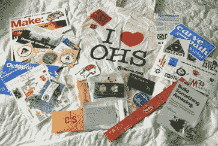
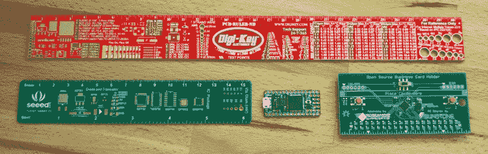

# 开放硬件峰会的人员、会谈和成果

> 原文：<https://hackaday.com/2016/10/10/the-people-talks-and-swag-of-open-hardware-summit/>

周五是 [2016 开放硬件峰会](http://2016.oshwa.org/)，这是一年一度相信开放设计力量的人们的聚会。使用“首脑会议”一词而不是“会议”很能说明问题。这个聚会聚集了大量坚持“开放”理念的硬件公司运营人员，但这并不排斥任何人——欢迎所有人参加。Hackaday 已经建立了世界上[最大的开放硬件](https://hackaday.io)项目库。我们不只是想去那里——我们发起了，派出了一个团队，并在这个过程中彻底享受了自己。

休息之后，请和我一起看看讲座，逛逛礼品袋，感受这美好的一天。

## 会谈和认证

大会上的重大新闻是开放硬件认证的发布。[Brian Benchoff]写了一份非常详细的认证说明，您可以查看一下。但有两大要点:你可以认证你的硬件，其中包括一个唯一的标识符，供人们寻找，以确保他们知道他们正在购买什么。如果你准备好了一个产品，你应该在 10 月底之前认证它。这样，就唯一标识符而言，您将能够确保一个非常低的数字。

由于这是一篇概述性的文章，我不打算深入讨论。但是这里有几个亮点。

我真的很喜欢听 Seeed Studio 的首席执行官(CEO)Eric Pan 谈论柴火创客空间运营的 x.factory。这听起来像是黑客空间的工业等价物。这是一个公共工厂，旨在汇集深圳各地不同工厂的人才。

[Eric 的]例子是，你的初创公司在制造技术增强型家具方面很棒，只是缺乏制造优秀家具的专业知识。相反，深圳有许多家具制造商，他们制造的家具很棒，但缺乏整合电子和其他技术的专业知识。将这两者结合在一起，你就拥有了技术专家的新经济知识，以及家具公司来之不易的制造知识和分销网络。跨行业的合作将会非常有趣。

[Steve Hodges]是微软团队的一员，他与 BBC 合作开发了 micro:bit。我认为这很棒，因为英国正在努力确保每个学生在通过学校系统时都能拿到一块裸电路板(T2)。[Steve]现场演示了开发板，展示了软件仿真器并向开发板刷新了构建。看到用于构建程序的块编辑器很酷，[然后切换到查看(并更改)可视化抽象背后的 JavaScript](https://www.microbit.co.uk/blocks/to-td) 。

[Steve]提到他们正在努力使 micro:bit 今年在欧洲上市，最快明年在北美上市。

## 糖果袋

      

在会议上得到礼包是很平常的事。这是值得注意的，因为它包含了一些我一定会坚持的免费赠品。我用了大量的贴纸贴在我工作台的背面，所以这些总是很受欢迎。Hackaday 的贡献很甜(不好意思，忍不住):一个棒棒糖，Tindie 和 Hackaday 的贴纸，还有几张宣传牌。

But check out the PCBs that came in the collector’s bag. I love having breakout boards on hand. CircuitMaker included an empty Arduino shield which has bus board, SMD adapter, and small-pitch through hole areas. I’m unlikely to use this with an Arduino but I will chop it up willy-nilly for needed projects. Sparkfun sent along four SOIC to DIP adapters, always handy to have. Digikey included their PCB ruler. This thing is pretty awesome, and although I’ve seen it at other conferences I haven’t scored one for myself. I laughed at the “For Reference Only” disclaimer in the upper right. Seeed Studio also included a PCB reference ruler.

我最喜欢的两个是开发板。首先是来自尖叫电路和 Sunstone 的开源名片夹。我永远不会将它用作名片夹，但它有一个带恩智浦 MMA8552Q 3 轴加速度计的 PIC18F46K22。I2c/SPI 总线断开，ICSP 引脚也断开。GPIO 引脚没有断开，但有两个用户按钮和 19 个 SMD LEDs。拆下电阻，就有了断开的引脚。

OSH Park 使第二个开发板成为可能，它是[Piotr es den-Tempski]的[1 bitsy](https://github.com/esden/1BitSy)STM 32 f 415 分线板。看到每个人的包里都有一个 ARM 开发板真是太棒了。我肯定会玩这个…我想很多与会者都会。如果你的包里有一张这样的名片，并且不打算用它，请确保你带着它(和名片夹)去参加下一次 hackerspace 会议，因为有人会很高兴有这些名片在手。

这让我觉得我们需要举办一场竞赛，挑战你围绕你在一次会议上得到的免费赠品来构建。我们将在[超级会议](https://hackaday.io/superconference/)上分发[我们自己非常棒的基于 PCB 的](https://hackaday.com/2016/09/28/new-supercon-badge-is-40-lighter-and-a-work-of-art/)产品。

## 还会有更多

在开放硬件峰会的前一天晚上，OSH Park 在其波特兰总部举办了一场盛大的黑客大会。当会谈在周五下午 5 点结束时，还有一个非常愉快的时刻，一个酒吧，一个酒吧。在此期间，我看到了非常酷的硬件，并将在本周发表更多文章。请留意黑客日。