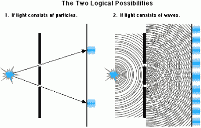
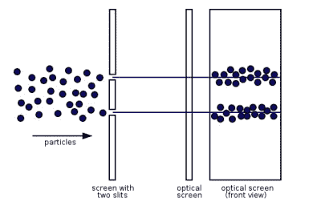
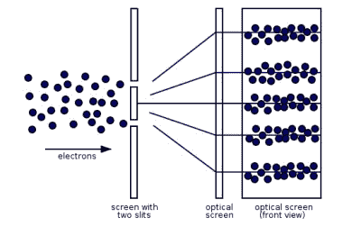
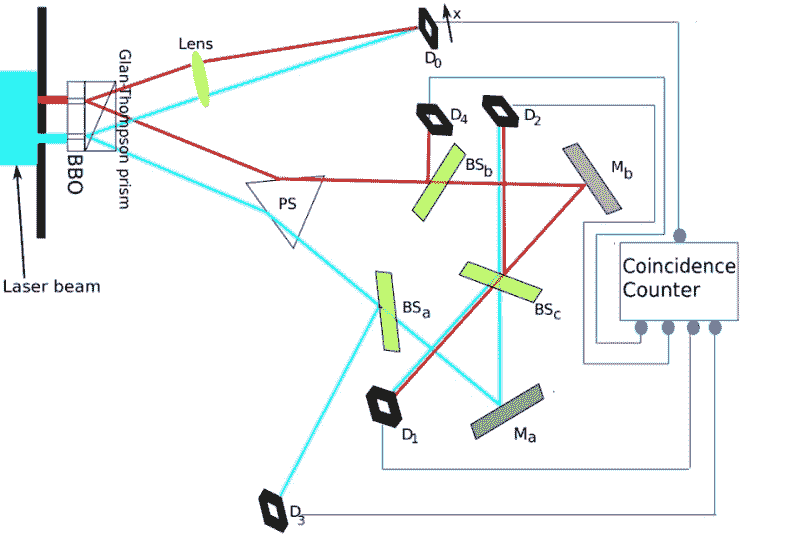
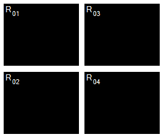

# 量子橡皮擦

> 原文：<https://hackaday.com/2016/09/07/the-quantum-eraser/>

理查德·费曼不止一次指出，互补性是量子理论的核心之谜。互补法则统治着非常小的世界……量子世界，并推测粒子和波是无法区分的。他们是同一个人。认为某样东西，甚至试图把它想象成一个单独的“粒子”或“波”是没有意义的。粒子/波/无论你想怎么称呼它，它都处于这种*叠加*中，在这里它既不是粒子也不是波。只有尝试测量它是什么的行为，才脱离了隐形装置，粒子或波的本质才被揭示。寻找一个粒子，你会找到一个粒子。相反，寻找一个波，你会找到一个波。

互补性来自于用经典测量设备测量量子世界中的事物时所受到的限制。事实证明，当你试图测量非常非常小的东西时，会出现一些问题……一些基本问题。例如，你无法确切知道一个亚原子粒子在空间中的位置。你只能在一定的概率内知道它在哪里，而这个概率是以波的形式通过空间分布的。理解测量中的不确定性是避免你在考虑互补性时产生怀疑的关键。

这篇文章是上面那篇文章的延续。我将从我停止的地方继续讲下去，因为每个人都同意量子尺度上的测量存在一些大问题。然而，并不是每个人都同意这些问题意味着什么。有些人，比如阿尔伯特·爱因斯坦，说不能测量的东西并不意味着它不存在。包括大多数主流物理学家在内的其他人则持相反的观点——如果某样东西无法测量，那么它实际上就不存在。我们将继续我们的旅程，利用现代技术窥视互补的黑暗世界。但首先，快速回顾一下。

## 双缝实验——一切开始的地方

首先，有些纯粹主义者不同意我解释这些概念的方法。我必须恳求你，这不是我的目标，提交这篇文章给科学杂志审查。我的目标只是简单地剥离这个高级主题的复杂性，并以一种任何人都可以享受和学习的易于理解的格式呈现它。但是无论如何，请随意在评论中展开讨论！

开发互补性是为了帮助理解实验室实验的结果。今天，互补的概念是量子力学哥本哈根解释的核心。还有其他的解释，但是哥本哈根模式是最被广泛接受的。

Source: [Rollins.edu](https://myweb.rollins.edu/jsiry/lightquantum.html)

我所说的实验室实验是围绕着双缝实验展开的，双缝实验可以区分粒子和波。想象一下，你在一个射击场，你竖起了一个大靶子。在你和目标之间竖立着一面巨大的钢铁墙，墙上有两条窄窄的缝……可能有六英寸宽，两英尺宽。你用机枪打了几百发子弹，然后观察目标上的图案。你会发现一个明显的图案——子弹穿过狭缝的两条窄线。

现在让我们把有两个裂缝的大钢墙放入湖中，使裂缝刚好露出水面。在墙后面，我们会放置某种能探测到波的探测器。我们把一块大石头扔进湖里，看着产生的波浪从撞击点发出并撞击湖壁。在墙的另一边，另外两个波从裂缝中出现。每个狭缝都像波源一样。来自每个源的波将相互干涉，并在我们的探测器壁上产生独特的图案。这就是所谓的干涉图样，由几条不同强度的线组成。

Source: [maths.org](https://plus.maths.org/content/schrodinger-1)

现在，你应该知道我们要做什么了。如果我们有一种未知物质，我们想知道它是由粒子还是波组成的，我们可以进行这个实验。例如，光会产生干涉图样。这很有道理——这是一种电磁波。有人会认为亚原子粒子会像我们的机枪子弹一样产生一种图案——两条截然不同的线。事实证明并非如此。它们也会产生干涉图案。而且最确定的是*和*没有意义。

Source: [maths.org](https://plus.maths.org/content/schrodinger-1)

但是物理学家很聪明，他们决定尝试在双缝中一次发射一个粒子。大约每小时一个粒子。但是它产生了同样的结果——干涉图样！粒子的行为就像一个波，好像它同时穿过了两个狭缝！那是不可能的！我们必须仔细看看。我们将观察单个粒子，看它通过哪个狭缝。事实证明，当你这样做的时候，你会得到你所期望的双线图案。如果我们观察它，我们会看到一个粒子。不看的话，会看到一波。因此产生了互补的概念。

“观察决定现实”的想法陷入了一个哲学泥潭，我不会用 39 英尺的高频天线去碰它。但是我们可以通过实验来更深入地探究这个秘密。如果我们能观察到粒子/波/无论什么东西在穿过狭缝之后**以及在到达探测器壁**之前**会怎么样？这正是量子橡皮擦实验所做的。**

## 量子橡皮擦

就像量子理论中的几个概念一样，最初的思想实验是为了探索一种想法或方法而开发的，但技术已经发展到我们可以实际实现其中一些想法或方法的地步。量子橡皮擦实验就是这样一个实验，于 1999 年在马里兰大学进行。

实验从可见光光子穿过双缝开始。出射的光立即撞击棱镜，将单个光子分裂成纠缠的一对。然后一个透镜将其中一个光子导向探测器 D [0] 。另一个光子进入另一个棱镜。接下来会发生什么取决于最初的光子是从哪个狭缝中出来的。如果它来自顶部狭缝(红色路径)，它将进入半镀银镜 BS [b] 。如果它来自底部狭缝(蓝色路径)，棱镜会将它导向半镀银镜 BS [a] 。请注意，“BS”代表“分束器”:半镀银镜将允许 50%的光子通过，并将反射另外 50%的光子。

Source: [wikipedia.org](https://en.wikipedia.org/wiki/Delayed_choice_quantum_eraser)

BS [b] 反射镜将 50%的光子从顶部狭缝发送到探测器 D [4] ，另外 50%发送到反射镜 M [b] 。来自 M [b] 的光子前往另一个半镀银镜 BS [c] 。该反射镜将分别向探测器 D [1] 和 D [2] 发送 50%的光子。

通过底部狭缝的光子也会发生类似的作用。它们将撞击 BS [a] ，后者将光子发送到探测器 D [3] 和反射镜 M [a] 。从 M [a] 开始，它们会到镜 BS [c] ，镜 BS 把一半的光子带到 D [1] ，另一半带到 D [2] 。

最终，来自顶部狭缝的光子将到达探测器 D [1] ，D [2] 和 D [4] 。请注意，没有来自顶部狭缝的光子能够到达探测器 D [3] 。来自底部狭缝的光子将进入探测器 D [1] ，D [2] 和 D [3] 。没有来自底部狭缝的光子能够到达探测器 D [4] 。注意，不可能确定撞击 D [1] 和 D [2] 的光子来自哪个狭缝。这就是我们所拥有的:

*   顶部狭缝= D [4]
*   底部狭缝= D [3]
*   不可知= D [1] 和 D [2]

探测器 D [0] 位于最短的路径上，因此一个光子将在它的纠缠伙伴到达另一个探测器之前大约 8 纳秒撞击它。符合计数器允许我们将撞击 D [0] 的光子分配给它的纠缠伙伴，后者撞击 D[1]–D[4]。

所以我们在 Arduino Uno 上加了 12v，让光子散了。这就是我们所发现的——D[3]和 D [4] (在维基图片中标为“R [0n] )显示了一种粒子模式。D [1] 和 D [2] 显示干涉图案。这是有道理的。我们无法知道在 D [1] 和 D [2] 检测到的光子是通过哪个狭缝。所以它们就像波浪一样。而且我们知道在 D [3] 和 D [4] 检测到的光子是从哪个狭缝穿过的，所以它们的行为就像粒子一样。但这不是实验的重点。

Note how the bands are opposite of each other in R01 and R02\. This corresponds to the R01 and R02 waveforms in the top image. See [the Wiki](https://en.wikipedia.org/wiki/Delayed_choice_quantum_eraser) for more information on why this occurs.

在探测器 D [0] 处，一切都很顺利。对于每一个击中 D[1]–D[4]的光子，它都有一个更早击中 D [0] 8ns 的纠缠伙伴。像其他探测器一样，D [0] 可以分辨粒子或波型。这正是我们想要做的——在穿过狭缝(经由 D [0] 之后，但在到达探测器壁之前，我们正在观察粒子**,在这种情况下，探测器壁由探测器 D[1]–D[4]组成。**

他们发现击中 D [0] 的光子总是——100%都是——与它们的伙伴光子相关联。而这，我的黑客伙伴们，应该是不可能的。为什么？因为:

*   光子在 D[1]–D[4]之前 8 纳秒到达 D [0] 。
*   光子有 50/50 的几率击中 D [1] /D [2] 或 D [3] /D [4] 。

那么，击中 D [0] 的光子如何知道它的纠缠伙伴是去了 D [1] /D [2] 还是 D [3] /D [4] ？我们被迫考虑一种不可能的情况:

*   在 D [1] 和 D [2] 结束的光子必须发送信息到过去 8ns，告诉它在 D [0] 的纠缠伙伴成为一个波。
*   在 D [3] 和 D [4] 结束的光子必须发送信息到过去 8ns，告诉它在 D [0] 的纠缠伙伴成为粒子。

朋友们，这是对[量子橡皮擦](https://en.wikipedia.org/wiki/Delayed_choice_quantum_eraser)的简单解释。它“抹去”了过去，使我们永远不知道光子是从哪个缝隙进来的。玻尔是对的:互补性是真实的，尽管看起来不可能。然而，我们的问题并不在于似乎不可否认的时间旅行。我们的问题是，我们如何看待自然界在量子领域是不兼容的。要问是波还是粒子，那就是扯淡。要问是不是真的有胡说八道。量子领域没有“那里”这种东西。像时间和空间、原因和结果这样的概念…在那里有不同的含义…直到今天我们仍然不确定的含义。

鼓励你的儿子、女儿、侄女和侄子掌舵，研究量子理论。激起他们的好奇心…还有故事要讲，还有发现要做。其中许多肯定比最伟大的小说更伟大，但其神奇的含义植根于非常真实的现实——现代科学的下一个前沿。