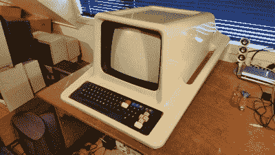
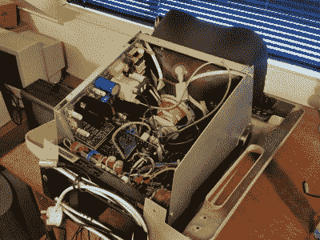

# 复活复古未来主义的 Poly-1

> 原文：<https://hackaday.com/2016/10/11/the-resurrecting-the-retro-futuristic-poly-1/>

[Tez]收购并复兴了新西兰计算历史的一部分，即 Poly-1。对于上世纪 80 年代在英国上学的人来说，Poly-1 似乎是 Acorn 的 BBC Micro 的一个更酷的镜像宇宙版本。像简陋的 Beeb 一样，Poly-1 主要是为教育用途而设计的。它还使用了一个相关的，但更好的微处理器(摩托罗拉 6809)。

然而，尽管 Acorn 的遗产在 ARM 架构中继续存在，[仅售出了几千个 Poly-1](http://playitagainproject.org/the-poly-computer-nzs-purpose-built-school-computer/)，而且它似乎已经被遗忘了。

Poly-1 的消亡可能部分是由于其高昂的价格——约 5000 美元——在新西兰缺乏支持，以及这家新西兰小公司难以打入国际市场:这些问题最终导致英国、日本和其他地方许多类似的 20 世纪 80 年代计算机公司倒闭。

但是回顾过去仍然很有意思，不仅仅是因为怀旧，还因为对无畏的 80 年代黑客的钦佩，他们创造了这些美丽的机器和一个可能实现的世界的梦想。