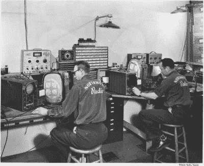
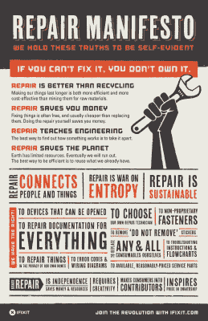

# 内部没有用户可维修的零件？修复文化的兴起

> 原文：<https://hackaday.com/2015/09/15/the-rise-of-the-fix-it-culture/>

 

【来源:[20 世纪 50 年代的电视](http://www.lilesnet.com/)

我高中毕业后的第一份工作是在一家电视店。我被雇佣主要是因为肌肉；那是在 20 世纪 80 年代初，我们卖了很多游戏机，它们似乎总是需要送到无电梯的三楼。但是我也可以修理电视和音响，我喜欢这份工作。60 年代和 70 年代的旧电视将会出现，它们的预 PCB 结构和满是端子板和点对点布线的手工布线底盘肯定是制造过程中的一场噩梦。我们会更换有问题的电子管，更换电子管，清洗机械调谐器，有时还会安装一个新的显像管——这总是顾客最害怕的诊断，就像被告知他们需要进行心脏移植一样。我们保留了这些旧电视机，我们的客户感觉他们在保护他们在宏伟的 Admiral 或 Magnavox 控制台上的投资，这些控制台采用了真正的——非常非常重的——胡桃木机柜。

我设法从我当电视修理工的时候学到了很多东西，而且我对让东西一直工作到一个理智的人会认为是去买新东西的时候这一点很感兴趣。修理东西是我真正擅长的，我的房子充满了史诗般的修理(至少在我看来)，这些年来已经为这个家庭节省了数万美元。洗碗机发出奇怪的声音？我就拔出来看看。你说刹车的时候前端有点摆？把车开进车库，我们就把轮子卸下来。基本上没有什么是我不会尝试去解决的，而且通常我都会成功。

我以为我的修复程序错误让我成为了一个正在消亡的吝啬鬼和吝啬鬼，但看来我错了。修复运动现在看起来相当健康，部分原因是信息爆炸，任何具有基本互联网技能的人都可以获得这些信息。

### “如果你不能修复它，你就不拥有它。”

回到过去，如果你真的需要一个电视的原理图，你必须买一本山姆的照片手册，你的汽车维修手册有 T2 奇尔顿 T3 和 T4 海因斯 T5 两种版本。事实上，那些被要求花大价钱购买这些手册的人，是那些太过廉价和固执而不愿支付专业维修费用的人，却不知何故逃过了营销人员的眼睛，因此，我们常常带着基本的工具和十足的信心进行维修。

 

维修者赖以生存的词语【来源:[iFixit](https://www.ifixit.com/Manifesto)】

这些天我对大多数维修的第一个想法是，“肯定有人已经处理过这个了”，于是我前往互联网进行搜索。诚然，维修信息的广度可能令人困惑，而覆盖的深度可能从难以置信的详细到几乎无法使用，因此很难获得任何特定维修的良好信噪比。但是，事实上有这么多的信息，几乎所有的信息都来自专门的 DIY 者，这确实说明了修复文化的健康。

一些网站开始对混乱的 DIY 教程和维修信息进行整理。我最喜欢的一个是 iFixit，这是一个基于维基的网站，拥有超过 16000 个社区创建的维修指南。他们的[维修宣言](https://www.ifixit.com/Manifesto)真的引起了我的共鸣，为世界上的每一个设备创建维修手册是一个崇高而崇高的目标。这个网站在很大程度上是一个正在进行的工作，如果我能找到时间，我可以看到自己在为它做贡献。

然而，困难在于:时间。尽管 DIY 者通过将可修复的设备排除在垃圾填埋场之外节省了所有的金钱和资源，但代价是花费在修复上的时间。以文档形式增加维修时间有时很难证明是合理的。然而，视频和教程不断堆积，不仅在 iFixit 上，而且在像 [FixYa](http://www.fixya.com/) 和 [RepairClinic](http://www.repairclinic.com/) 这样的网站上。让我们不要忘记为修理人群举办的爱情黑客秀——毕竟，我们甚至有[自己的修理黑客类别](http://hackaday.com/category/repair-hacks/)。

对于那些不能完全摆脱“拆除后保修无效”标签的人，或者那些钻研一个项目却陷入困境的勇敢的人来说，也有一个向修理诊所和会面发展的新兴运动。维修咖啡馆基金会一直在为一个世界范围的维修咖啡馆会议网络提供支持和组织，在这个会议上，人们被鼓励把他们的坏东西带进来，与志愿维修专家一起好好检查。这个想法是让维修成为一个合作的过程，业主投入一些汗水和资产，至少学习一些关于维修的东西。希望这将激发人们对进一步进行更多修复的兴趣，或者至少产生对工作的欣赏，并稍微揭开这个过程的神秘面纱。修复会面的方式正在流行，其他团体如[费城修复者协会](http://phillyfixersguild.org/)也在当地举办类似目标的研讨会。

### 从解决者到建设者

所有这些聚会和丰富的在线维修信息似乎对维修运动产生了积极的影响——看看最近《华尔街日报》的专题报道,一名记者和公认的 DIY 新手对朋友的电视进行了维修。这次修复只是简单的重新盖上电源，但是记者从他的经历中学到的技能可能会鼓励他尝试另一次修复。没有什么比成功更能建立自信了。

然而，下一步呢？如何看待从现有设备的修理者到新奇事物的制造者的这一步？这就是修复运动的发展真正开始给黑客文化带来回报的地方。我认为，从很多方面来说，修复助长了黑客行为——人们在导师的帮助下或仅仅依靠在线帮助，从害怕的新手变成成功的修复者。成功孕育自信，自信导致更多的尝试修理和更多的经验。对于有经验的修理工来说，这只是从“看我修好了什么！”到“看我造了什么！”

所以修理者，继续修理。你不仅节省了金钱和资源，而且你可能正在为下一步和构建新的东西做准备。当你大获成功并把产品推向市场时，确保里面有用户可维修的部件！