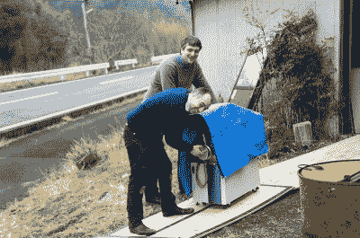

# 农村黑客的崛起

> 原文：<https://hackaday.com/2015/09/07/the-rise-of-the-rural-hacker/>

在波索半岛的另一边是 Kamogawa。这不是发光二极管、宅男和女仆咖啡馆的日本，也不是疲惫不堪的工薪族的日本。这是稻农和稻田、鲜鱼和野猪、电子显微镜和千兆光纤、SMD 组件和 500Mhz 5 千兆采样示波器的日本。

世界已经变了。在 20 世纪，一个农村黑客的生活就是不断寻求技术创新。我们到处寻找能找到的东西。一份(通常是全国性的)期刊将每月提供一期科技珍闻。知识被紧紧锁在昂贵的教科书里，即使你买得起，也可能需要几个星期才能到达。

因此，和之前 1000 年的情况一样，创新聚集在技术中心，如旧金山、剑桥和东京等。黑客们涌向这些创新蓬勃发展的中心，同时黑客们交换知识和工具。

但是后来，农村黑客的世界开始扩大。许多农村黑客迁移到的技术中心开始连接世界。年轻的黑客可以从 BBSs 上发布的文本文件中学习编程(就像我学习 C 语言一样),并交流知识，将各国社区联系起来。此后不久，互联网带来了它永恒的九月。世界各地的黑客，无论身在何处，都可以相互交流。

另一方面，科技中心也在发生变化。风险资本，而不是自举，成为了常态。随着现金的涌入，对熟练黑客的需求上升，工资增加，进一步将技术人才集中在这些中心。但是租金和费用也上涨了。黑客们被他们昂贵的生活方式所束缚；眼睛紧紧盯着承诺的百万美元回报和“退出”的永恒梦想。

然而，对一些人来说，自由地进行黑客攻击比百万美元的退出更重要，因此一种新的模式正在出现。农村社区的黑客群体生活成本低，可以接触到世界上最好的技术人才和设备，让最优秀的创业公司相形见绌。

农村生活当然有其利弊。当地没有星巴克，夜生活也仅限于偶尔夜间出没的獾或狐狸。虽然新鲜的本地产品和迎合旅游经济的餐馆有助于娱乐，但一个更重要的限制是技术工作不多。这意味着勤劳的黑客必须找到其他赚钱的方法。

解决这个问题的方法有很多种，从每年迁移到技术中心几个月或远程承包，到开发和销售小批量项目(通过他们自己的在线商店，或像 Tindie T1 这样的销售渠道)。一个关键的区别是:在大都市可能只提供零花钱的项目可以在租金低廉的农村提供可持续的生活。

这种模式最好的例子可能是[黑客农场](http://www.hackerfarm.jp/)一个以日本农村的一个小村庄为中心的黑客社区。目前，4 个家庭已经搬迁到该地区，更多的方式，偶尔长期访客。黑客农场的许多成员逃离了东京技术工人充满压力的生活。在 Hacker Farm，成员共享技术技能、工具和共同工作空间，这些空间不仅配备了电子和科学测试设备，还配备了用于翻新当地废弃建筑的工具，供 Hacker Farm 成员使用。

这种自由也意味着工具可以慢慢获得。专注于维修二手设备，这在大多数现代初创公司都是一个困难的命题。受日本制造业衰退的推动，Hacker Farm 收购并维修了各种测试设备，其中大部分在几年前会花费数万美元。在某些情况下，数以百计的人喜欢他们最近获得的电子显微镜。

An unorthodox electron microscope installation process in progress

像 Techrice(一个监测当地稻田水位的项目)这样的项目让他们能够融入当地社区。充裕的时间让 Akiba(项目创始人)能够参与印度的农村社区，帮助达兰萨拉的 [Hill Hacks](http://hillhacks.in/) 并开发了许多表演项目，如他在[舞者](http://freaklabs.org/index.php/blog/misc/wrecking-crew-orchestra-cosmic-beat-behind-the-scenes.html)和 flair 调酒设备上的 EL lighting 工作。

黑客农场是一个鼓舞人心的地方，我在那里的经历让法默·格林奇(有点令人惊讶的是，他是一个乐队的共同创始人，这个乐队也叫[“黑客农场”](https://www.youtube.com/watch?v=9kpYrl5UQHU))和我一起创建了 [Yeovil Hackerspace](http://yeovilhackers.com/) ，试图效仿日本项目的成功。我们希望这两个黑客空间能够跨越 6000 英里，参与共享项目。

尽管还处于起步阶段，但乡村黑客的模式暗示了一种新的工作方式的萌芽。对于现代黑客来说，乡村生活方式并不一定是技术隔离，但它给了黑客自由和大量最宝贵的商品——时间。