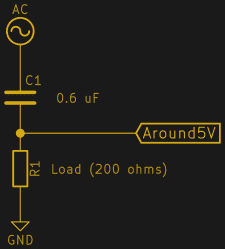
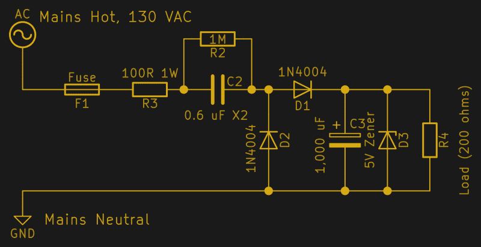
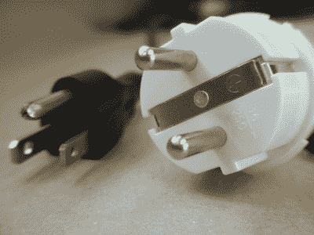
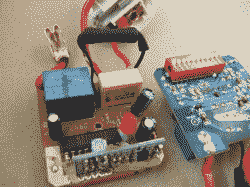
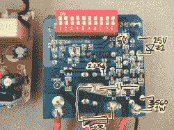
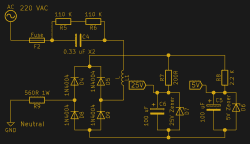
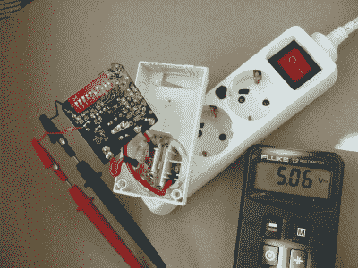

# 无变压器电源令人震惊的真相

> 原文：<https://hackaday.com/2017/04/04/the-shocking-truth-about-transformerless-power-supplies/>

无变压器电源在 Hackaday 上出现了很多，特别是在廉价产品中，变压器的成本会大大增加 BOM。但是，无变压器电源是一把双刃剑。那个标题？不是点击诱饵。如果你不理解它们并采取适当的安全预防措施，在一个无变压器供电的设备中摸索会使你的示波器变成一堆冒烟的东西或使你触电。

但这不是恐怖片。无变压器设计在其适当的位置非常棒，有一天你可能会遇到一个，因为它们出现在从 LED 灯泡到物联网 WiFi 开关的所有东西中。我们将看看它们是如何工作的，以及如何安全地设计和使用它们，因为你永远不知道什么时候你可能会想要侵入其中一个。

有趣的是:无变压器电源只有在整个设备可以封闭并且没有人会意外接触到它的任何部分的情况下才能安全使用。这意味着没有物理电气连接进出——射频和红外是公平的游戏。当你用它工作时，你必须知道电路的任何部分都可能处于电源电压。现在继续阅读，看看为什么！

## 原则

无变压器电源(TPS)基本上只是一个[分压器](https://en.wikipedia.org/wiki/Voltage_divider)，它从您的墙上获取 115 或 220 VAC，并将其分压到您想要的任何电压。如果这个电压需要 DC，它通过几个二极管被[整流](https://en.wikipedia.org/wiki/Rectifier#Single-phase_rectifiers)，并且可能被调节到最大电压，但是我们一会儿就会谈到这个。

 通常情况下，DC 分压器是由一对电阻组成的。二者共同决定流经路径的电流，然后可以选择顶部电阻来降低输入电压与所需输出之间的差异。在我们的例子中，如果电压差是一两百伏，即使只需要通过几十毫安，电阻也会很快变热。

在分压器的顶部使用一个更好的元件是一个电容器，选择它的电抗，以在你居住的任何电源频率下给出期望的“电阻”。例如，假设您需要 25 毫安的 5 V 输出，而您在美国，需要降低 110 V，R = V / I = 4，400ω。用一个电容的[电抗，那就是 C = 1 / (2 * pi * 60 Hz * 4400) = 0.6 μF，如果需要更大的电流，就用更大的电容，反之亦然。就这么简单！](https://en.wikipedia.org/wiki/Electrical_reactance#Capacitive_reactance)

一个完整的 TPS 设计需要更多的部件。为了安全起见，并且为了限制浪涌电流，在输入端使用保险丝和 1 瓦限流电阻是一个好主意。与电抗电容器并联的大值放电电阻器将防止它在电路被拔掉时保持其高电压并电击你。

说到这个电容，它是电路的一个安全关键部分。它承受持续的高交流电压，如果它短路，“5 V”输出处于电源电压，部件可能会着火。这是一个 [X 级电容](https://en.wikipedia.org/wiki/Capacitor_types#Class_X_and_Class_Y_capacitors)的工作。你会看到它们大多标有 X1 或 X2，X1 能够承受更高的电压尖峰。任何一个都可以，只是要确保它的额定 X 和你的电源电压水平指定。

经过电容后，通过的交流电需要整流成 DC。一个普通的半波或全波整流器将在这里工作:几个二极管和一个大值平滑电容器。如果负载不稳定，您可能需要用齐纳二极管限制电容的最大电压，这样当负载消耗的电流低于我们设计的 25 毫安时，多余的电流就会分流到地。这些器件只看到低电压，所以这里没有特殊要求。

最后，请注意，该电路有多种可能的配置。除了降低火线和我们的设备之间的大部分电压之外，还可以将我们的设备直接连接到火线，电容位于分压器的下脚，这是一个上下颠倒的电路。当然，保险丝和安全电阻可以位于电路中的任何位置。但基本原理是一样的:电容器充当分压器的一条腿，然后是一些整流和调节，负载充当另一条腿。

## 穆夫里定律

TPS 电路的一大注意事项是*必须*隔离。对于一个[独立物联网开关](http://hackaday.com/2015/04/19/switch-mains-power-with-an-esp8266/)或 [DIY 调光器](http://hackaday.com/2017/01/08/light-dimmer-shows-how-to-steal-power-from-ac-line/)来说，这完全没问题。TPS 非常适合无线电或红外控制。LED 灯泡内部都使用 TPSs，因为它们便宜而且完全密封。但是，如果你想接触这个电路的任何部分，或者将任何信号线插入其中，你应该考虑变压器。

 为什么要完全隔离？请注意，作为电路接地参考的电线与您家中的中性线相同(与“火线”相对)。现在想象一下错误地把插头插反了。地面是热的，虽然由于交流是对称的，该设备工作正常，但如果您接触到“地面”，就会有触电的危险。把一个 USB 串行连接器插到这个设备上，你就通过“地线”把你的笔记本电脑烧掉了。所以第一道防线就是用不能插错的两极插头。如果你住在欧洲，这可能不是一个选项。

但是即使是极化插头也是不够的。一些老房子(包括我们在 DC 华盛顿住过的一套公寓)的中性线和热线颠倒了。再说一次，你永远不会注意到，直到你同时触摸“中性”和真实地面，但当你这样做时，它可能是致命的。你可以，或许应该，现在就用万用表测试一下。当以地为参考时，零线应低于交流电压，而火线读数为 115 或 220 交流电压。对照[您当地的插头类型](https://en.wikipedia.org/wiki/AC_power_plugs_and_sockets)进行检查。

无论如何，即使你把插头的极性弄对了，你墙上插座的中性线和地线还是有区别的。美国和欧盟的法规规定，零线是载流线，正常情况下，地线不应载流。接地故障电路中断器 (GFCI)在实践中强制执行。尽管如此，你家其他地方的高负载加上线路中不可忽略的电阻会在中性线上产生一些`V=IR`电压。服务变压器上的不平衡将进入你家的电力“相”分开，也可能将中性电压拉离地面，这取决于它的接地位置。简而言之，空档*应该在接地附近，但这并不保证。*

绝对安全使用这个电路的唯一方法是永远不要接触它。把它放在一个不导电的盒子里，或者一个连接到大地安全接地的金属盒子里。如果它插反了，或者中性线变热了，没有人会受伤。这就是专业人士的工作。

这个电路还会出什么问题？我们选择的电抗电容在 50 或 60 Hz 时具有合适的电阻，但在较高频率时电阻较小。如果你家里的某个地方有高频开关设备，它们可能会将意想不到的电流推过你的 TPS。例如，快速的电力线尖峰会直接通过，阻尼它们是输入电阻的一个原因。雷击？Blammo！还有什么可能出错的吗？给我们留言吧！(但不要提 Muphry。)

基于变压器的电源会比同等的 TPS 稍微贵一点，大一点。但是如果你不能完全封闭设备，或者你不能绝对保证输入电源的极性，你就不能安全地使用 TPS。对于个人日常使用，我会一直选择开关模式电源或壁式电源。与墙壁进行电流隔离难道不值得花几美元吗？

## 让我们拆开一个

另一方面，TPS 存在于我们喜欢入侵的各种设备中，所以你需要在现实生活中识别它们。寻找保险丝或大 X1 或 X2 额定电容器，你会在正确的轨道上。(它有并联的泄放电阻吗？如果没有，可能会热。)限流电阻器是 X2 帽后面几乎看不见的大陶瓷东西。导火线穿着一件黑色收缩包装的衣服在镇上过夜。

接下来，找到整流部分——这款廉价的 RF 墙壁开关中有一个四二极管全波整流器和一个 100 μF 电容。二极管指向正极 DC 轨，远离负极。

现在看看齐纳二极管。在这种 RF 控制开关的情况下，有两个:用于激活继电器的 25 V 齐纳二极管，以及为 IC 和无线电电路供电的 5 V 齐纳二极管。这是 TPS 电路的一个便利特性。因为只要 DC 电压不超过交流峰值，电容就会通过一些电流，所以只要选择正确的齐纳二极管，几乎可以从同一电路中获得任何或多个电压。

## 玩火

你会想尽可能避免在启动的 TPS 上工作，但是有*种*种方式让[安全地完成](http://hackaday.com/2016/05/16/looking-mains-voltage-in-the-eye-and-surviving-part-2/)。这是隔离变压器的一个主要例子，它本质上是将变压器插入到它所缺少的电路中。在你的电路中仍然有一对 115 或 220 伏的电线，但至少有了变压器，你就可以把示波器连接到设备上了。

Jackpot!

没有隔离变压器，你可以用电池供电(非接地)万用表做很多事情。将 TPS 设备插入带开关的延长线，并尽可能长时间关闭开关。读取读数:拔掉 TPS，在你想测量的地方粘上焊接线，把这些连接到你的万用表上，退后，打开电源板。一旦你读完了，关掉它，等一会儿再触摸任何东西。

TPS 中可以保持电荷的部分是电抗电容，这就是为什么它应该有一个分压电阻。在我们的示例电路中，0.6μF * 1mω= 0.6 秒，在接触任何东西之前，您可能需要等待至少 5 个这样的时间常数，所以数到 3。RF 开关旁路一个 220kω的 0.33 μF 电容，因此更安全、更快速。(它还使用两个串联的 SMT 电阻，大概是因为其中任何一个单独的额定电压都不够。智能设计。)

你可以通过相对于墙上插座的接地针来测量电路的哪个部分处于什么电压。例如，利用回路中的 560ω安全电阻，RF 开关的“地”实际上比大地高出约 12 VAC。这是打探的时候值得了解的。再次，连接你的探针，退后，打开，读取，关闭，等待。

这就是全部了。现在，您可以计算出设备中的电压，并为自己的目的劫持它们。只要确保无论你做什么，它都放回它漂亮的盒子里。因为尽管胎压传感器无处不在，体积小，价格便宜，但它们有潜在的(嘻嘻！)烫到不能碰。