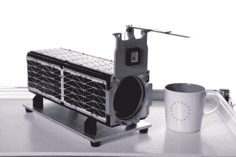
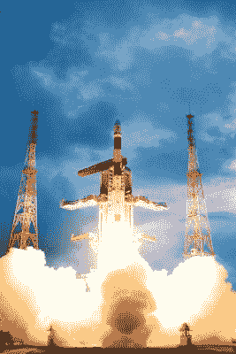
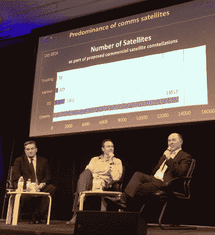

# 最小的发射器战争

> 原文：<https://hackaday.com/2017/02/09/the-smallsat-launcher-war/>

在过去十年左右的时间里,“小卫星”的定义已经从最初的立方体卫星设计规范扩展到 50 或 100 公斤的卫星。如今，“小卫星”的定义更多的是围绕成本，有时是所用的技术，而不是进入轨道的盒子的大小和形状。

现在有超过 50 家公司在研发运载火箭，致力于将这些小型卫星送入轨道，虽然没有人真的期望所有这些卫星能在未来几年存活下来，但这将是发射器市场的一个有趣时期。因为我有一种潜在的怀疑，杰夫·贝索斯[的声明](https://thescene.com/watch/vanityfair/the-new-establishment-summit-the-power-of-jeff-bezos)“立方体卫星没什么意思”很可能变成 21 世纪的“没人需要超过 640kb”，而且有可能每个人都错了，有多少发射公司将长期生存下去。

### 建造更小的卫星

小型卫星制造商比老牌航空航天公司使用了更多的现成技术。虽然这不可避免地意味着更多的在轨故障，但小型卫星的生产成本比传统尺寸的有效载荷低得多，这实际上是一种可以接受的权衡。现成的技术也意味着建造卫星的门槛大大降低，开发时间也大大缩短。

Planet Labs [Dove 2 Satellite](https://www.planet.com/pulse/dove2/)

在一个通常需要几十年来建造和发射一颗卫星的行业中，像[行星实验室](https://www.planet.com/)这样的“新空间”公司从一个车库开始，[在五年内建造了一个由 150 多颗地球观测卫星组成的星座](https://www.itu.int/en/ITU-R/space/workshops/2015-prague-small-sat/Presentations/Planet-Labs-Safyan.pdf)，这是一个严重的破坏。

当行星实验室的 26 颗“鸽子”小卫星在 2014 年 10 月被摧毁时，随着 Antares Orb-3 任务的[失败，该公司建造了几颗替换卫星，并在短短九天内测试并交付给美国宇航局。这些卫星于 2015 年 1 月由 SpaceX 猎鹰 9 号成功发射。这种周转时间是行业突破，如何购买和销售发射的模式将不得不改变，以适应在更短的时间内建立的有效载荷。大多数传统运营商向地球同步轨道发射所使用的从合同到发射的典型的两到三年时间线对大多数新的航天公司来说是行不通的。](http://www.universetoday.com/116639/antares-orb-3-rocket-explosion-and-frightening-incineration-captured-by-up-close-launch-pad-videosphotos-pt-2/)

### 提高发射器的可用性

Launch of a PSLV [by the Indian Space Research Organization](http://dos.gov.in/pslv-c11-chandrayaan-1/pslv-c11-chandrayaan-1-gallery). The PSLV is [scheduled to launch 104 satellites](http://tech.firstpost.com/news-analysis/isros-mid-february-pslv-c37-launch-of-104-satellites-to-have-88-satellites-from-planet-labs-360922.html) on 15th Feb, 88 of them will belong to Planet Labs.

最近在中型和重型运载火箭上的低成本搭载机会的可用性吸引了数量迅速增长的小型卫星有效载荷。但是现在，大多数(如果不是全部的话)小型卫星是作为更大、更昂贵的卫星的辅助有效载荷发射的。

那些重型发射器上仍然有未使用的容量，所以问题绝对不是发射可用性，至少现在不是。对于大多数小型卫星制造商来说，问题是[发射是否会如期进行](http://spacenews.com/spire-deploys-four-satellites-from-cygnus/#sthash.LdfW8bfF.dpuf)，以及有效载荷最终轨道的有限选择。

然而，虽然发射可用性现在不是一个问题，但随着猎鹰 9 号第二有效载荷机会的可用性枯竭，它很可能很快成为一个问题。就在两年多前，埃隆·马斯克走上舞台，[宣布 SpaceX 将在西雅图开设一个办公室](https://www.youtube.com/watch?v=AHeZHyOnsm4)，专门设计和建造 4000 颗小型卫星，这些卫星将组成一个低地球轨道星座，为地球上的任何地方提供互联网连接，[将提供资金](http://www.wsj.com/articles/exclusive-peek-at-spacex-data-shows-loss-in-2015-heavy-expectations-for-nascent-internet-service-1484316455)支持 SpaceX 的核心任务，前往火星。

### 构建卫星星座

你可能会说卫星宽带已经存在，而且[并不是特别有利可图](http://www.airspacemag.com/space/the-rise-and-fall-and-rise-of-iridium-5615034/)。你说得对。它是，也不是。但是马斯克正在建造的卫星星座有些不同。目前的卫星网络是基于高地球轨道上的地球静止卫星，相应地通信延迟较长，往返延迟约为 600 毫秒。相比之下，马斯克的卫星星座将位于更低的轨道上，高度范围为 715 英里至 823 英里，延迟时间为 25 至 35 毫秒，与现有的地面网络类似。

Keynote at the 2017 SmallSat Symposium shows a projection of constellations put into orbit. This photo was [tweeted by Erik Franks](https://twitter.com/erikjfranks/status/829049193968783361/photo/1)

马斯克预计，虽然大多数人的“最后一英里”连接仍将是光纤，但 SpaceX 卫星将能够处理 50%的全球回程容量，他们实际上希望获得大部分流量。

你可能会说这很疯狂，但马斯克和 SpaceX 并不孤单。他们甚至不是第一个。OneWeb 同样提出了一个由大约 700 颗卫星组成的星座，虽然他们的方法略有不同，但他们也在追逐有利可图的回程市场。他们购买的 [21 号联盟号运载火箭](https://spaceflightnow.com/2015/07/01/oneweb-launch-deal-called-largest-commercial-rocket-buy-in-history/)将他们的星座送入轨道，被称为“历史上最大的商业火箭购买”

如果他们或 SpaceX 成功了，你的互联网连接可能会在你不知情的情况下通过他们的卫星传输。

### 我们今天要去太空吗？

虽然过去几年里发布了很多产品，也进行了很多测试，但很少有产品上市。但这种情况即将改变。去年年底，火箭实验室[宣布他们在纽西兰](https://www.rocketlabusa.com/latest/rocket-lab-launch-complex-1-ready-for-launches/)[马希亚半岛](https://en.wikipedia.org/wiki/Mahia_Peninsula)建造的发射中心竣工。该公司的两级[电子火箭](https://www.rocketlabusa.com/electron/)设计用于携带高达 330 磅(150 公斤)的有效载荷，它们[将于今年年初进行试飞](https://www.rocketlabusa.com/latest/rocket-lab-completes-final-major-technical-milestone-before-first-test-launches/)，商业发射将于第二季度开始。电子的一次专门发射价格约为 550 万美元，1U 立方体卫星的轨道价格约为 50，000 美元至 500 公里的太阳同步轨道。

随着四家，可能是五家公司寻求在今年进行首次发射，包括火箭实验室和维珍银河的发射装置一号，争夺第一的竞争正在升温。至少目前，火箭实验室看起来正在赢得成为第一个商业小型卫星发射器的竞赛。尽管他们仍然面临着激烈的竞争，而且不仅仅是在日程安排上。随着商业小型卫星发射公司[从中国](http://spacenews.com/new-chinese-commercial-launch-company-advertises-high-launch-rate-low-price/)进入市场，定价也面临压力，1U 立方体卫星的轨道价格可能会降至 10，000 美元左右。

### 下一站，月球？

> 舒尔茨( [@ulalaunch](https://twitter.com/ulalaunch?ref_src=twsrc%5Etfw) ):“我们看到了 cis-lunar 机会的更大市场。” [#SmallSat17](https://twitter.com/hashtag/SmallSat17?src=hash&ref_src=twsrc%5Etfw) @SmallSatBiz
> 
> — Collin Krum (@collinkrum) [February 7, 2017](https://twitter.com/collinkrum/status/829091801344544769?ref_src=twsrc%5Etfw)

在拥有安全发射合同的五个谷歌月球 X 奖决赛选手中，有两个将作为主要有效载荷搭载在新一代小型卫星发射器上。唯一进入决赛的美国团队 [Moon Express](http://www.moonexpress.com/) ，已经与火箭实验室签署了世界上第一份多任务月球发射合同，用于 3 次月球任务。第一枚计划在今年晚些时候发射，是新电子火箭的首批发射之一。

无论接下来的一年或两年发生什么，对于新的发射公司和想要跟随他们的小型卫星制造商来说，都是成败的关键。如果他们成功了，发射你自己的太空计划的价格将会大幅下降，并使拥有你自己的卫星的成本与购买一辆中档汽车的成本持平。在这一点上，可能有很多人在阅读这篇文章时会认为拥有一颗卫星比拥有一辆汽车更酷。