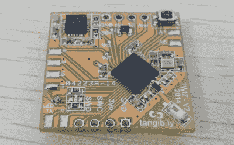
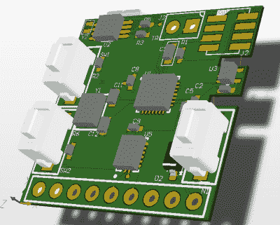
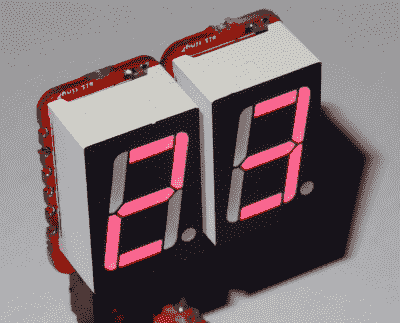

# 方寸项目挑战你的布局技巧

> 原文：<https://hackaday.com/2015/10/02/the-square-inch-project-challenges-your-layout-skills/>

 [ [ alpha_ninja ](https://hackaday.io/alphaninja) ]证明了 Hackaday.io 不仅仅是伟大的项目，而是一个令人敬畏的社区。在过去的一周里，[alpha_ninja]创建了[平方英寸项目](https://hackaday.io/project/7813)，这是一个草根竞赛。[竞赛规则](https://hackaday.io/project/7813-the-square-inch-project/log/25979-rules)非常简单:项目 PCB 必须适合 1”x 1”的正方形。对于不使用自由单位的人来说，这是 2.54 厘米。小于一平方英寸也可以。如果项目有多个 PCB，如积木模块，所有的 PCB 必须仍然适合 1”x 1”的正方形。Hackaday.io 用户想出了很酷的竞赛创意，并邀请每个人都来尝试获胜？厉害！

比赛当然要有奖品。[Alpha_ninja]已经为 Osh park 准备了 100 美元的礼券。非常感谢[Laen]和 OSHPark 全体工作人员赞助了这次比赛。Hackaday 喜欢这个想法，所以我们还向 Hackaday 商店提供了八张价值 50 美元的礼券，向 OSHPark 提供了四张价值 25 美元的礼券。

虽然竞赛开始还不到一周，但平方英寸项目已经有了一些很棒的参赛作品。

【Drix】已进入 [Twiz](https://hackaday.io/project/7121) ，9 自由度惯性测量单元(IMU)带蓝牙低能量(BLE)连接。Twiz 通过 MPU9150 IMU 芯片感知环境。nRF51822 提供蓝牙连接和 ARM Cortex-M0 处理器。把这些放在一起，你就有了一个很好的方法来确定一个物体在空间的位置。[Drix]已经使用 Twiz 来控制从全息投影仪到房间灯的一切。竞赛对[Drix]来说并不新鲜，他已经让 Twiz 参加了 2015 年 Hackaday 奖。

 【威斯特肯】已进入[微型 DIY Lipo 复古 NumiTron 时钟](https://hackaday.io/project/7881)。喜欢经典的 IV-9 俄罗斯 numitron 电子管。他的计划是建造一个由 ATmega328 微控制器驱动的 numitron 时钟。这个时钟的时基也是一个经典 Dallas Semiconductor(现在的 Maxim) DS1307 I2C 实时时钟芯片。一切都将在一个脂肪细胞上运行。在项目限制范围内，板将只有 1 英寸见方。这是[WeisTekEng]在 Hackaday.io 上的第一个大项目，所以我们很高兴看到他加入这个社区。他也只是刚刚开始，所以 PCB 的只存在于他的 EDA 软件的虚拟世界中。我们期待着阅读 numitron 时钟！

【Al1】已进入 tiny7，一个兼容 Atmel ISP 头的 7 段显示器。注意到 Arduino 上的 6 针插头了吗？那是 ISP 连接器，用来给 ATmega328 微处理器编程。在许多设计中，这些宝贵的 IO 引脚大部分时间都没有使用。[Al1]决定给他们一个目的——显示数据！他将 75HC595 移位寄存器连接到 ISP 接头的 SPI 引脚。输入 595 的数据显示在 7 段显示屏上。[Al1]设计了侧面带有齿形连接的电路板。一些仔细的焊接允许电路板菊花链。几个 7 段显示器由一个 ISP 头驱动。

 【拉多米尔·多皮耶拉斯基】也将平方英寸项目作为一个学习平台。他正在进入 [Nyan 板](https://hackaday.io/project/7860)，一个小 PCB，形状像每个人都喜欢的彩虹便便猫。[Radomir]正在使用 nyan 板学习如何使用 ATtiny 微控制器。由于内存限制，这些小控制器比它们的大兄弟更难编程。[Radomir]Nyan 的早期目标是谦逊的——当它演奏 Nyan Cat 曲调时，他会很高兴看到猫的眼睛闪烁。一旦这项任务完成，ATtiny 微控制器的 RAM 和 Flash 将成为他唯一的限制。

比赛截止日期是 2015 年 11 月 28 日，所以还有很多时间可以参加。如果你想看到更多的参赛者，请查看[平方英寸项目页面](https://hackaday.io/project/7813)，或者[参赛者名单](https://hackaday.io/list/7909)。想了解更多？在项目页面提问，或者给[Alpha_Ninja]留言！

这就是本周的 Hacklet，一如既往，下周见。同样的黑客时间，同样的黑客频道，带给你最好的 [Hackaday.io](https://hackaday.io/) ！