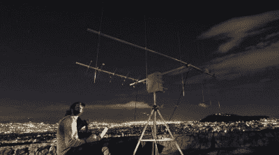
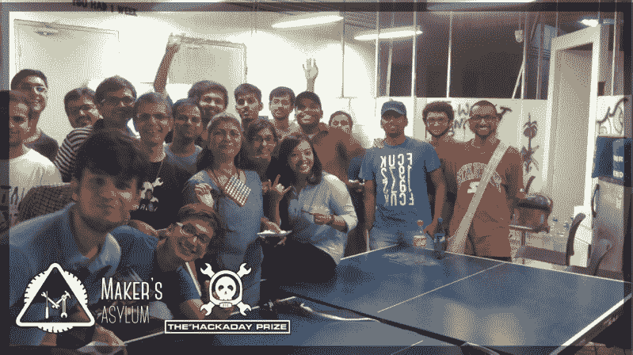
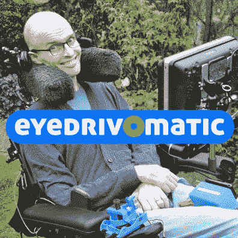
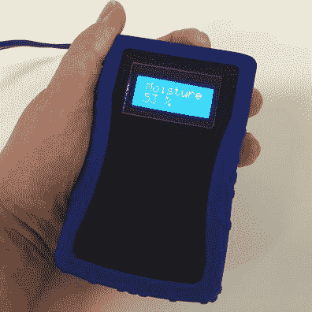

# 2015 年黑客日奖的故事

> 原文：<https://hackaday.com/2015/11/19/the-story-of-the-2015-hackaday-prize/>

本周我们报道了 2015 年黑客日大奖的大奖和最佳产品得主: [Eyedrivomatic](http://hackaday.com/2015/11/17/the-gaze-controlled-wheelchair-that-won-the-hackaday-prize/) 和 [Vinduino](http://hackaday.com/2015/11/18/water-saving-agricultural-system-wins-best-product/) 。这些都是令人惊叹和有价值的项目，但 Hackaday 奖的真实故事与奖项无关:它是关于才华横溢的人们为共同利益而工作的九个月。

如果你没有机会参加 Hackaday 超级大会，这里是仪式的视频。让我们来看看在 300 多名与会者面前的演讲。休息之后，请加入我们，回顾过去令人惊叹的九个月。

 [https://www.youtube.com/embed/PlLNg3vX2z8?version=3&rel=1&showsearch=0&showinfo=1&iv_load_policy=1&fs=1&hl=en-US&autohide=2&wmode=transparent](https://www.youtube.com/embed/PlLNg3vX2z8?version=3&rel=1&showsearch=0&showinfo=1&iv_load_policy=1&fs=1&hl=en-US&autohide=2&wmode=transparent)

感谢所有参与 2015 年 Hackaday 大奖的人。思考解决问题，使用开放的设计理念来记录和分享想法，以及学习面对面或远程地与他人合作，对这个世界有着深远的影响。这些是明天突破的种子。下一个重大成就可能来自参加 Hackaday 奖的人，或者怀着敬畏之心追随的初露头角的问题解决者。Hackaday 很自豪能够成为这个由黑客、设计师、艺术家和工程师组成的运动的一部分。

### 这个概念

[SatNOGS](https://hackaday.io/project/1340-satnogs-global-network-of-ground-stations) – Global Network of Ground Stations won the 2014 Grand Prize

这是 Hackaday 奖的第二年。从 2014 年 Hackaday 奖出来，我们知道人们对有目的的建设感到兴奋。2014 年的奖项有令人惊叹的 50 名入围者，大奖得主 [SatNOGS](https://hackaday.io/project/1340-satnogs-global-network-of-ground-stations) 讲述了自己的社会公益故事:让卫星数据更广泛地可用。SatNOGS 项目继续存在。他们成立了一个非营利基金会，并将奖金重新投入到该项目中。

SatNOGS 团队树立的这个榜样激励我们展望 2015 年，寻找更多的社会公益。2015 年 Hackaday 奖的目的变成了:*创造有意义的东西*。

Hackaday 社区拥有改善全世界生活的技能和能力。这样做的黑客应该得到认可和奖励。我们试图将不同的大奖作为奖励的一部分；一次马里亚纳海沟的潜艇之旅，一次去南极洲参加研究任务的旅行，以及其他一些想法被抛来抛去。但是最后，有什么比太空旅行更重要呢？

### 发布会

![[Matt], [Sophi], and [Brian] building the Moisture Vaporator during the launch video](img/c2ba41be24a0053466b43b1cef8a6a5a.png)

【Matt】【Sophi】和【Brian】在发布视频期间制作水汽蒸发器

回到 Hackaday 总部，我们必须想出如何最好地宣传这项旨在改变世界的竞赛。可以炫耀的酷东西来自整个社区。因此，我们非常倚重参加 2014 年 Hackaday 奖的每个人的出色工作。但是，我们仍然需要一个核心来启动今年的比赛。我们需要一个视频。

制作视频是一次史诗般的黑客之旅。我们在 2 月初会面了几天，讨论奖项的细节。自然而然地，这变成了租赁相机，建造一个水汽蒸发器道具，并度过了一个有趣而又充满汗水的拍摄日。接招吧，好莱坞！

### 世界巡演

Hackaday Prize Worldwide event [at Maker’s Asylum in Mumbai, India](http://hackaday.com/2015/03/23/hackaday-prize-worldwide-makers-asylum/)

由于 Hackaday 奖不仅是为了获奖，也是为了合作，因此 Hackaday 的工作人员在比赛期间在世界各地举办活动。从硬件展示到研讨会和黑客马拉松，我们与 Hackaday 社区进行了愉快的面对面交流。我们称这些活动为全球黑客日奖，它们分别在芝加哥、孟买、多伦多、纽约、班加罗尔、洛杉矶、深圳、新德里、波士顿、华盛顿、DC、苏黎士、柏林和旧金山举行。

在每一次活动中，我们都试图加入闪电对话，让参与 Hackaday 竞赛的人们展示他们的项目。公开谈论你的创作可以让你从听众的角度思考，这可以突出那些“未知的未知”。与会者通常充满了黑客知识，而不是单向的介绍。面临类似问题的人们伸出援手，结成了伙伴关系。分享想法让黑客们聚在一起。

Hackaday 奖全球巡回赛，更不用说 500，000 美元的奖金包，都是由于颁发 2015 年 Hackaday 奖的 Supplyframe 的支持以及我们的赞助商 Atmel、Freescale、Microchip、Mouser 和德州仪器的慷慨参与才得以实现的。感谢您分享我们通过工程和开放设计让世界变得更美好的愿景。

### 在线社区

世界巡回赛令人惊叹，但并不是每个人在地理位置上都离活动现场足够近，所以我们成立了 Hackaday 有奖频道。Hackaday.io 上的这个实时消息系统主要用于休闲聚会。但是我们每周组织一次机会，让人们在网上闪电谈话中展示他们的项目。

在这些名为“协作室”的在线活动中，我们和其他人一样开心。回过头来看，很多决赛选手都参与了那些环节。[[Antti Lukats](https://hackaday.io/antti)],[迪西](https://hackaday.io/project/6592-dipsy)(最佳产品决赛入围者)的创造者，甚至与 Hackaday 的【Al Williams】共同主持了一场关于可编程逻辑的会议。这个频道仍然存在，现在叫做 HackChat，可以在[的黑客频道](https://hackaday.io/project/5373-hacker-channel)上找到，这是一个很好的休闲聊天或者问一些严肃问题的地方。

### 未来

  Eyedrivomatic – Grand Prize  Vinduino – Best Product

2015 年的 Hackaday 奖非常成功。看看前两名获奖者， [Eyedrivomatic](http://hackaday.com/2015/11/17/the-gaze-controlled-wheelchair-that-won-the-hackaday-prize/) 为四肢瘫痪者和 [Vinduino](http://hackaday.com/2015/11/18/water-saving-agricultural-system-wins-best-product/) 的生活增添了行动自由，这有助于使测量作物灌溉变得简单和负担得起，并使农民能够更好地节约用水。仅这两个项目的潜在影响就令人震惊，但它们是[数百项有价值的努力中的一部分。如果你想要一个有益于世界的黑客，我们有数百个你可以借用和建立。如果你有灵感，Hackaday 奖是成功的。](https://hackaday.io/list/7401-2015-hackaday-prize-quarterfinalists)

Hackaday 奖将在 2016 年再次举办。现在开始计划还为时过早，但我们总是对听取意见感兴趣。你认为明年的挑战应该是什么？你希望 Hackaday 奖走向何方？请在下面的评论中告诉我们。

#### 2015 年[黑客日奖](http://hackaday.io/prize)由以下机构赞助:

