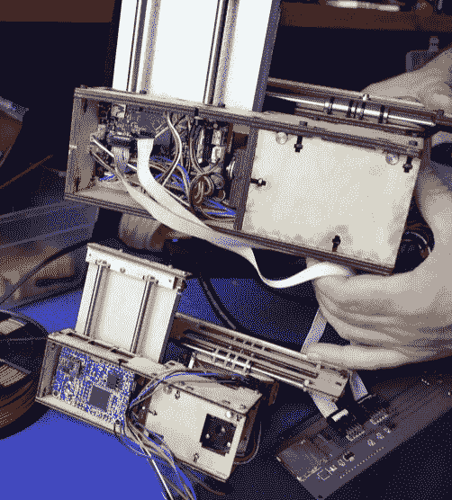
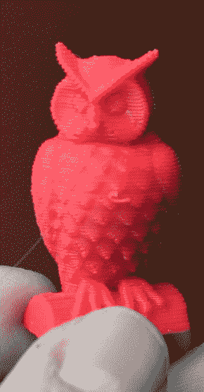
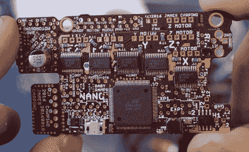
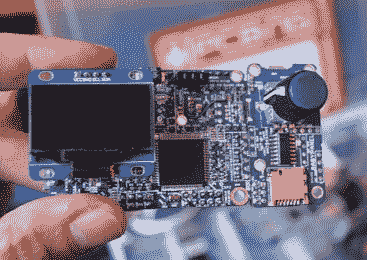
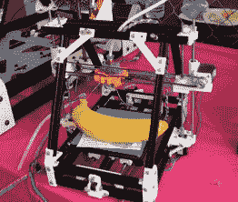
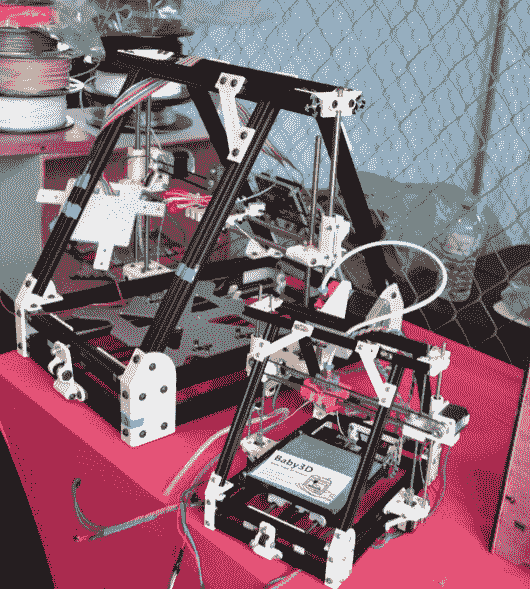
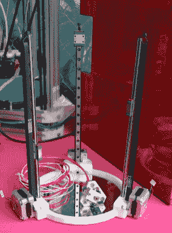
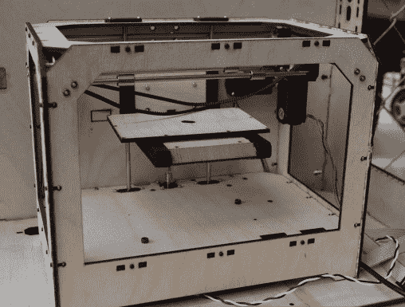

# Maker Faire 的微型 3D 打印机

> 原文：<https://hackaday.com/2016/10/02/the-tiny-3d-printers-of-maker-faire/>

建造一台大型 3D 打印机有其自身的挑战。当然，材料的强度并不是线性的，长轴也有摇摆的趋势。也就是说，制造一个大机器人并不难——步进电机和铝挤压都是为工业制造的，你总是可以得到更大的光束或更强大的电机。[【詹姆斯】往反方向走](http://minirap.com/)。他正在制造小型的半尺寸打印机。它们很小，很可爱，它们有自己的设计挑战。

在今年的纽约 Maker Faire 上，[James]展示了他正在进行的建造小型 3D 打印机的项目。他有一个半比例的木制 Printrbot，一个半比例的 Mendel Max，一个微型 Makerbot 复制器，以及一个婴儿 delta 和婴儿 Ultimaker。

点击休息时间查看画廊，以及更多关于[詹姆斯的]小作品的信息。

                    

微型 3D 打印机的主要设计挑战不是框架或机械结构。您可以随时缩小激光切割零件的尺寸，任何尺寸的皮带都有。问题在于机械和电子设备。NEMA 17 步进电机对这些微型机器来说太大了，你只能做这么小的电子板。

为了解决这些问题，[詹姆斯]正在缩小到 NEMA 8 汽车公司。它们很容易买到，也很贵，扭矩也不大，但它们确实能工作。在其中一次构建过程中，[James]发现正好有两种 NEMA 8 标准具有不同的螺栓孔模式。

RAMPS 或 RAMBO 板只有一种尺寸，所以为了缩小这些打印机的尺寸，[James]不得不建造自己的小型 3D 打印机控制器板。他把一块跳板缩小到只有 50 毫米 x35 毫米。他有几个版本的电子设备，其中一个使用分立 Pololu 驱动器和有机发光二极管/点拨轮显示器。还有另一个使用集成 Allegro 驱动程序的主板，它仅仅比一张邮票大一点，但仍然拥有其更大兄弟的所有功能。

如果不能打印，3D 打印机就没有用，在这方面，这些微型机器表现很好。这些机器打印出来的样片看起来很棒，尽管灯丝轴比机器本身要大。

这是创造性的表现，也是一项比从零开始建造一台普通尺寸的 3D 打印机困难得多的任务。这个展台在 Maker Faire 上并没有吸引很多参观者，但它是一个独特的建筑，体现了 3D 打印机社区的 DIY 精神。