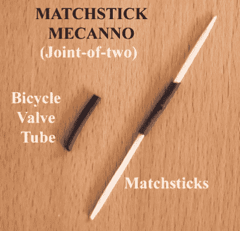

# 玩具制造商

> 原文：<https://hackaday.com/2016/01/22/the-toy-maker/>

世界上很大一部分人仍然使用完全过时的系统来教育他们的孩子。个人选择和兴趣无所谓，死记硬背才是常态。政府学校教育严重不足，教师也不具备传授有用教育的能力，也没有受过这方面的培训。科学教育家 Arvind Gupta 试图通过教孩子们如何组装玩具来改变这种状况。他的 [YouTube 科学和数学教育玩具频道](https://www.youtube.com/user/arvindguptatoys)拥有近 10 万名订户和超过 4400 万的浏览量。太牛逼了。

【Arvind】毕业于印度最好的工程学院之一，位于坎普尔的印度理工学院，并加入塔塔集团的重型车辆厂，帮助制造卡车。他没多久就意识到自己不适合制造卡车。所以他休学一年，参加了一个致力于改变教育体系的乡村科学项目。在每周一次的乡村集市上，他看到了村民们正在出售的有趣的工艺品。一块用作自行车内胎气门芯的橡胶管引起了他的注意。他买了一段长度和几个火柴盒，创造了他所谓的“火柴棍 Meccano”。

那是在 20 世纪 70 年代。从那以后，他一直在印度各地旅行，让孩子们通过制作有趣的玩具来学习。他设计的玩具由普通的原材料制成，可以用最少的资源很容易地制造出来。这些巧妙的 DIY 玩具和活动有助于使数学和科学教育对各级学校的孩子变得有趣。他的所有作品都以开源的精神分享，并通过他的网站和 YouTube 频道提供。他的大量作品已经被翻译成近 20 种语言，欢迎你为这些视频配音。

看看下面的 INK 会议视频，他分享了他对教育的热情，并展示了由垃圾和回收材料制成的简单而有趣的精心设计的玩具。

[https://embed-ssl.ted.com/talks/arvind_gupta_turning_trash_into_toys_for_learning.html](https://embed-ssl.ted.com/talks/arvind_gupta_turning_trash_into_toys_for_learning.html)