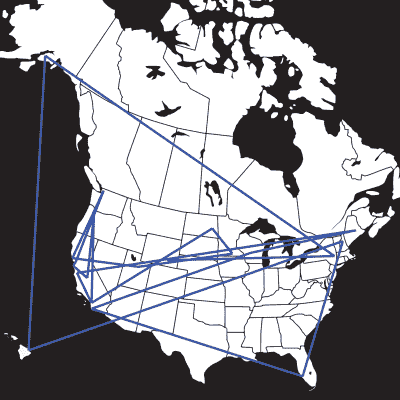

# 旅行黑客箱正在走向国际

> 原文：<https://hackaday.com/2016/11/08/the-travelling-hackerbox-is-going-international/>

在过去的一年里，Hackaday.io 见证了一个不可思议的项目。这是一个随机电子垃圾的移动盒子，[更广为人知的是旅行黑客盒子](https://hackaday.io/project/7373-travelling-hacker-box)。这个移动电子剩余商店背后的想法很简单:收到盒子，拿出一些很酷的电子小发明，添加一些你自己的，然后发送给名单上的下一个人。它是黑客审美最纯粹的表达，全部装在一个纸箱里。

The previous travels of the (second) Traveling Hackerbox

上周，这个旅行黑客盒子出现在黑客日超级大会上，在那里被拆成了碎片。它的硅和塑料内部零件被用于徽章黑客比赛。盒子的主体已经离开了这个世界，但灵魂却永存。零件被收集起来，别针被拉直，防静电包里的东西被压缩，现在是旅行黑客盒子离开巢穴的时候了。它将去邮局递交护照申请，最终前往美国以外的遥远国度。

在过去的一年里，尽管佐治亚州有一些混蛋，旅行黑客箱已经积累了英里。从缅因州到佛罗里达州，从阿拉斯加到夏威夷，Hackerbox 已经将零件分发到数十个实验室和工作站。如果你想了解这个盒子，最后一位获奖者卡尔·史密斯[整理了一份很棒的摘要和照片日志](https://hackaday.io/project/7373/log/47247-hacker-box-visits-north-dakota)，记录了他在这个神奇的盒子里发现的东西。

我一直承诺 Hackerbox 将在行驶 25000 英里(相当于地球赤道的距离)后走向国际。现在，终于是时候了。这正在发生，我正在寻找志愿者来照看这个盒子。

### 事情会如何发展

现在，旅行黑客箱正坐在帕萨迪纳的 Hackaday Overlords 办公室里。下一次旅行将是去加拿大，希望是在温哥华附近，在那里它将最终到达海洋时代。从那里，箱子将运往欧洲(从西向东，可能以俄罗斯为终点)。然后这个箱子将穿越非洲，到达南非，越过印度洋到达澳大利亚。大洋洲的其余地区、东南亚、印度和中国将是下一个，接下来可能是南美和中美。运气好的话，这个旅行黑客盒子将会在明年回到大本营。

当然，这完全取决于有多少 hackaday.io 社区成员愿意接收这个盒子，以及这些人在哪里。如果要领取盒子， ~~[这是报名表](http://nope)~~ *【报名表现已关闭】*。该表格将在下周开放，之后我将查看回复，考虑每一个回复，并计划这次史诗般的环球旅行。

### 盒子的当前状态

旅行黑客箱最初是基于美国邮政服务统一费率箱。因为统一费率箱仅适用于美国目的地，所以箱子的物理表现形式必须改变。至少，这给了我一个机会用包装带层压一个新盒子，并加固纸板的边缘。

这款旅行箱的新主体是一个 12×12×3 英寸(约 5 升)的纸箱，用粘性胶带精心保护和加固。这确实在一定程度上减少了的总体积，因为它需要处理一些不太酷的部件。我向你保证，没有丢失任何有价值的东西，我只是移除了我记得上次看到的更大、更笨重的部件。

下周，当我收到一些提交的国际注册表格时，所有即将到来的旅行都会被计划好。