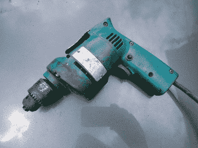
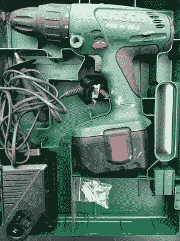
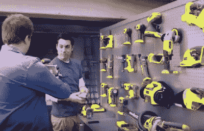
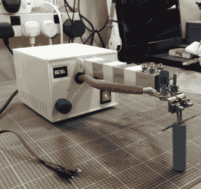

# 无线电动工具的问题

> 原文：<https://hackaday.com/2017/08/07/the-trouble-with-cordless-power-tools/>

如果你在一个小型工程企业周围长大，你可能会对电动工具有所了解。你会看到各种年龄、大小、制造商和技术的产品。例如，当我想到像我父亲一样的铁匠的车间里经常放在手边的电动工具时，我立即看到了一个钻头和一个角磨机。我最先想到的是 Makita 电源驱动的手钻，我记得他在 1976 年买下它来取代他破旧的 Wolf 的那一天，它在过去四十年中提供了非凡的服务，并继续这样做。

41 years of hard use, and still going strong…

当然，牧田不是他唯一拥有的钻头。这些年来，各种不同大小和速度的其他机器人来来去去，对于任何给定的任务，手边总有一个。另一个我想特别指出的是我认为是最近的收购，他几年前买的博世无绳型号。它的大小和功能与 Makita 相似，除了它庞大的电池组，它是一个质量相当不错的工具。

所以，我们有两个钻头，大小相似，质量都很好。一个是上世纪 70 年代中期，另一个是上个十年的末期。一个是非常有用的工具，可以整天钻孔，另一个比镇纸大不了多少。你会问，喇叭裤时代的复古款是镇纸吗？不，不是很旧的博世，因为它的电池组已经失去了容量。由于老化的电池化学成分导致的不可避免的退化使它无法保持足够的电量超过一分钟的使用时间，而曾经是你很乐意拥有的工具现在成了装饰品。

… Not so many years of light use, can’t say the same.

自然，这对于大多数黑客读者来说不会陌生。这些年来，我们都收到了一堆废弃的无线工具，作为作者，我们已经报道了不少使用它们的创造性的黑客技术。它们是电机的有用来源，有时甚至是速度控制器，即使你不想把它们用作工具。

将牧田和博世作为两股电动工具所有权的典范进行比较，我不得不承认对无绳工具的崛起感到不安，并对围绕它们的营销感到厌恶。在将客户转变为无线工具的过程中，制造商找到了一种方法，让他们每隔五年左右从他们那里购买相同的工具，因为他们以前的工具没有任何问题，只是因为它的电池组已经达到了使用寿命。电池组的外形会随着每一代工具的更新而改变，因此客户不能仅仅购买一个新的电池组就离开。对制造商来说是好事，对消费者来说是坏事。

当然，与此同时，营销机器正在全力推动无线工具的便利。令人惊讶的是，这往往集中在那些有问题的电池本身，例如，这些石灰绿色电动工具的制造商有一个广告，宣传一系列具有相同电池的工具。这个想法大概是这样的，五年后，你不仅要因为电池没电而更换电钻，你还要更换所有的工具！

“You might as well take that lot away with you Kevin, I’ll have to replace them all in a few years anyway!”. ([Ryobi TV](https://www.youtube.com/watch?v=uVbLyF65w0o))

当然，尽管没有某种解决方案，但对电动工具内置过时的完全咆哮是没有用的。如果我们要确定一个问题，那么我们也应该提供一些解决问题的方法，至少是对我们硬件黑客和制造商有效的方法，如果不是对更广泛的公众有效的话。

避免无线工具过时的最明显的方法是首先不要买无线工具。仔细想想，你多久会在远离电源插座的地方使用一次电动工具？真的多长时间一次，而不仅仅是假设。如果有可能的话，这种情况不会经常发生，而且在五年后，购买电钻延长线会比购买替换电钻便宜得多。此外还有意想不到的好处，你会忘记如果手柄上没有电池组，电动工具会有多轻。买一个带绳子的工具，就像我爸爸带着他的牧田一样，四十年后你可能还会用到它。

## 修理

但是假设你有一个无线工具，它的电池没电了。你能修理电池吗？你当然可以。你们是黑客日的读者，你们都会意识到，在几乎所有的无绳工具电池中，你会发现一组标准的现成电池连接在一起，在 NiCd 或 NiMh 电池包中有 C 或 D 电池，可能还有 18650 个锂离子电池。如果你能击败你的工具制造商的努力，阻止电池组拆卸，你可以把它们放在你的工作台上，并更换它们。

This is a rather nicely built tab welder [we recently featured](http://hackaday.com/2017/07/18/beautiful-diy-spot-welder-reminds-us-we-love-3d-printing/).

当然，更换电池组中的电池有一个障碍。这不像你的收音机里的弹簧电池盒，每个电池都有点焊的金属条导体连接到它的邻居，你必须想出一种方法来复制它。如果你幸运的话，你会找到可焊接的电池，否则你将不得不考虑使用电池焊机。但是如果你能克服这个障碍，你至少应该能够在不倾家荡产的情况下更新你的细胞。

你不太可能找到一个新的出售 NiCd 电池的工具，但仍然有大量的旧的死包可以找到，往往几乎没有支出。这不是最安全的利用方式，但是有可能通过短时间的高电流脉冲使死亡的 NiCd 细胞恢复活力。该理论认为，金属晶体在电池中生长并使其短路，高电流吹动这些金属晶体，使电池恢复活力。有故事说，这是执行与重型工作台电源，汽车电池，电弧焊机，虽然你可能希望仔细研究，然后再尝试。

最后，谁需要细胞？如果你有一个合适的强大的低压电源，为什么不直接用它来运行你的工具，而忘记电池组呢？当然，你失去了将它作为无线工具运行的能力，但是如果它以非常低的成本来到你身边，那么应该不会有什么困难。如果它是一个 12 V 的工具，尝试一个修改过的 PC 电源，如果不是，则尝试一个铅酸电池。

因此，我们已经超越了我对无线电动工具固有的过时的不公正的咆哮，并确定了我们作为足智多谋的 Hackaday 读者可以从其他电池已达到其生命尽头的人的抛弃物中受益的几种方式。这并没有改变我的个人观点，即我仍然会选择购买带电线的工具，但至少对于那些坚持使用失败的无绳工具的人来说，还有其他方法。你和我一样对这个话题感兴趣吗？