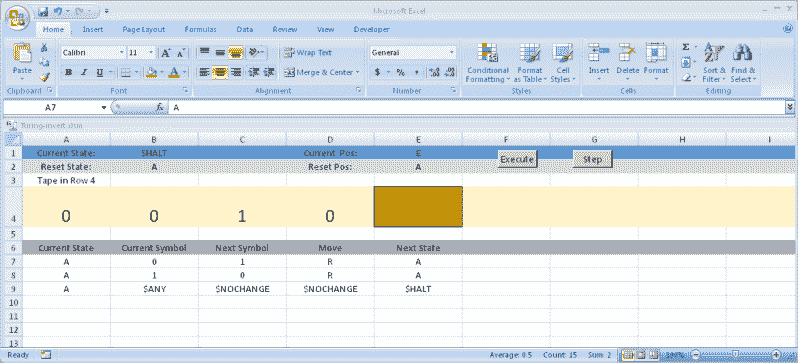

# 图灵磁带

> 原文：<https://hackaday.com/2016/08/18/the-turing-tapes/>

最近的电影《模仿游戏》让[艾伦·图灵]在非计算机类型中获得了一些当之无愧的名声(尽管那部电影的[历史准确性](https://ursulawrites.blogspot.co.uk/2014/12/the-imitation-game-or-inventing-things.html?m=1)很差，充其量；电影中的[和现实中的](http://www.slate.com/blogs/browbeat/2014/12/03/the_imitation_game_fact_vs_fiction_how_true_the_new_movie_is_to_alan_turing.html?wpsrc=sh_all_dt_tw_top)有过几次比较。然而，对于计算机行业的人来说，图灵不仅仅因为帮助破解了“谜”而出名。他在计算方面的理论工作导致了图灵机的出现，图灵机仍然是以数学方式对计算机进行推理的一个重要概念。他还为我们今天认为理所当然的存储程序计算机奠定了基础。

## 什么是图灵机？

图灵机看似简单，像许多数学模型一样，非常不切实际。首先是不实用，机器包括一个无限长的纸带。有一个磁头可以在磁带的某个位置读写任何符号，磁带可以向左或向右移动。请记住，头部可以将一个符号写在另一个符号上，所以这是另一个实际困难，尽管不是不可克服的困难。另一个问题是这个符号可以是任何东西:一个字母，一个数字，一个扳手，或者一串点。同样，也不是不可能，但是在实际的硬件实现中很难做到。

不过，先把这个放一放。机器还具有当前状态和将指示机器操作的有限动作表。表格中的每一行都包含一个当前状态和一个当前符号。与当前状态和当前符号匹配的行将指导机器的动作。如果磁带向左或向右移动一步，则该行的其余部分包含要打印在磁带上的符号(可以与当前符号相同)，以及新状态(当然可以与当前状态相同)。

你可能想知道这是如何构成一台实用的计算机的。好吧，实际可能有点多，但你可以做任意的任务，尽管有时即使是简单的任务也要花很多时间。例如，这里有一个非常简单的机器，它在磁带上打印 001:

| 初速电流状态 | 当前符号 | 下一个符号 | 移动 | 次状态 |
| --- | --- | --- | --- | --- |
| A | 任何美元 | Zero | 对吧 | B |
| B | 任何美元 | Zero | 对吧 | C |
| C | 任何美元 | one | 对吧 | $暂停 |

机器从状态 A 开始，在状态$HALT 结束。$ANY 关键字匹配任何符号。下面是一个更有趣的反转二进制数的例子:

| 初速电流状态 | 当前符号 | 下一个符号 | 移动 | 次状态 |
| --- | --- | --- | --- | --- |
| A | Zero | one | 对吧 | A |
| A | one | Zero | 对吧 | A |
| A | 任何美元 | 再加一块钱 | 再加一块钱 | $暂停 |

在这种情况下，只有一种状态。任何 0 都变成 1，任何 1 都变成 0。第一个既不是 0 也不是 1 的符号停止操作。

## 在野外

尽管你不能用一个无限长的磁带和真正图灵机的所有其他不切实际的东西来建造一个真正的机器，但这并不能阻止像[Mike Davey]这样的人建造足够好的实用机器。你可以在下面看到这台机器的视频。

 [https://www.youtube.com/embed/E3keLeMwfHY?version=3&rel=1&showsearch=0&showinfo=1&iv_load_policy=1&fs=1&hl=en-US&autohide=2&wmode=transparent](https://www.youtube.com/embed/E3keLeMwfHY?version=3&rel=1&showsearch=0&showinfo=1&iv_load_policy=1&fs=1&hl=en-US&autohide=2&wmode=transparent)

显然，[迈克的]机器实际上是艺术。如果你没有那么大的野心但非常有耐心，你可以试着用乐高积木[建造一个。](https://legoofdoom.blogspot.com/)

 [https://www.youtube.com/embed/cYw2ewoO6c4?version=3&rel=1&showsearch=0&showinfo=1&iv_load_policy=1&fs=1&hl=en-US&autohide=2&wmode=transparent](https://www.youtube.com/embed/cYw2ewoO6c4?version=3&rel=1&showsearch=0&showinfo=1&iv_load_policy=1&fs=1&hl=en-US&autohide=2&wmode=transparent)

## 普遍的

你可以用合适的磁带和表格构建许多东西，并且用数学方法对它们进行推理比试图对一台成熟的计算机进行推理更容易——事实上这就是思维实验的要点。关键在于:构建一台通用的图灵机是可能的。也就是从磁带上读取任意图灵机描述并进行模拟的机器。你可以争辩说，这样的机器构成了现代存储程序计算机的基础。

## 轮到你了

如果你想用图灵机做实验，你不必求助于乐高积木或大型硬件构建。你可以在网上找到[模拟器](http://morphett.info/turing/turing.html)。此外，我整理了一些 [Excel 电子表格](https://github.com/wd5gnr/ExcelTuring)，它们实现了一个你可以在 GitHub 上找到的图灵机。请确保在加载电子表格后启用宏。你可以看到下面的一个电子表格。

最上面一行允许您设置当前状态和磁带位置(磁带上突出显示的块)。也可以使用控制按钮(右边有两个复位按钮，图中看不到)。当然，你可以编辑磁带，状态表在底部。您可以使用“步进”按钮运行一个周期，或使用“执行”按钮连续运行。一定要保存，因为如果你按下 Execute 并陷入一个死循环，就很难停下来(Control+Break 应该可以做到，但并不总是这样)。

我们最近看了一个非常时髦的图灵版本。你可以在下面看到这台机器运行的视频。

 [https://www.youtube.com/embed/OBOIi9VjSJY?version=3&rel=1&showsearch=0&showinfo=1&iv_load_policy=1&fs=1&hl=en-US&autohide=2&wmode=transparent](https://www.youtube.com/embed/OBOIi9VjSJY?version=3&rel=1&showsearch=0&showinfo=1&iv_load_policy=1&fs=1&hl=en-US&autohide=2&wmode=transparent)

