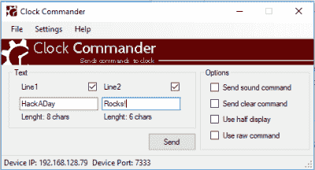

# 你可以通过局域网控制的网络时钟

> 原文：<https://hackaday.com/2017/10/22/the-web-clock-you-can-control-over-a-lan/>

不是每个项目都是为了解决一个新问题。一些项目可能是现有解决方案的扩展，只是为了锻炼极客的肌肉。[limbo]的一个这样的项目是[网络时钟 2.0](http://www.instructables.com/id/Web-Clock-Version-20/) ，这是一个连接互联网的时钟。

是的，它使用了配备 ESP-12F (ESP8266)的 WEMOS D1 mini，并且是的，它使用了带有 I2C 模块的 LCD 来连接两者。该系统的工作原理是连接到谷歌服务器获取 GMT，然后对其进行偏移以计算当地时间。它还有每小时唠叨的钟声，让你知道你生命中又一个宝贵的小时过去了，你需要设置它。

[ limbo]在传统功能的基础上增加了一个局域网应用程序，可以向液晶显示器发送定制信息。这款软件名为“时钟指挥器”，可以作为 Windows 二进制文件下载，源代码目前还不可用。只需将它指向正确的 IP 地址，然后你就可以向它发送显示内容和控制声音的命令。该项目带有 Lua 脚本和如何 DIY 的指令。

我们想象这可以用来创建一个定制的极客桌面时钟或破解一个数字 coo-coo 时钟，让你的同事在按下按钮时疯狂。对于那些正在寻找激光的人来说，看看[激光指针时钟](https://hackaday.com/2016/11/04/laser-pointer-clock-makes-timekeeping-a-drawn-out-affair/)更具挑战性。

 [https://www.youtube.com/embed/QB5Ilf7pwrM?version=3&rel=1&showsearch=0&showinfo=1&iv_load_policy=1&fs=1&hl=en-US&autohide=2&wmode=transparent](https://www.youtube.com/embed/QB5Ilf7pwrM?version=3&rel=1&showsearch=0&showinfo=1&iv_load_policy=1&fs=1&hl=en-US&autohide=2&wmode=transparent)

