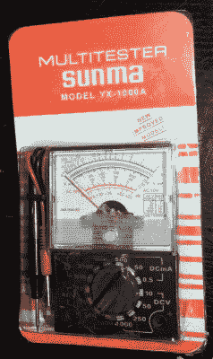
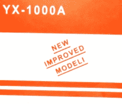
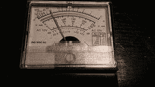
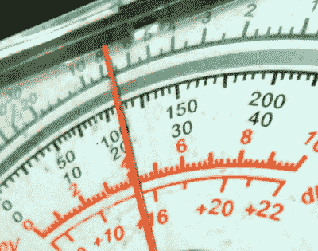
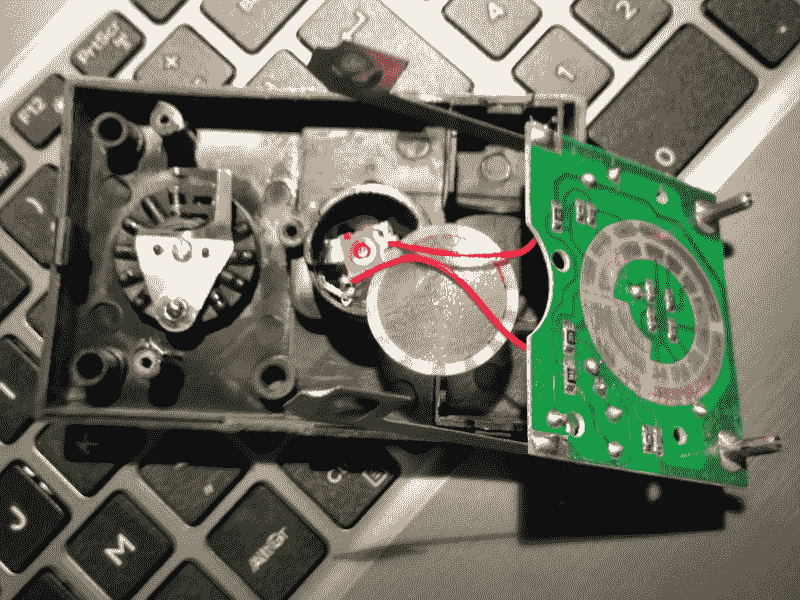

# 你尝试过的最糟糕的测试设备

> 原文：<https://hackaday.com/2017/11/28/the-worst-piece-of-test-equipment-youve-got-to-try-hacking/>

A brand new meter in its blister pack

我对来自中国的各种电子产品和其他制成品的在线供应商非常着迷。这里列出了来自深圳或其他地方的最新奇观，你可以以令人惊讶的合理价格买到，只是要等三个星期才能拿到邮费。

我的一个特别爱好是寻找市场的底部。一旦我选择了我要订购的商品，我会先用低价搜索，看看几美元能买到什么。是的，我喜欢发现绝对的垃圾，因为有时候这样你就能发现一颗未经雕琢的钻石。

因此，当我最近购买万用表时，我快速浏览了一下，看看那个供应商最便宜的型号是什么。大约 2.50 美元或 3 美元多一点，我就可以拥有一个小型袖珍模拟万用表，那种“我的第一个万用表”，你可能会在 20 世纪 80 年代发现。我想它们还不算太糟，于是在一家英国酒吧里用不到一品脱的啤酒点了一杯。

New Improved Modeli!

到货的是一个塑料泡罩包装的 Sunma YX1000A，很有希望。纸板背面自豪地宣称“新改进的 Modeli”，所以我显然做了一次明智的购买。在背面，它告诉我有一个万用表，测试引线，电池和说明书，但我打开的只有电表和相当轻的导线。尽管如此，谁还需要万用表的说明书，而我有很多 AA 电池。拧开外壳的后盖，一个角上缺了一片塑料，把电池放进去，我们就出发了。2.50 对一个万用表来说，我们是一个享受！

This is why moving coil meters need damping.

我的第一项任务是将它连接到我可靠的 723 电源上，并检查电表是否工作。太棒了，指针摆动到 7.5 伏。然后回到 3.5 伏。然后又回到 7，以此类推陷入疯狂的振荡。但最终定在了 4V，这是个好兆头。或者，至少，如果我没有给它提供 5V 电压，这将是一个好迹象。

用我日常用的 Uni-T 数字万用表快速检查一下，它本身也不是纯种马，是的，我给了它 5 伏电压。也许是工作中出现了视差，指针的反射与仪表表面的镜像条纹对齐了吗？仔细一看，看不到指针的倒影，也许是仪表正面被水汽笼罩了。不，事实上那面镜子根本不是真正的镜子，只是一条银色的油漆条纹，从远处看起来像一面镜子。让我告诉你，这是高质量的工艺。

That’s silver paint, not a mirror.

快速检查电阻范围和安培计显示一致的 20%低读数。没问题，YX1000A 的用户只需在他们得到的读数上增加 25%就能得到真正的价值。这给了一个意想不到的好处，仪表的量程增加了 25%。免费的。还有哪种测试设备能提供这样的价值？

拆开仪表，我发现了一个单独的印刷电路板，和预期的一样，选择开关由 PCB 板形成。除了用作电阻范围零点调整的通孔整流二极管和调整器之外，所有元件都是表面贴装的。除了 HASL 或类似的 PCB 镀锡外，焊盘上没有镀层。那些口袋里的米早在一天通常会失败，因为这些接触氧化，毫无疑问，这一个将最终屈服于同样的命运。

Opening up the YX1000.

然后是 Sunma YX100A:一个装有芯片的外壳，一个明显没有阻尼的剧烈振荡的仪表装置，一条灰色的视差反射镜涂料，以及持续 20%的低读数。即使有一点挖苦的评论，公平地说，我有比孙玛更好的万用表。事实上，公平地说，我用过的*的每一台*万用表都比孙玛的好。有可能让一个万用表比 Sunma 更差会非常困难，但他们一定做到了，因为正如他们所说，这是“改进的 Modeli”。之前未改进的车型到底有多差*？*

那么，我在这里证明了什么？2.50/$3 并不能让你得到一个像样的计价器。这并不奇怪，但我买它是为了搞笑，所以我并不失望。事实上，回顾一个糟糕的仪表比回顾一个好仪表要有趣得多，这就是要揭示的可怕特征的目录。有体面的袖珍模拟万用表仍在生产，但如果你想要一个你应该期待支付它的价值。

不过，我看着这个糟糕的仪表，发现了一个有趣的机会。这是一个装有 AA 电池盒和动圈式电表的箱子，价格相对便宜。你能做些什么来使 Sunma YX1000A 变得更好？你们中有谁想在下一个 Banggood 订单中添加一个并尝试破解它吗？也许你可以修好它，用它做一个好的万用表，或者你可以把它拆了，做一个完全不同的东西。放到 Hackaday.io 上跟我说说吧，我相信我们都很乐意看到。我不能承诺任何奖励，但我会看看我能做些什么来给你的作品带来名誉和财富。