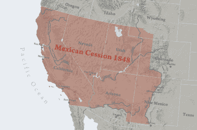

# 齐默尔曼电报

> 原文：<https://hackaday.com/2017/01/26/the-zimmermann-telegram/>

第一次世界大战开始于 1914 年，是几个欧洲国家之间的战斗，而美国奉行不干涉政策。事实上，伍德罗·威尔逊再次当选总统很大程度上是因为“他让我们远离了战争”。但随着战争在欧洲展开，一份被截获的由德国外交部长阿瑟·齐默尔曼发给墨西哥政府的电报激怒了美国公众舆论，这也是美国加入第一次世界大战的主要原因之一。这就是改变了上个世纪的加密电报的故事。

### 德国报价的来源

地区墨西哥于 1848 年割让给美国，由【kb Allen】via[Wikimedia Commons](https://commons.wikimedia.org/w/index.php?curid=3841280)

德国积极寻求促成墨西哥与美国之间的战争，希望以此来分散军事注意力，避免美国参战。在几次引发冲突的失败尝试后，德国人决定向墨西哥新总统维纳斯蒂亚诺·卡兰萨提出收复失去的德克萨斯、新墨西哥和亚利桑那领土，以防德国获胜。(加州没有包括在内，可能是因为德国人认为这对日本人来说是一个不可抗拒的提议，以防他们也想对美国宣战。)

但是德国人如何向墨西哥人传达这个提议呢？考虑了三种选择。第一件事是把建议传达给墨西哥驻柏林大使。第二种，通过*德国*号潜艇发送信息，该潜艇将在美国的某个地方着陆，然后将信息传递给德国大使馆，再转交给墨西哥人。第三个选择是用最好的加密技术，用加密电报发送提议。

墨西哥驻柏林大使不受德国信任，因此这个选项被认为太不安全。第二个选项提供了最安全的方法，但也是最慢的。因此，德国人选择了第三种方案。1917 年 1 月 19 日，德国驻墨西哥大使海因里希·冯·埃尔卡特收到了齐默尔曼发来的加密电报。解码后的文本如下:

> 我们打算在 2 月 1 日开始无限制的潜艇战。尽管如此，我们仍将努力保持美利坚合众国的中立。如果这一努力没有成功，我们将在以下基础上向墨西哥提出结盟建议:共同作战，共同缔造和平，慷慨的财政支持，以及我们认为墨西哥将重新夺回失去的得克萨斯州、新墨西哥州和亚利桑那州的谅解。具体的解决办法就交给你了。一旦与美利坚合众国的战争爆发是确定的，你将最秘密地通知总统上述情况，并建议他应主动邀请日本立即加入，同时在日本和我们之间进行调解。请提醒总统注意这样一个事实，无情地使用我们的潜艇现在提供了迫使英国在几个月内讲和的前景。齐默尔曼签名

### 墨西哥拒绝了这一提议

墨西哥总统维纳斯蒂亚诺·卡兰萨成立了一个军事委员会来研究德国的提议。基于几个原因，委员会建议拒绝。首先，墨西哥赢得与美国的战争的可能性很小。其次，针对美国的战争将危及墨西哥与其他国家的关系。第三，人们严重怀疑德国会信守“慷慨的财政支持”的承诺。

英国情报部门截获并破译了这份电报，并于 2 月 24 日将其交给了美国。同一天，威尔逊总统宣读了这份电文，并于 3 月 1 日将其公之于众。事实证明，美国公众的反应正是改变不干涉政策所需要的。墨西哥、日本和德国可能合并的威胁是一场噩梦。3 月 20 日，威尔逊总统会见了他的内阁，发现他们赞成参战。4 月 6 日，美国国会批准了对德国及其盟国的宣战，只有一票反对。

### 英国密码破译者

破译齐默尔曼电报可能是英国在一战期间最重大的情报胜利。这份电报是在一战期间英国海军部负责密码分析工作的高度机密的 40 号房间被截获和分析的。

齐默尔曼电报使用密码 0075 进行编码，这是一个由 10，000 个单词和短语组成的两部分代码，编号为 0000 至 9999。为了避免频率分析，数字是随机选择的，此外，每个字母都使用简单替换法单独编码。当然，只要密码本保密，密码就是安全的。一个名为 13040 的旧密码已经被英国人破解，但是新密码 0075 被认为是安全的。代码 13040 有大约 25000 个明文元素和 75000 个代码数字。例如，这里有一些来自密码本的例子:
二月 13605
fest 13732
finan zielle 13850
fol Geng 13918
Frieden 17142
Friedenschluss 17149
führung 17166
Ganz geheim 17214
Gebeit 17388
geheim 4377】

然而，德国人低估了英国密码破译者。这份电报最早于 1 月 16 日从柏林发往华盛顿(使用美国外交线路)，被英国人截获，并被 40 号房间的人部分解密。即使信息不完整，德国的意图也是显而易见的。英国人想把这一信息传递给美国，但这样做会暴露对美国电报的窃听。与此同时，德国人会意识到他们新的 0075 密码被破解了。

为了向美国证明这份电报的真实性，同时又不被德国怀疑破译了密码，并且不暴露英国情报机构在监视美国电报的事实，英国会告诉美国，这份电报是通过贿赂墨西哥的一名电报公司雇员获得的(这份电报是从德国驻华盛顿大使馆发往墨西哥的)。此外，发送到墨西哥的电报是用更老的 13040 密码编码的，所以，在最坏的情况下，德国人会认为 13040 密码被破解了。

最终，德国决定了自己的命运，为英国提供了将美国推入战争的途径。威尔逊总统曾说，将他的国家引向战争是“反文明的罪行”，但 40 号房间的密码破译员的一个突破迫使他改变了主意。正是密码学的巨大胜利将美国卷入了战争，并改变了历史的进程。