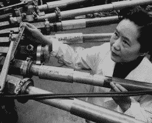
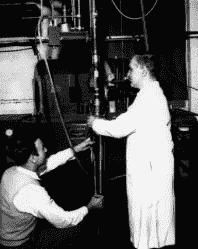
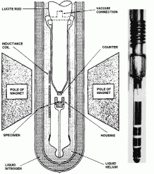

# 没有对等:吴健雄

> 原文：<https://hackaday.com/2017/09/28/there-is-no-parity-chien-shiung-wu/>

伸出双手，掌心向前。他们看起来非常相似，但我相信你们都很清楚，他们实际上是彼此的镜像。你的手是手性物体，这意味着它们是不对称的，但不可叠加。在研究物质的物理性质时，这个性质是相当有趣的。手性分子可以具有与其镜像分子完全不同的性质。在物理学中，产生某物的镜像称为宇称。1927 年，一个被称为宇称守恒的假设定律被阐明。它指出，无论是实验还是物体之间的物理相互作用——宇称必须守恒。换句话说，如果你按照实验的镜像再重复一次，实验结果会保持不变。就任何物理相互作用而言，左/右或顺时针/逆时针之间没有区别。

Dr. Wu working with a particle accelerator via [Biography](https://www.biography.com/people/chien-shiung-wu-053116).

最终证明量子力学区分左右手的核物理学家吴建雄是一位女性，而提出“吴实验”背后理论的两位男性因他们的合作获得了诺贝尔奖。如果我们认为量子力学对镜像粒子的不同作用很奇怪，那么一个物理学家仅仅因为(她的)性别而得不到认可又有多奇怪呢？我们主要是在这里讨论物理学，但我们很快就会回到吴健雄。

## 平价的终结

宇称守恒是一位名叫尤金·p·维格纳的物理学家的成果，它将在量子力学日益成熟的过程中发挥重要作用。众所周知，像行星和棒球这样的宏观世界物体遵循维格纳宇称守恒定律。暗示这个定律延伸到量子世界是直觉的，但不超过直觉。在那个时候，众所周知，量子物体不像经典物体那样遵循同样的规则。量子力学会奇怪到在乎利手吗？

到 20 世纪 50 年代，物理学家在高速粒子加速器中将亚原子粒子相互碰撞，并分析由此产生的新的、有时是以前未发现的粒子的爆炸。其中一种以前未被发现的粒子非常令人困惑——K 介子。似乎有两种不同的版本——一种会衰变为 2π介子，另一种会衰变为 3π介子。π介子也叫π介子。K 介子的所有其他特性都是相同的，表明只有一种类型。

Setting up the Cobalt-60 parity test via [NIST](https://www.nist.gov/pml/reversal-parity-law-nuclear-physics).

经过数学计算，确定了两粒子和三粒子系统中的π介子必须具有相反的宇称。根据维格纳宇称守恒定律，因此必然有两种 K 介子——一种产生两个π介子，另一种产生三个π介子。宇称守恒不允许两个系统都来自一个粒子。

但是如果维格纳的宇称理论是错误的呢？K 介子是在弱力相互作用过程中质子被撞向更重的原子核时产生的。1956 年，物理学家李政道和杨振宁提出，弱力相互作用可能不遵循宇称守恒，而且确实存在单个 K 介子。这两个π介子系统是具有可定义宇称的单一 K 介子的结果，而宇称在这种特殊情况下并不守恒。考虑一下，如果 K 介子有自旋，顺时针自旋产生 2π介子系统，逆时针自旋产生 3π介子系统。这是违反宇称的一个例子。物理学家认为 K 介子违反了这个定律。

衍生出一个实验来对奇偶进行终极测试。

## 钴-60

可以想象，这类实验有点复杂。我的任务是把复杂的东西分解成你每天好奇的黑客都能理解的东西。目的是证明维格纳宇称守恒在弱力相互作用下不成立。为此，我们需要三样东西:

1.  发出β辐射的东西(β衰变是由弱力引起的)。
2.  有两种已知物理状态的东西。
3.  测量每个州的辐射的方法。

Cobalt-60 parity test apparatus via [NIST](https://www.nist.gov/pml/reversal-parity-law-nuclear-physics).

宇称守恒坚持认为，在任一状态下，测得的辐射都是相同的。因为如果宇称守恒，在不同的状态之间，不可能得到不同的实验结果，比如自旋。这可以通过使用具有天然放射性的钴-60 并将其冷却到绝对零度以上来实现。将它冷却到这个温度会带走大部分分子运动，并允许原子在非常强的磁场下排列成晶体结构。磁场还会极化 Colbalt-60 原子核，这意味着它们在平行于磁场的相同方向上旋转。

现在我们要做的就是:

1.  测量β辐射强度。
2.  反转磁场方向。
3.  测量β辐射强度。
4.  比较结果。

通过逆转磁场，我们使钴-60 原子核逆转极化。宇称守恒表示两种物理状态之间应该没有可测量的差异。我相信你现在可以猜到他们发现了什么——在一个方向上测得的β辐射强度更大。这是魏格纳宇称理论的致命一击。它允许物理学家重新检查以前涉及弱力相互作用的实验结果，并有助于推进量子理论和最终导致我们今天拥有的粒子标准模型。

## 吴健雄

正如我们上面提到的，李和扬因为吴的实验获得了诺贝尔奖。可惜，吴没有。吴是那段时间为数不多的女物理学家之一，她们的名字和研究并没有得到应有的重视。在她那个时代，基于性别的不公正普遍存在，但她从 70 年代起对核物理的贡献得到了全世界的认可。

事实上，她在 1978 年被授予了首届沃尔夫物理学奖，部分是为了弥补诺贝尔奖的轻视，但也是为了她在实验核物理方面的进一步工作。吴还参与了曼哈顿计划，在哥伦比亚大学担任有声望的教授，并负责探索弱核力的重要实验结果和首次证实量子光子纠缠的实验。

吴健雄于 1997 年去世，享年 84 岁。让我们引用吴博士 1964 年在麻省理工学院的一次研讨会上的一段讲话作为结束语:

> “我想知道微小的原子和原子核，或者数学符号，或者 DNA 分子是否对男性或女性有任何偏好。”