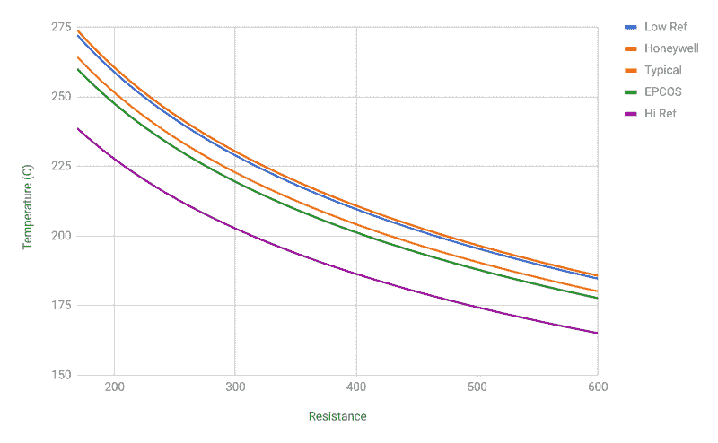
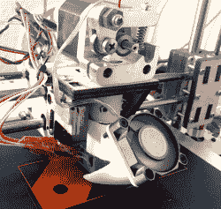

# 热敏电阻和 3D 打印

> 原文：<https://hackaday.com/2017/12/15/thermistors-and-3d-printing/>

我一直觉得有趣的是，3D 打印机——至少是我们大多数人都有的那种——大多是开环设备。你告诉磁头在 X 方向移动 4 毫米，你假设步进电机会让它移动。因为力学的原因，你可以计算出 4 毫米是这么多的步，然后指挥马达去走。如果有什么阻碍了你的行程，你就会得到一个失败的打印。但是打印机有一部分是闭环的一部分。它非常微小，非常重要，但是你听不到太多关于它的信息。热敏电阻。

 热端和加热床都有一个温度传感器，固件用它来保持温度至少在大约范围内。根据控制器的不同，它可能只是进行开-关的“砰砰”控制，也可能进行像 PID 控制这样复杂的控制。但无论哪种方式，你设置所需的温度，控制器使用热敏电阻的反馈，试图保持在那里。

如果使用高温材料打印，您的热端可能会有一个热电偶，但大多数机器都使用热敏电阻。这些通常在 300 摄氏度左右有效。让我想到这一点的是在我最老的打印机上安装了一个 E3D V6 克隆热端，这台打印机有一个用了五年的热端。我积累了各种克隆零件，但不知道我使用的加热块中是哪种热敏电阻。

## 有关系吗？

当你为你的打印机建立固件时，你要告诉它你用的是什么热敏电阻。有一些打印机可以在运行时切换热敏电阻类型，当然，如果您知道它们是什么，您可以调整您的温度设置来解决任何错误。通常使用负温度系数(NTC)器件，其电阻随着温度上升而下降。但是具体什么样的电阻对应什么样的温度取决于设备。

所以对于我的升级，旧的热端有一个热敏电阻，我想是由固件知道的霍尼韦尔制造的。新的热点是完全未知的。您将在打印机中使用的大多数(但不是全部)普通热敏电阻在室温下的读数为 100kω，这两种热敏电阻也是如此。我想知道如果我选择了错误的转换，我的体温会下降多少。令人惊讶的是，虽然有大量关于如何读取热敏电阻的信息，但我没有看到太多关于使用不正确的温度曲线所产生的误差的数据，所以我决定自己动手。

## 但是首先

首先，可能值得思考一下典型 3D 打印机的温度传感器中到底发生了什么。当然，热敏电阻会改变值，但那又如何呢？大多数控制器都有一个带固定电阻和热敏电阻的电阻分压器，然后使用 A/D 读取电压。

不要让太多的电流流过热敏电阻，因为该电流会导致发热，并且是误差源。典型的打印机将使用一个 4.7kω的 5 V 电阻来激励热敏电阻，并读取产生的电压。假设热敏电阻为 500ω。热敏电阻两端的电压将为 5 * (500/(4700+500))或大约 0.5 伏。

我提到过，打印机中的大多数热敏电阻在室温下的读数为 100kω。你可能认为 500ω有点低。事实上，随着设备变热，电阻迅速下降。在典型的 100kω热敏电阻中，500ω电阻相当于 190°C 左右。

运行打印机的微控制器必须做相反的运算。也就是说，它将采用上面的等式并求解电阻。换句话说:0.5 = 5 * (R/4700+500)因此求解 R。问题是你不想以欧姆为单位设置灯丝温度！你想用度。

从热敏电阻读数计算温度的最佳方法是施泰因哈特-哈特模型。这需要三个参数和一些数字运算。然而，大多数 3D 打印机软件使用一种简化方法，只使用热敏电阻的第二个参数，即β。

我不会给你公式，我会给你看这个电子表格。A 列有一些电阻值，其他列有不同的 beta 值，并以摄氏度显示温度。如果您真的想深入了解数学和其他应用，请查看下面的[Peter Vree]视频。

 [https://www.youtube.com/embed/53_xxl4bV64?version=3&rel=1&showsearch=0&showinfo=1&iv_load_policy=1&fs=1&hl=en-US&autohide=2&wmode=transparent](https://www.youtube.com/embed/53_xxl4bV64?version=3&rel=1&showsearch=0&showinfo=1&iv_load_policy=1&fs=1&hl=en-US&autohide=2&wmode=transparent)

## 差别大？

有了这个电子表格，就很容易弄清楚热敏电阻失调有多严重。当然，您希望获得正确的值，但对于通用热敏电阻来说，这有多大关系呢？

我的方法很简单。我去 Digikey 搜索热敏电阻。我使用他们的滤波器只查看 100kωNTC 器件，其读数至少为 300°C，并指定 100°C 时的β值，β值范围为 3988 至 4280，根据价格和数量，实际范围甚至更小。例如，Digikey 只有大约 180 台 beta 为 4280 的设备。我承认这不太科学，但它确实给了我一系列你可能期望在“野外”找到的 beta 值。

如果您在电子表格(和下图)上注意到，在您将打印 PLA、ABS 和 PETG 等塑料的典型范围内，没有太多的温度差异。当然，你可能会不走运。如果你有最底部的曲线，温度对那条曲线来说是一个很好的偏离。或者，也许你有一个独特的热敏电阻，它有一些古怪的值，会偏离。但是从统计数据来看，即使你不能改变热敏电阻表，你也会认为你是在大概的范围内。现在，如果任何一个热敏电阻具有不同的室温电阻，一切都完了。但是我见过的大部分 3D 打印机确实使用了 100kω的传感器。

## 结果呢

虽然这不会有太大的不同，但我确实根据一些启发进行了有根据的猜测，并改变了热敏电阻的类型。我想过尝试在热敏电阻上设置一个精确的温度，以获得更多的数据点，但决定不值得打开真空吸尘器。

毕竟，每台打印机都有一点不同，塑料看到的温度可能不是热敏电阻的温度，所以总是需要一点“拨入”来确定您的打印机对于特定工作需要什么温度。那么，噪音中就会有五度甚至十度的差异。你会发现你的 PLA 在 210°C 时太软，于是把温度降到 190°C。或者 ABS 可能会引起挤出机跳跃，你会把温度升高几度。无论如何，你都要做不同品牌或颜色的长丝。

 虽然在最后，我还是取得了巨大的成绩。谁知道 3D 打印机最微小的部分会如此重要？如果您仔细观察右边的照片，会发现有两根涂有特氟隆的细线从加热块中伸出。那是热敏电阻，不管它是什么牌子和型号。

当然，热敏电阻还有许多其他用途。它们可以用来限制浪涌电流，提供温度稳定的偏置，当然也可以在许多不同情况下检测温度。例如，它们可以是非常简约的烙铁控制器的核心。