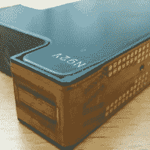
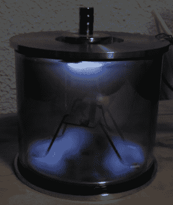

# 这二十个令人惊叹的项目赢得了开放硬件设计挑战赛

> 原文：<https://hackaday.com/2018/05/02/these-twenty-amazing-projects-won-the-open-hardware-design-challenge/>

现在，我们正在进行这个星球上最大的硬件竞赛。[黑客日奖](https://hackaday.io/prize)是开放硬件的奥斯卡奖，我们向成千上万的硬件黑客、制造商和艺术家敞开大门，创造下一个大东西。

上周，我们完成了今年 Hackaday 奖的第一项挑战。我们现在很高兴地宣布 20 名入选者将进入决赛，并获得 1000 美元的现金奖励。祝贺 Hackaday 奖*公开硬件设计挑战*部分的获奖者。以下是获奖者，排名不分先后:

### *开放硬件设计挑战赛* Hackaday 奖决赛入围者:

*   PR-Holonet:灾区紧急通信
*   [ROPS](https://hackaday.io/project/119133)
*   [I2C 编码器 V2](https://hackaday.io/project/122039)
*   [代谢者](https://hackaday.io/project/139958)
*   [黑掉一个 35 美元的可穿戴设备来制造精神健康设备](https://hackaday.io/project/144350)
*   [口内呼吸监测器&用药过量探测器](https://hackaday.io/project/106917)
*   [Arcus-3D-P1——3D 打印机的拾取和放置](https://hackaday.io/project/45404)
*   [回流控制器——无线回流控制器生态系统](https://hackaday.io/project/27900)
*   [紧凑型，25 美元分光计](https://hackaday.io/project/143014)
*   [风筝:开放硬件安卓智能手机](https://hackaday.io/project/42944)

## 这些项目太棒了

The [Oasis 3D Printer](https://hackaday.io/project/86954-oasis-3dp) repurposes HP ink cartridges to build a powder-baseed 3D printer

看看这些项目就知道了。他们是精英中的精英，未来还会有更多。我们很高兴看到一些项目重新利用现成的技术，通过 [Oasis 3DP](https://hackaday.io/project/86954-oasis-3dp) 极大地扩展了家庭制造的能力。来自[Yvo de Haas]的这个项目从惠普打印机中获取墨盒，并使用它来构建基于粉末的 3D 打印机。这是自制 3D 打印机领域真正没有做过的事情，Oasis 3DP 已经有了工作硬件。这真的是我们见过的最有趣的项目之一，不仅仅是因为[Yvo]正在处理几十个从微型喷嘴喷出粘合剂的微型泵。

但这还不是全部。有数百个项目参加了这一轮的 Hackaday 奖，我们唯一的遗憾是，我们只能为开放硬件设计挑战挑选出 20 个获胜者。看看 [Semiconductors @ Home](https://hackaday.io/project/107598-semiconductors-home) ，一个来自【谢妮】的项目——这是一个试图让沙子眨眼的项目。[谢妮]正在制造所有的工具，在国内制造半导体。能够建造一个简单的场效应晶体管是令人惊讶的，为此你需要一个通风橱来容纳危险的氢氟酸，一个用于溅射沉积的真空室，以及一个具有可控气氛的奇特烘箱。这些工具是[谢妮的]设计挑战的入口。这不是你的花园品种硬件黑客；这是*高级*硬件黑客。

 is turning ions into FETs

对 DIY 半导体印象不深？你是个可怕的人，但没关系。有没有一种简单的方法来读取旋转编码器？[fattore.saimon]和[Atikaimu]正在构建一个 I2C 编码器，这是一种仅用两个微控制器引脚读取多个旋转编码器的简单方法。阅读旋转编码器是电气工程中看似困难的任务之一；你真的需要一些中断来做好它，而一个微控制器真的只有几个。[fattore]和[atikaimu]的项目解决了这个问题，将旋转编码器放在一块可以通过普通 I2C 总线读取的板上。这意味着任何人都可以轻松地添加一打旋转编码器到任何项目。有人说过 MIDI 控制器吗？是的，这是可能的。从乐器到令人印象深刻的控制面板，一切都可以用 I2C 编码器实现，而且都是开放的硬件。

你还不开心吗？卡尔·布吉亚用一块印刷电路板做了一个马达。在过去的十年里，定制印刷电路板的价格急剧下降，这意味着任何人都可以用铜箔和玻璃纤维做实验。我想既然你可以把线圈放在印刷电路板上，你也可以做一个马达。虽然我们这里只看到一个 1 瓦电机，但这是一个由印刷电路板制成的无刷电机。这太神奇了，你以前从未见过，我们完全不知道人们会为这项神奇的技术找到多少用途。

这些是 Hackaday 奖中开放硬件设计挑战的获胜者，我们喜欢能够构建*甚至*更多开放硬件的开放工具。如果你想要一个这样的例子，你只需要看看来自[达人秀]的[Arcus-3D-P1](https://hackaday.io/project/45404-arcus-3d-p1-pick-and-place-for-3d-printers)。这是一个为任何 3D 打印机添加轻量级拾取和放置头的项目。在一定尺寸以下，拾取和放置机器是创建电子产品所必需的，并且现在几乎每个人都有 3D 打印机。Arcus-3D-P1 是任何 3D 打印机的附件，可以将它从 CNC 热胶枪变成制造电子产品的机器。它是开放的硬件，硬件创造硬件。令人震惊的是，它发生在 Hackaday.io 上。

祝贺所有进入第一轮挑战的选手，以及进入决赛的 20 名优秀选手。我们迫不及待地想知道还有哪些项目将进入全球最大的硬件竞赛 Hackaday Prize 的决赛。

## 谁将获得 2018 年 Hackaday 大奖？

谁会赢得黑客日奖？这些公开硬件设计挑战赛的决赛选手现在正在角逐 Hackaday 奖的最后一轮，他们将有机会赢得 50，000 美元的大奖。这并不意味着你仍然不能参与行动；Hackaday 奖还剩下四个挑战。

现在，我们正在进行[机器人模块挑战](https://hackaday.io/prize/details#two)，之后，我们将启动能量采集挑战、人机界面挑战，最后是乐器挑战。还有时间在硬件大师中赢得你的一席之地，所以[现在就开始你的 Hackaday 奖品入口](https://hackaday.io/project/add?light&tag=2018HackadayPrize)。

The [HackadayPrize2018](https://hackaday.io/prize) is Sponsored by:     