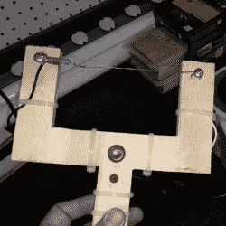

# 从热金属丝切割机器人身体中学到的东西

> 原文：<https://hackaday.com/2017/09/09/things-learned-from-hot-wire-cutting-a-droids-body/>

[Bithead]的爱好之一是制造星球大战机器人，在为其中一个机器人建造外壳的过程中，他决定使用[热丝泡沫切割](https://bithead942.wordpress.com/2017/02/09/hot-wire-foam-cutting/)并制作自己的工具。手头上有了必要的部件，看了一些演示该技术的 YouTube 视频后，[Bithead]就一头扎了进去。事情并没有完全按照计划进行，但令人高兴的是，他决定分享什么可行，什么不可行，最终结果是有用的。

【Bithead】用镍铬合金线做了两把热钢丝钳。第一个很小，但第二个更大，并融入了一些设计改进。当他第一次开机时，他的电源开得太高，他也得到了一个重要的安全提醒；电线瞬间变红，啪的一声， ***砰*** 的一声。他很晚才意识到自己既没有戴手套也没有戴护目镜，真是愚蠢。

当谈到使用他自制的工具时，最大的发现之一是，在一个热钢丝剪眼里，不是所有的泡沫都是平等的。这是那些对有经验的人来说是常识的事情之一，但是对一个新人来说不一定是显而易见的。一把热钢丝钳可以干净利落、毫不费力地切割聚苯乙烯泡沫，但他用来铸造机器人外壳的泡沫却做不到这一点。尽管如此，他还是克服了困难，取得了令人满意的结果。[Bithead]的博客帖子对于以前使用过泡沫和热钢丝钳的人来说可能没有什么新东西，但如果你对这些东西不熟悉，你可以用它来学习他的经验。说到改善体验，[Bithead]最近通过[变得狡猾地隐藏他的遥控器](https://hackaday.com/2017/07/19/this-isnt-the-r2-d2-controller-youre-looking-for/)来搞乱他的 R2-D2 建造的演示。