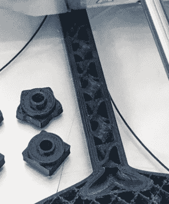

# 这种 3D 打印的注射器静态混合器可以做到这一切

> 原文：<https://hackaday.com/2018/07/08/this-3d-printed-syringe-static-mixer-does-it-all/>

从新混合的双组分环氧树脂中去除气泡的一个技巧，也叫脱气，是用丙烷火炬的火焰轻轻扫过它。但是混合和脱气都需要时间。[Gianteye]想出了一个 3D 打印的双注射器静态混合系统，它加快了这个过程。他将它与硅胶一起使用，以便在他的软机器人实践课上快速完成困难的步骤，使学生们能够更专注于手头的事情。但我们认为大多数读者可能会用它来写环氧树脂。

Mixing tube interior

如果你以前在商店里买过这种双组分环氧树脂注射器，你会知道它们通常有两个注射器，每个注射器都装有要混合的两种组分中的一种。压下注射器会导致每个部分从其自己的管中出来。然后你的工作是将它们混合在一起，并对结果进行脱气。

[Gianteye 的]系统由 3D 打印部件和两个注射器组成。3D 打印的模型可以在[他的 Thingiverse 页面](https://www.thingiverse.com/thing:2987395)上找到，注射器也可以在网上找到。一些 3D 打印的部件可以帮助你首先填充注射器并对其脱气。然后将 3D 打印的混合管连接到注射器的末端。这根管子有两个用途。当压下注射器的柱塞时，材料的两个部分都被迫通过管子并被挤出。但是在它们通过的过程中，两个部分都经过了八个螺旋，形成了 180 度的转弯，并将这些部分混合在一起。出来的是经过分份、混合和脱气的材料，它们可以直接进入模具或任何你需要的地方。

混合管是为一次性使用而设计的，但是[Gianteye]在评估过程中发现，如果您取出任何固化的材料并清洗它，它可以重复使用。不过评估涉及到硅树脂。对于硬化的环氧树脂，你可能每次都要用一个新的管子。

在下面的视频中查看他的系统的全部细节，包括组装和使用。

如果你正在寻找金属外观的东西，而不想铸造金属，那么看看我们自己的[Gerrit Coetzee 的] [关于冷铸造的文章](https://hackaday.com/2016/07/14/learn-resin-casting-techniques-cold-casting/)，其中他制作了一些非常好看的零件。

 [https://www.youtube.com/embed/XF3lmJ7OVE8?version=3&rel=1&showsearch=0&showinfo=1&iv_load_policy=1&fs=1&hl=en-US&autohide=2&wmode=transparent](https://www.youtube.com/embed/XF3lmJ7OVE8?version=3&rel=1&showsearch=0&showinfo=1&iv_load_policy=1&fs=1&hl=en-US&autohide=2&wmode=transparent)

