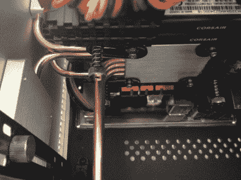

# 这台电脑像鼠标一样安静

> 原文：<https://hackaday.com/2018/05/22/this-computer-is-as-quiet-as-the-mouse/>

[Tim aka tp69]造了一台[完全静音的台式电脑](https://tp69.wordpress.com/2018/04/17/completely-silent-computer/)。根本听不到。普通的台式机会有几个风扇在里面旋转——冷却 CPU、GPU、SMPS，可能还有一个风扇用于机箱循环——所有这些最终都会产生相当大的噪音，分贝方面。液体冷却可能有助于使它更安静，但泵仍然是噪音的来源。为了完全消除噪音，你必须摆脱所有的旋转/移动部件，并使用被动冷却。

[Tim]的计算机是由标准的现成部件构建而成的，但我们感兴趣的是详细的构建日志。了解这样一个构建的内部情况，选择部件时需要做出的决定，以及你需要知道的各种问题，所有这些都使它成为一个引人入胜的读物。

这一切都始于一个立方体铝底盘，旨在容纳一个迷你 ITX 主板。顶部和侧壁基本上是巨大的挤压散热器，旨在有效地将热量从机箱内带走。热量通过嵌有充满冷却液的密封铜管的散热器被提取并输送到侧板。从主板开始，每一个部件都需要根据机箱的机械和散热限制进行选择。使用升级套件作为盘柜附件，使[Tim]能够使用额定功耗接近 100 W 的 CPU。这不仅让他缩小了主板的选择范围，还为未来的升级提供了足够的开销。GPU 获得了一个类似的散热套件，以换取风扇冷却组件。无风扇电源的选择是因为其功率容量以及即使在低负载下的高效率，可以让计算机安静地嗡嗡作响。

一旦计算机启动并运行，他花了一些时间分析他的系统的热分布图，以检查是否真的值得所有的努力。T2 的数字和图表看起来很有希望。在 100%负载下，AMD [锐龙 5 1600 CPU](https://www.amd.com/en/products/cpu/amd-ryzen-5-1600) 在 60°C(比环境温度高 40°C)时保持平稳，没有任何性能影响。外壳温度为 42 摄氏度——温暖，但不危险。当然，性能取决于“环境温度”，所以当环境温度升高时，你必须开始小心。

获得这样的沉默是有代价的——有些人可能认为这相当昂贵。[Tim]花费了大约 3000 澳元来建立这整个系统，部分原因是由于比特币采矿的需求导致的高 GPU 价格。但是成本是一个相对的衡量标准。与他早期的几个项目相比，他在这个系统上花费更少，这让他享受大自然的声音，而不是抱怨的冷却风扇。有些人会建议一副耳塞会是一个超级便宜的解决方案，但他想要一台安静的电脑，而不是可以抵消周围所有其他声音的东西。