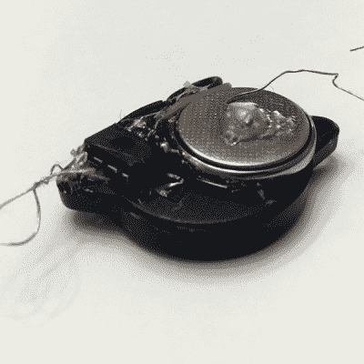

# 这是硬币电池挑战赛的最后一个周末

> 原文：<https://hackaday.com/2018/01/06/this-is-the-last-weekend-for-the-coin-cell-challenge/>

这就是了。这是你不得不参加近年来最具爆炸性的电池驱动竞赛的最后一个周末。[这是硬币电池挑战赛](https://hackaday.io/contest/28283-coin-cell-challenge)，本周一全部结束。你有不到 48 小时的时间来创造最神奇的由硬币电池供电的*物品*。

Joseph Primmer slapped a coin cell on a piezo and rickrolled a university

现在，我们正在查看硬币电池挑战赛的参赛作品，这里有一些真正的瑰宝。你知道康奈尔大学宿舍里疯狂分布的 Rickroll 投掷游戏是一个参赛项目吗？是的，只需一个硬币电池，一个 ATtiny85 和一个压电，你就可以让人们一整年都处于瘫痪状态。

需要更多灵感吗？[拟人化的泳池面需要爱](https://hackaday.io/project/28637-noodle-spawnling)。下周末 CES 就要来了，这意味着*你也可能会被终身踢出去，[就像 Gizmodo 记者](https://hackaday.io/project/29330-micro-tv-b-gone)一样。东北部正在遭受寒流，所以让我们试试用硬币电池启动汽车。你可以用硬币电池做无数的事情，我们想看看你能用它们做什么。*

本次比赛的前二十名项目将分别获得[100 美元的 Tindie credit](https://www.tindie.com/) 来挑选一些花哨的套件和酷装备。前三名获胜者将每人获得 500 美元的现金奖励。我们特别寻找三样东西——让一个项目持续时间最长的终身奖，眨眼之间耗尽硬币电池的超新星奖，以及展示简单硬币电池不可能实现的事情的举重奖。

这是您提交项目的最后一个周末，竞赛将于太平洋时间周一下午结束。[现在进入](https://hackaday.io/contest/28283-coin-cell-challenge)！