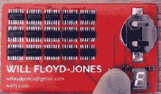

# 这张 PCB 名片在逻辑上是不同的

> 原文：<https://hackaday.com/2015/10/01/this-pcb-business-card-is-logically-different/>

看过许多 PCB 名片后，[Will]决定反对更受欢迎的基于微控制器的设计，并通过基于逻辑的有限状态机来展示一些特性。[Will]使用单个 7 段显示器来滚动他名字的字母，每次按下触觉按钮时，状态机都会向 LED 显示器输出所需的 1 和 0 的组合。

[Will]使用由 D 触发器组成的 4 位计数器作为时钟信号，作为 4 输入与门中 6 个门的条件输入。他没有详细描述在整个过程中显示每个字符的痛苦细节(谢天谢地),但他确实提到他使用了奎因-麦克卢斯基技术进行简化，而不是布尔代数。因为他的名字是 11 个字符长，并且 4 位二进制计数器从 0000 到 1111，在将计数滚回 0000 之前，再按 5 次按钮，在此期间，显示是空白的。如果你有兴趣更深入地了解这个设计，【威尔】在[的博客](http://willfj.com/)上提供了 eagle 和 Gerber 的文件供你下载。

[Will]采用 0.8 毫米薄的主板，而不是标准的 1.6 毫米，这为表面贴装器件提供了更大的厚度。BOM 总计:15 个 IC、一个纽扣电池、一个按钮、7 个限流电阻和一个作为硬件去抖的电容器。[Will]亲自组装它们，手工放置 SMD 元件，并将焊接工作留给他的[回流焊工作室。](http://hackaday.com/2015/02/02/reflow-chateau/)

使用逻辑门而不是微控制器显示了对基于逻辑的设计的一些理解，这与具有一些微控制器知识的爱好者相比有点少见。这并不是说包含一个微型的 PCB 名片本身并不令人印象深刻。如果你需要提高你的逻辑能力，最近有几个帖子你可能会觉得有用:[【比尔·赫德】逻辑系列](http://hackaday.com/2015/05/28/from-gates-to-fpgas-part-1-basic-logic/)，【阿尔·威廉姆斯】涵盖了[一个基于浏览器的触发器逻辑讨论](http://hackaday.com/2015/09/24/learn-flip-flops-with-more-simulation/)。

  a nice click-through demo  PCB business card – sexy angle