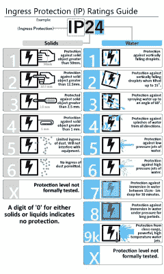

# 入口是这样的:用 IP 和 NEMA 保持物品干燥和清洁

> 原文：<https://hackaday.com/2017/06/30/this-way-to-the-ingress-keeping-stuff-dry-and-clean-with-ip-and-nema/>

当设计一件硬件时，即使有最微弱的机会暴露在自然环境中，最好还是重复这句咒语:水能找到出路。无论你如何努力保护一个项目免受雨水、水花甚至潮湿空气的影响，如果你没有采取预防措施来密封你的外壳，我敢打赌，当你打开它时，你会发现水的证据。水总是赢家，虽然这可能不是你的项目的丧钟，但它可能不会有所帮助。水并不是户外或粗糙设施面临的唯一问题。颗粒侵入也是一个真正的杀手，尤其是在灰尘可以导电的环境中。

您可以做很多事情来防止不请自来的液体或颗粒客人参加您的户外聚会，但在设计时防止问题往往比在硬件部署后修复问题更容易。为了帮助您进行设计，这里简要介绍了一些保护外壳免受有害侵入的标准。

### 另一种知识产权

为什么首先要有一个外壳等级标准？简单——这样工程师就知道他们在买什么。在国际保护标准出台之前，任何制造商都可以在设备上贴上标签，声称它是“防水”或“防尘”的，然后蒙混过关。国际防护标志标准(IP Code)旨在提供一种更加客观的方法来衡量外壳内的物品是否受到固体和液体的保护。

Click to embiggen

IP 代码有两个等级，每个等级用一个数字表示，数字越大，保护级别越高。IP 代码的第一个字符代表颗粒，第二个字符代表液体。如果没有进行任何一项测试，则用 X 代替该编号。因此，“IP54”和“IPX7”是有效的 IP 代码，而“IP6”不是。

颗粒进入等级范围从 0(不提供保护)到 6(防尘)。IP1X 基本上防止您将整只手伸入电路板，IP2X 防止您将手指伸入任何肮脏的地方，IP3X 和 IP4X 防止工具侵入。IP5X 和 IP6X 解决了防尘等级问题。IP 颗粒等级是累积的，因此 IP6X 外壳可以防止灰尘、螺丝刀和人手等任何东西。

在液体方面，情况有所不同。额定值再次从 0(无保护)开始，一直到 6(保护免受直接高压水射流的伤害)，直到 IPX6 的额定值也是累积的。IPX7 规定了在 1 米处浸水 30 分钟的保护，但并不保证之前的任何额定值——正如你可以想象的那样，在厕所中额定几秒钟的手机可能无法抵抗压力清洗机。如果一个设备经过两种液体标准的测试，你会看到类似“IPX6/IPX7”的东西，这意味着你可以在洗车时使用它。IPX8 还规定了浸入深度，但让制造商负责定义深度和持续时间。

最后一个液体等级是 IPX9K，这基本上是冲洗场景的蒸汽清洗标准。它规定了高压、高温保护。下面的视频显示了对交换机进行的一些非常粗糙的测试——注意，IP 等级适用于任何类型的机箱，而不仅仅是您在其中构建项目的机箱。只用一个 IPX9K 外壳，只在外壳上放一个 IPX0 开关是不行的。

 [https://www.youtube.com/embed/3tncb7xNFR8?version=3&rel=1&showsearch=0&showinfo=1&iv_load_policy=1&fs=1&hl=en-US&autohide=2&wmode=transparent](https://www.youtube.com/embed/3tncb7xNFR8?version=3&rel=1&showsearch=0&showinfo=1&iv_load_policy=1&fs=1&hl=en-US&autohide=2&wmode=transparent)

### NEMA 怎么样？

在美国，我们有另一套针对物体和液体侵入的标准。美国国家电气制造商协会(NEMA)定义了一套外壳规格标准。不出所料，这些标准被称为 NEMA 评级，比 IP 评级更主观一些，具体规定了“风吹尘埃”和“轻雾”之类的东西这些类别更多地取决于具体情况，如 NEMA 5 号，它是一个“带有垫圈或同等物以防尘的外壳”;用于钢厂和水泥厂。”NEMA 等级主要用于工业外壳；因此，虽然 [IP68 手机](http://www.pcadvisor.co.uk/test-centre/mobile-phone/best-waterproof-phones-for-2017-3647101/)正在成为一种东西，但我们不太可能会看到那些额定在大约相当于 NEMA 6P 的手机。

虽然外壳的 IP 代码和 NEMA 类型之间有一些通用的一致性，但这两种标准是达到不同目的的手段。NEMA 评级涵盖了工业外壳的许多其他方面，如耐腐蚀性、防油和防水性、防爆、危险场所适用性等。因此，如果你只是担心水爬进来，一些 NEMA 评级可能是矫枉过正，但如果你在寻找不会生锈的东西，它们可能正是你要找的。

[精选图片来自[荷兰屏蔽 BV](https://hollandshielding.com/393-IP%20Rating%20Chart) 和[自动化世界](https://www.automationworld.com/article/topics/oee/enclosures-critical-specification-factors)