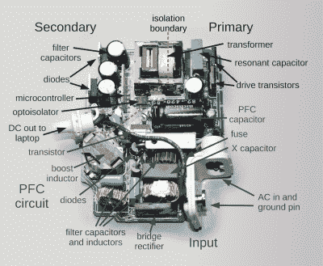

# 彻底拆卸 Macbook 充电器揭示了一些复杂的电路

> 原文：<https://hackaday.com/2015/11/26/thorough-macbook-charger-teardown-reveals-some-complex-circuitry/>

苹果在科技界有定价过高的名声，这种感觉在黑客评论中最为普遍。当然，标准的说法是，对于同等规格的设备，苹果的价格要比竞争对手高得多。这种说法并非没有缺陷，尤其是当你考虑 RAM 和处理器速度等简单规格之外的因素，并考虑所用材料和制造质量时。但是，正如[Ken Shirriff]展示的那样，苹果对细节的关注不仅仅是简单地用铝制成 Macbook 机身。

在他的拆解中，[Ken Shirriff]彻底调查并描述了无处不在的 Macbook 充电器的所有组件和电路。为什么要 79 美元？除了 MagSafe 连接器，还有什么比 90 年代东芝卫星附带的充电器更好的呢？不就是一个把交流电转换成 DC 的变压器吗？

[Ken Shirriff]回答了所有这些问题，你可能会对他的发现感到惊讶。事实证明，Macbook 充电器不仅仅是一个塑料外壳中的变压器，还有一个别致的磁性连接器。这涉及到许多高质量的电路，以使电源输出尽可能干净和稳定，并避免脏电源或电压尖峰对 Macbook 造成的潜在损坏。即使有这么多失败的报道，这是否证明了成本的合理性？这由你决定，但毫无疑问，苹果公司在充电器上花了更多的心思，而不仅仅是简单地将交流电转换成 DC。