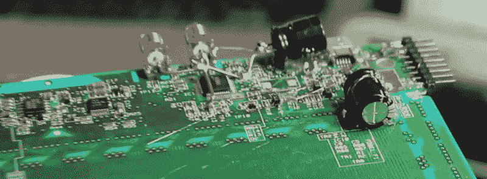
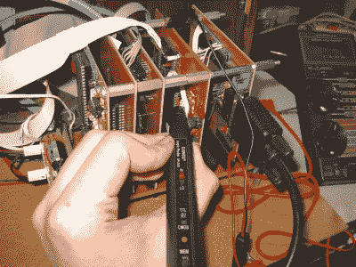

# 我们最喜欢的三个黑客

> 原文：<https://hackaday.com/2016/10/11/three-of-our-favorite-hackers/>

成功破解是一回事，解释清楚让每个人都能理解完全是另一回事。[Micah Elizabeth Scott]采用了一个非常复杂的概念(电源故障攻击)，并将一个成功的逆向工程过程制作成一个令人难以置信的视频。我们知道，如今观看 30 分钟的视频是一个巨大的要求，只要观看它并稍后感谢我们。

她解释了通过破解 USB 描述符共享来从 Wacom 平板电脑中转储固件的过程。这包括改变电源轨平滑电路，建立她自己的时钟控制板，与目标硬件和芯片密语器一起工作，然后迭代故障，直到她锁定完美的攻击。

当然，这不是她第一次参加竞技表演。也被称为[scanlime]，她已经大张旗鼓地出现了一段时间。查看[更多她的作品](http://www.misc.name/)，也许祝贺她最近被[争取到*首席研究员*角色](http://blog.senr.io/blog/welcoming-micah-elizabeth-scott-to-the-senrio-research-team)，我们想部分归功于她在网上展示的作品。你还应该感谢她在 2015 年和 2016 年担任[hack aday 奖评委。](https://hackaday.io/prize)

今年，我们在 Maker Faire 上发现了[Debra Ansell],不是作为一个参展商，而是一个带着她的最新作品去野外的与会者。[黛布拉的] LED matrix 手袋是[制造的奇迹](http://hackaday.com/2016/05/31/exquisite-led-handbag-in-the-wild/)——设计和制作都非常棒，很难相信这不是一个商业产品。但是，这款独一无二的包使用了间隔完美的编织皮革条，为 WS2812 RGB LED 模块留出了完美的空间。自从我们上次检查之后，她甚至还发布了一个教程！如果你听不出她的名字，你可能会认出她的公司: [GeekMomProjects](http://www.geekmomprojects.com/) 。她是小型袖珍蚀刻草图机器人[的幕后人，这个机器人是【黛布拉】在 Tindie](https://www.tindie.com/products/geekmomprojects/etchabot/) 上出售的。

The custom PCBs of Veronica ([in troubleshoot mode](http://quinndunki.com/blondihacks/?p=2644))

我们对[奎因·邓基]作品的迷恋可以追溯到很久以前。她有软件背景，但她的硬件才能令人钦佩。最近，我们很高兴她努力提高她的商店的制造能力。想知道如何审查你的新钻床。我们也很高兴看到她[带来一把符合标准的廉价带锯。还有太多来自奎因·邓基的其他优秀黑客，我无法一一列举。我们将留给你她在](http://quinndunki.com/blondihacks/?p=2863)[维罗妮卡](http://hackaday.com/tag/veronica/)上的惊人工作，这是她带去参加 10 周年演讲[的临时组装的 6502 电脑。她在顶部的头像来自](http://hackaday.com/2014/10/05/hackaday-10th-anniversary-quinn-dunki-and-veronica/)[她的 PCB 蚀刻教程](http://quinndunki.com/blondihacks/?p=835)之一。

## 庆祝阿达·洛芙莱斯日

今天是 10 月的第二个星期二——是阿达·洛芙莱斯日，这是全世界科技界女性的节日。上面的黑客是我们所有人的最爱，我们经常展示他们的作品。他们对技术的影响是不可否认的，我们非常尊重他们的技能和成就。我们很想听听你自己最喜欢的女性在硬件黑客方面的例子。请在下面的评论中告诉我们。