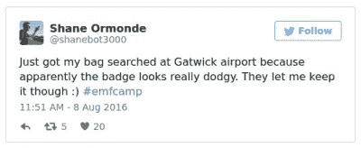
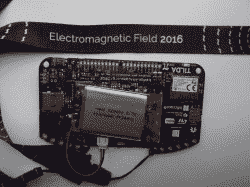
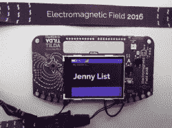
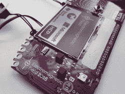
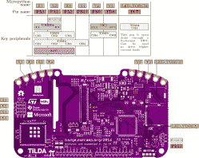
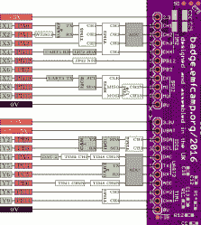

# TiLDA MKπ，EMF Camp 2016 徽章

> 原文：<https://hackaday.com/2016/08/09/tilda-mk%cf%80-the-emf-camp-2016-badge/>

苏格兰领事馆已经在它最后的护照上盖了章，荷兰消防塔已经喷出了它最后的火焰，黄金会员休息室也随着庄园和帐篷被遗忘。EMF Camp 2016 已经结束，所以 1500 名左右的参与者留下的只有回忆、照片和节日腹泻，以提醒他们在萨里郡乡下的三天。

不完全是，还有徽章的小问题。

在 EMF 2016 的案例中，它被称为 [TiLDA MKπ](https://badge.emfcamp.org/wiki/TiLDA_MK3) ，由于今年早些时候[似乎徽章可能永远不会出现](http://hackaday.com/2016/05/18/electromagnetic-fields-badge-hanging-in-the-balance/)，它代表了 EMF 徽章团队的一项重大成就。

该徽章具有一个运行在 80MHz 的 STM32L486VGT6 ARM Cortex M4，一个 320×240 像素彩色 LCD，磁力计和加速度计，以及一个 CC3100 WiFi 处理器。该固件提供了一个简单的界面来[一个应用商店](http://api.badge.emfcamp.org/apps)，其中包含了来自 EMF Camp 团队和活动参与者提交的 [micropython](https://micropython.org/) 应用的扩展阵列。出厂时，徽章会连接到其中一个站点网络，但在活动结束后，您可以根据自己的网络进行调整。它被设计为易于黑客攻击，只需要一个 USB 连接和安装为磁盘驱动器，而不需要特殊的软件或 IDE。一系列全面的 I/O 线路连接到 0.1 英寸间距的引脚和 4 毫米边缘安装孔。在 EMF 营的闭幕演讲中，宣布了一项竞赛，为徽章的最佳硬件和软件用途提供一系列奖项。

[The TiLDA causes a sticky moment](https://twitter.com/shanebot3000/status/762602130721079302) for our colleague, [Tindie](https://www.tindie.com/) scribe Shane.

正如经常发生的情况一样，这个徽章并非没有初期问题，因为网络要同时处理如此多的设备连接，而且板上的 Neopixel 原来是颠倒安装的。我们的徽章似乎在保持稳定的网络连接方面有点麻烦，应用程序经常因各种 Python 错误而崩溃，尽管一系列固件更新已经带来了更稳定的体验。但这些时刻是徽章体验的一部分；毕竟，这是一场参与者可能有办法应对此类问题的盛会。

徽章的所有相关文件和软件都是完全开源的，可以在 [EMF Camp GitHub 仓库](https://github.com/emfcamp)中找到。如果你感兴趣的话，我们在下面的画廊里放了一组板子的图片。引脚排列图像由 [EMF 徽章 wiki](https://badge.emfcamp.org/wiki/Main_Page) 提供。

我们以前展示过 EMF 徽章，下面是我们对 EMF 2014 设备的看法。