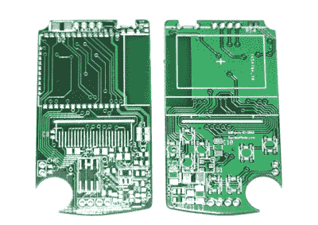

# 最小的游戏机藏在你的口袋里

> 原文：<https://hackaday.com/2016/11/28/tiniest-game-boy-hides-in-your-pocket/>

这可能是世界上最小的全功能 Game Boy Color，能够使用微小的方向键和按钮玩所有的游戏，带有板载显示屏和电池，并采用原始的形式。这是一个令人难以置信的黑客技术，在硬件和软件方面都堪称杰作。这将很容易成为你今年看到的前五名黑客。

我相信很多人对自己的第一款掌上游戏都有着美好的回忆。这将是大多数游戏机，我们承认他们有相当不错的便携性和电池寿命，使许多智能手机自惭形秽。尽管如此，Sprite_TM 一直梦想着一个更加便携的版本，令他青少年时期高兴的是，他发现了一个游戏男孩的钥匙链版本。不幸的是，他上当了。这个钥匙链看起来像一个游戏机，但只起到时钟的作用。

但是现在，几十年过去了，技术进步了，他也有了自己的技能。对于他在 [2016 Hackaday 超级大会](https://hackaday.io/superconference/)上的讲话，Sprite_TM 实际上构建了他童年的梦想。

 [https://www.youtube.com/embed/BYXAZZfJm-g?version=3&rel=1&showsearch=0&showinfo=1&iv_load_policy=1&fs=1&hl=en-US&autohide=2&wmode=transparent](https://www.youtube.com/embed/BYXAZZfJm-g?version=3&rel=1&showsearch=0&showinfo=1&iv_load_policy=1&fs=1&hl=en-US&autohide=2&wmode=transparent)

## 硬件:

Sprite 通过详细说明显示器开始了他的硬件设计。最初的 Game Boy 屏幕相当差，可以管理 160×144，大约有 4 级灰度。新屏幕需要包含这一点，但物理尺寸要尽可能小。

  Screen test  PCB Front and Back

他发现的第一个屏幕是一个 800×600 的小彩色有机发光二极管屏幕:一个惊人的硬件，价格却高达 720 美元。更好的选择是售价 3.80 美元、尺寸不到 1 英寸的彩色有机发光二极管——它在 96×64 的分辨率下不够高，但 Sprite 对它进行了测试，发现它的图像还过得去。为了完善硬件选择，他配备了一个直径不到 1 厘米的扬声器，一个 ESP-32 芯片(以 ESP-WROOM-32 模块的形式)，以及一个 150 毫安的锂离子电池。

屏幕的大小决定了游戏男孩身体的所有尺寸。Sprite 将屏幕的测量图像拖入 Inkscape，并开始播放原始硬件的图像，以达到他的最终尺寸。他在布置电路板时遇到了一些挑战，因为它需要一个插槽让有机发光二极管柔性电缆穿过。他在 OpenSCAD 中对 PCB 进行建模，并围绕它构建机箱设计。这是他第一次使用 3D 打印机，他的箱子(打印在表格 1+上)看起来真的很棒！

## 软件:

在这种情况下，软件是一个挑战。Sprite 想从模拟器开始，但是模拟器是为完整的计算机系统编写的。ESP32 是一个强大的芯片(双核 240 MHz，512k RAM，一系列外设，WiFi 和蓝牙)，但它仍然不是一台完整的计算机。他决定着眼于更老的模拟器，这些模拟器经过优化可以在非常老的计算机设备上运行。在调查了许多选项后，他选定了 GNUboy，它有优化功能，可以在 486 计算机上运行。

这是一个良好的开端，但要确保这一切成为可能，他还有很长的路要走。最值得注意的是 GNUboy 用来维护“精灵”的“图块缓存”——构成每个游戏的 8×8 图形块。这在视频的 18:34 得到了很好的解释。GNUboy 为 tile 缓存分配了大约 128 kB 的内存(超过可用内存的 1/4)。Sprite 能够将这个需求减少到大约 46 kB。

模拟器运行后，Sprite 添加了一些不错的用户特性。有一个屏幕显示，允许用户调整亮度，音量，并加载或重置 ROM。由于主板上没有大容量存储器，这个小小的游戏机一次只能存储几个只读存储器。Sprite 利用芯片的 WiFi 功能来解决这个问题。当你想加载一个新游戏时，它会广播一个接入点并运行一个网络服务器，允许任何手机或电脑上传一个新游戏。

## 起初并不顺利的事情

在构建像这样的定制硬件时，总会遇到一些问题。对我们来说幸运的是，雪碧非常乐意分享他的绊倒点，他在这样做的时候非常有趣。

音频是一个难点，也是演讲中技术上最有趣的部分之一。他注意到扬声器变得比它应该有的温度要高…大约有 90 摄氏度。他用一个 H 桥电机驱动芯片(BD6211)来驱动它，这个芯片并不那么另类。就好像那个芯片一直在驱动扬声器。

为了解决这个问题，他开始研究滤波技术，并发现了两种被称为 AD 调制和 BD 调制的设计。原来 BD 调制是以 0V 两侧的正负电压驱动为中心线。这是热量问题的解决方案，但也带来了另一个挑战:如何从微控制器产生负电压？他最初的音频技术使用 I2S 外围设备，但只输出一个引脚。他转而使用具有两个引脚的 RMT 外设，用它来触发负电压电路。这个解决方案非常聪明，Sprite 建议查看 RMT 外设中的其他黑客(这里的[是驱动 ws 2812 led](http://www.esp32.com/viewtopic.php?t=296)的一个)。

我们听到有人抱怨使用外部闪存的微控制器。有时候这确实是一个非常好的特性。例如，Sprite 需要更多的程序内存，ESP32 支持这一点，但 WROOM 模块有一个焊接在电路板上的金属盒，可以屏蔽所有电路。他认为热风回流站可以解决这个问题。是的，它还负责拆焊其余的机载组件。又尝试了一个新的模块，他能够用最大的闪存芯片来完成。

## 它活着——而且它不仅仅是一个游戏机

证据总是在布丁里。小游戏男孩的示范令人愉快。如果你周末和雪碧聊过，他可能会让你试试。这和原来的 Game Boy 一样好用。尽管缺少像素，屏幕看起来棒极了！用户控制感觉正常，声音也不错，虽然有一点延迟，他已经在待办事项列表中解决了这个问题。

被黑客攻击的游戏系统的庸俗基准早已注定，这一事实在 Sprite 上并没有消失。他演示了《毁灭战士》运行得很好，但帧率很差——这在我们的书中仍然算作一场胜利。他还展示了他的钥匙链大小的掌上游戏机《巫师 3》。有点不对劲，对吧？当然，微控制器不能处理当前一代的游戏，但它可以像魔咒一样处理 VNC 转发。一个非常酷的把戏，如果游戏男孩模拟没有完全让我们明白我们的小型化技术已经走了多远，这个演示应该可以完成任务。

Sprite 将在 GPL 下发布代码，一旦他清理了代码。他正计划对 PCB 和机箱设计文件进行同样的处理。如果你想要其中的一个，并且喜欢做一点你自己的虚构，它可以是你的。观看[SpritesMods.com](http://spritesmods.com/)发布代码和更多关于建筑本身的信息。

现在想要更多的 Sprite_TM？他在去年的超级电脑“电子鸡奇点”上的演讲，本身就是一次史诗般的演讲和硬件破解。尽情享受吧！