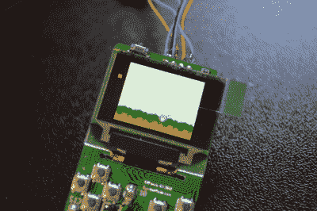
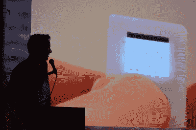
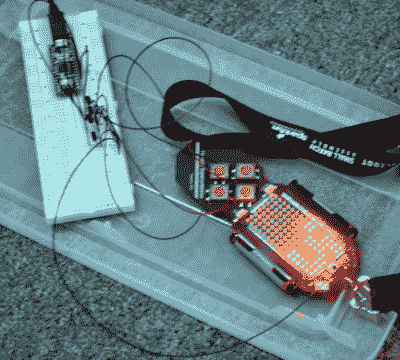
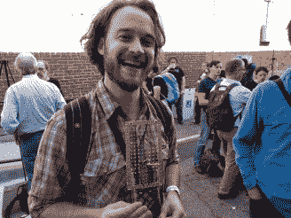
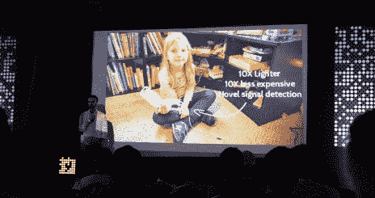
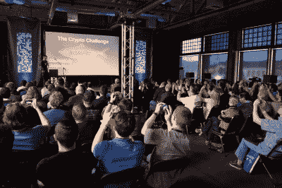
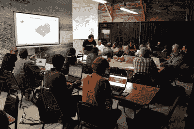

# 小游戏男孩(玩巫师 3)和其他让我大吃一惊的东西

> 原文：<https://hackaday.com/2016/11/07/tiny-game-boy-that-plays-witcher-3-and-other-things-that-blew-my-mind/>

多年来，Sprite_TM 一直是我最喜欢的黑客，然而他仍然有一种不可思议的能力，即使我已经准备好了，他的黑客技术也让我大吃一惊。本周末，在 Hackaday 超级会议上，他发表了一篇关于他的微型、全功能游戏机的精彩演讲。他用一个 Rick Roll 偷走了徽章黑客秀，通过直接切入最终答案在一个小时内分解了加密挑战，并设法同时到达每个地方。你是巫师~~哈利~~精灵！

疯狂之处在于:这些只是数百人中的一个人的滑稽动作，我在会上发现他同样令人惊叹。当我说 SuperCon 是我参加过或听说过的最好的会议时，我感到无法向你们表达我的绝对真诚。它成功地超越了我在周末之前构建的任何夸张。今天早上感觉像是从梦中醒来，拼命想再睡着。

### 你说的这个小游戏机是什么？

Tiny Game Boy PCB running gnuBoy Emulator

Sprite_TM 的演示节奏是理解这一过程的重要组成部分。他有一个“哦，还有一件事”的习惯，用不可思议的创造性跳跃和跨越技术障碍来攻击你，这在这里是不可能做到的。但是视频编辑完成并准备出版还需要几周时间。这里有一些亮点来吊你的胃口。

在他年轻的时候，Sprite_TM 沉迷于围绕任天堂 Game Boy 的文化，并且清楚地记得订购一个小小的 Game Boy 钥匙链的失望，这个钥匙链除了作为一个数字手表之外什么也不能做。近 25 年后，技术已经足够先进，一个熟练的工程师实际上可以建立这一点。Sprite 的超级对话提供了一个合适的借口来集中他的技能完成任务。

挑战是这样的:找到一个合适的小彩色屏幕，将其连接到 ESP32(双核 240 MHz 处理器)，用一个 3D 打印外壳将其包围，该外壳的比例与最初的 Game Boy 的比例相匹配，并用一个定制板将整个东西包装起来，以处理电池管理、音频(这本身就是一个很棒的 h 桥黑客，我不会在这里讨论)和用户输入。

Look closely, that’s the tiny Game Boy running Doom

一个小小的 Game Boy 案例是一回事，但你需要一个同样令人印象深刻的软件来进行模拟。这里的挑战是，仿真器是在成熟的计算机上运行的，尽管功能非常强大，但 ESP32 是一个微控制器，而不是 SoC。一旦他的模拟器运行得完美无缺，Sprite_TM 就会继续运行——Doom 必须在所有东西上运行，对吗？但他回放了一个在硬件上运行的当代游戏《巫师 3》的演示。你将不得不等待谈话视频的秘密，但我会给你一个提示:ESP32 是一个 WiFi 芯片。

如果你还不熟悉雪碧的黑客技术，那就从去年的电子鸡奇点开始吧。

### 神智不清

Using an Arduino to brute-force forth crypto challenge puzzle

我错过了本周末我真正期待看到的大部分演讲。Ken Shirriff 的工作“逆向工程硅”总是让我惊讶，当他在舞台上解释其中的一些内容时，我并不在场。我很高兴在追逐解决徽章的加密挑战。(我成功了，但只是得到了克鲁克斯和沃佳·安东尼克的提示，以及其他六个人的帮助。)这种情况一次又一次地发生——我错过了本·克拉斯诺、娜迪亚·皮克、萨米·卡姆卡、斯达·辛普森以及无数我尊敬和崇拜的人的演讲。是的，我头晕眼花地跑来跑去，就像一个在游乐园里的孩子。

我在 Crystal Gordon 博士关于生物感应的演讲的后半部分漫步，并对她关于机器人运动如何通过记录和分析生物运动的数据而得到显著改善的见解感到高兴。我看到本·克拉斯诺和艾伦·耶茨被俊郎·柯德拉对超材料旋磁的研究迷住了——这些人不容易被打动。带着史蒂夫·柯林斯讲述的美国宇航局许多失败模式的故事去火星和更远的地方旅行。

  Zach Fredin air-wiring his badge LED matrix  Bodo Hoenen had help from all over the world for his daughter’s exoskeleton prosthesis

Everyone in the room taking pictures of Brian Benchoff’s literal red herring during Crypto challenge unveiling

这个场地非常完美，提供了两个舞台，宽敞的室外冷藏区，室内和室外工作室，以及恰到好处的氛围，创造出一种恍惚的状态。

我们吹捧这是建立一个黑客村。我敢说在场的任何人都不会说我们不这样做。我坐在那里聊天，而我周围的人都在黑他们徽章的固件。我看着 Zach Fredlin 减少了他徽章上的所有表面贴装 led，并将显示器重建为一个超大尺寸的无线设计。我们向第[届黑客日大奖](https://hackaday.io/prize)的前几名颁发了 20 万美元。在供应框架设计实验室里，一个完全没有计划的、即兴的桌面铣削车间焕发了生机。

Become an Eagle Master — a workshop for that.

也许最值得注意的是，我从未见过有人独自站在房间的边缘，紧张地想要加入。包容的感觉，社区的感觉，每个人都是重要的和重要的，这当然是整个经历中最鼓舞人心的部分。

这是一件特别的事情，我希望我能度过我生命中的每一天——就像我在这个超级会议上一样。

### 更多即将到来

你不必相信我的话，但你必须再等一会儿。我们将尽可能快地从这个周末开始发布每一个精彩的细节。看看 Hackaday 的首页，留出一些时间来真正挖掘一下让它如此特别的演讲和活动。