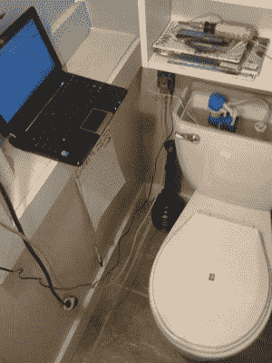
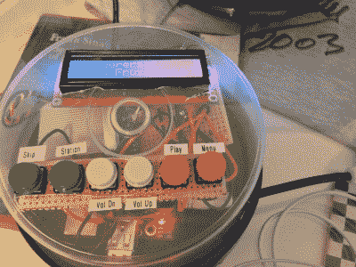
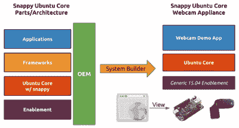

# 到处都是微型无头服务器

> 原文：<https://hackaday.com/2015/09/17/tiny-headless-servers-everywhere/>

快问，“云计算引擎”和 goofy Raspberry Pi 物联网黑客有什么共同点？除了那些值得恶搞的时髦词汇，它们都涉及管理远程无头(Linux)安装。正是因为这个原因，一个新的 Ubuntu 发行版本, [Ubuntu (Snappy) Core](http://developer.ubuntu.com/en/snappy/) 瞄准了价值数十亿美元的亚马逊弹性计算云和 55 美元的 BeagleBone Black。

如果这种组合对你来说不太可能，你并不孤单。但是请继续读下去，我们希望能对它有更多的了解。

## 黑客硬件历史

当 2011 年树莓派的谣言第一次出现时，它被宣传为世界计算机扫盲困境的解决方案——以每台 25 美元的价格，世界上每个孩子都能拥有一台。(别管键盘、显示器、HDMI 线、鼠标、电源的价格……)没人会想到我们会面临一个无头 Linux 服务器大军，但这确实发生了。

周围还有其他小型计算机；当时， [BeagleBoard](https://en.wikipedia.org/wiki/Beagle_Board) 是单板计算机(SBC)前端的热门产品，但是它太贵了，只有忠诚的人和书呆子才使用它。我们有一个连接到硬盘驱动器和外部 DAC，作为当时我们立体声系统的中心。这个系统有点笨拙，因为我们偶尔不得不拿出一个屏幕和键盘来对它进行维护，但总的来说，它作为多媒体中心工作得很好。

然后树莓派的价格只有猎兔犬纸板的四分之一，有趣的事情发生了。Raspberry Pi 没有成为世界计算机需求的解决方案，而是最终进入了 Arduino 曾经居住过的同一个项目空间。也许是价格和外形的原因。

 例如，人们不能否认，一个[叽叽喳喳的厕所](http://hackaday.com/2009/05/05/twittering-toilet/)是现代时代的必需品。(别怪我们！这是时代精神。)另一方面，让你的 Arduino 直接连接到互联网在当时是相当困难的——因此，Arduino 感知刷新并与负责 Twittering 的真实计算机通信也就不足为奇了。

树莓派改变了这一切。它们足够便宜，以至于你可以把其中一个专用于厕所，而不会有一点点罪恶感。所以不久之后，我们在厕所和 T2 鸡舍里吃到了覆盆子尿，而不是在小学课程里。

这些类型的项目根本不使用设备作为“计算机”。事实上，在我们在 Hackaday 看到的数十亿个 Raspberry Pi 项目中，有多少个连接了屏幕、键盘和鼠标？很少，除了 MAME 版本和被塞进他们自己软盘驱动器的仿真 Amigas。

或者看看[小猎犬家族](https://en.wikipedia.org/wiki/Beagleboard)。BeagleBoard (2010)是一款成熟的单板计算机(SBC)；你可以插上显示器和键盘。然后是最基本的版本(也稍微便宜一点):BeagleBone (2012)。这表明它是为嵌入式应用设计的，而不是一台独立的电脑，它没有视频输出，价格也便宜一点。这是一次成功。

更便宜的是，BeagleBone Black (2013)再次选择了 HDMI 端口，因为，见鬼，为什么不呢？似乎是为了回答这个问题，最新的 [BeagleBone Green](https://hackaday.com/2015/08/05/beaglebone-green-hands-on-lower-price-same-horsepower/) 用一些 I2C 外设连接器取代了视频输出，重申了该设备作为嵌入式计算机而不是迷你桌面的意图。

那么你希望你的项目是什么样的呢？最近在 Linux Gizmos 进行的一项调查要求读者对他们最喜欢的单板电脑进行评级，结果在流行品牌方面毫无意外:Raspberry Pi 最受欢迎，其次是 BeagleBone Black，然后是 Odroid 产品。

更有趣的是，他们还询问人们他们的 SBC 将用于哪些应用。结果，按顺序排列:

1.  家庭自动化
2.  特殊功能服务器
3.  家庭多媒体
4.  教育
5.  机器人/车辆
6.  数据采集/控制
7.  人机界面/工业
8.  "其他"
9.  电话亭

这也符合我们对普通黑客感兴趣的东西的直觉，所以我们会购买它。

查看应用程序列表，有多少项目应用程序需要键盘、显示器和鼠标？有多少是传统的“电脑”应用？比如说“教育”的一部分，也可能是所有的“信息亭”。其余的应用程序要么是独立的，通过网络运行，要么可能最好是由一个小的液晶显示器服务。简而言之，它们是嵌入式项目，受益于(微型)真实计算机带来的连通性和开发便利性。

### 那又怎样？

 这个近代史教训的要点是，如果你把一台电脑做得足够便宜，它*就会变成*一台嵌入式设备，因为没人能拒绝廉价的互联网或 USB 连接，或令人愉快的开发环境，甚至只是有广泛库支持的解释编程语言。如果网络抓取是设备功能的一部分，你不会想在 8 位微控制器上编码。因此，以前的 Arduino 应用程序充斥着树莓 Pis，我们的评论区充斥着谴责“过度杀戮”的人。

但更重要的是，我们在一些项目中看到了嵌入式 Linux 系统，在这些项目中，很难获得 HDMI 端口，或者你只是不想携带显示器。这些是无头 Linux 系统，它们不在某个服务器机房的机架上，而是在你卧室的床头柜下。卑微的硬件黑客正在研究无头联网服务器的远程管理，这听起来像是一个完全不同的工作描述。

## 无头运行:软件迎头赶上

因此，如果物联网将是一个无头 Linux 机器的互联网，难道我们的软件/操作系统不应该跟上吗？不再有这种 GUI 配置菜单的废话——那是针对拥有豪华显示器的台式机的。一旦您将您的 Raspberry Pi 或 BeagleBone 放入某个地方的某个盒子中，您需要的是对其中的小型无头 Linux 服务器进行快速而简单的部署和基于网络的远程管理。在你安装并运行它的网络服务器或 VNC 之前，这意味着你要花一些时间在游戏机上。

对“云”世界中的并行开发进行排队。快速启动服务器上的机器的需求使得使用简单而强大的命令行工具来安装和更新整个系统变得更加容易。特别是，在过去五年中，创建系统、保存配置和安装细节，然后将它们回放到另一个实例中的能力变得更加容易了。见[集装箱](https://en.wikipedia.org/wiki/Software_container)和[码头工人](https://en.wikipedia.org/wiki/Docker_(software))和所有的爵士。

 回到嵌入式世界，Ubuntu 核心文档中有一个例子[在 BeagleBone Black](http://developer.ubuntu.com/en/snappy/guides/appliance-builder-guide-webcam/) 上设置一个网络摄像头，然后回放那个配置，可能是一个全新的安装。如果与世界共享您的嵌入式设备意味着传达各种系统和应用程序配置细节，那么有工具使这变得更容易就太好了。

最后，安装安全补丁是目前物联网世界的热门话题。没有人希望联网设备在他们的家庭网络中到处都是漏洞百出的安全实施方案，然而如此多的物联网设备都闪烁着不灵活和/或难以更新的固件。“云”与嵌入式技术融合的一个主要优势是，设备可以从更简单、无需干预的安全更新机制中获益。

## 结论

来自“云设备”的软件技术与我们被黑掉的(非隐喻性的)设备的不太可能的联姻才刚刚开始，我们认为它实际上会让我们的硬件类型受益。当然，这在一定程度上是语义上的，但是我们认为将你的 Twittering 厕所识别为一个无头的 Linux 服务器可以增加可再现性和安全性，以及便利性。

你怎么想呢?树莓派作为微型台式电脑的想法从一开始就注定要失败吗？安装和管理的简易性是否会将一些微控制器的顽固分子推向微机阵营？你是一个分布式 Linux 系统管理员吗，因为你的家庭自动化系统中有四个 BeagleBones？还是我们在啤酒里进行了太多的哲学思考？

[董事会照片由比格板基金会和卢卡斯博世提供]