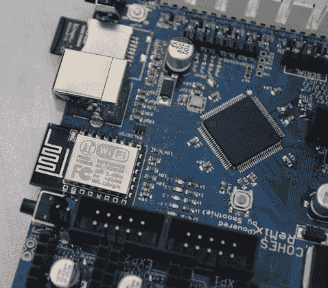
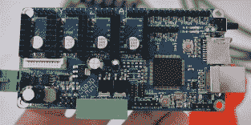
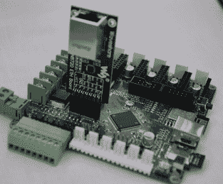
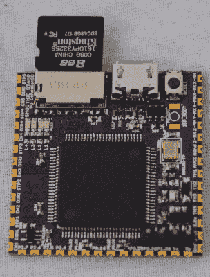

# 创客集市上的小冰沙

> 原文：<https://hackaday.com/2016/10/05/tiny-smoothies-at-maker-faire/>

近十年来，桌面 3D 打印的核心一直围绕着 8 位微控制器。ATmegas 和其他 Atmel 芯片足以移动几个步进器并喷射一些塑料。借助更快的处理器，您可以获得更平稳的加速，从而获得更好的打印效果。现代 ARM 设备有许多外设，允许板载 WiFi 和以太网连接。未来是 32 位打印控制器。

现在有一些 32 位控制器，从非常奇怪的、突然冒出来的用于[单价迷你 3D 打印机的控制器](http://hackaday.com/2016/06/13/review-monoprice-mp-select-mini-3d-printer/)到更传统的[光滑板](http://smoothieware.org/)。这些主板中只有一个拥有合适的 3D 打印机控制器的开放硬件证书，在今年的 Maker Faire 上， [Cohesion3D](http://cohesion3d.com/) 推出了几个基于 Smoothie 的机器控制板，增加了一些有趣的功能和技术。

      

Cohesion3D 提供了两到三个产品，这取决于你如何看待它。展台的明星显然是 cohesion 3d ReMix——带有六个 Pololu 电机驱动器插座的大板、LPC17xx 微控制器、用于大型加热床的 20 A MOSFET、受保护的 endstop 输入、由 ESP8266 提供的 WiFi 以及用于以太网模块的空间。

第二款最小的主板是 Cohesion3D Mini。这种板真的不是为 3D 打印机设计的，尽管由于有四个电机驱动器，它当然有可能用它来建造一台打印机。Mini 专为小型台式铣床和激光切割机设计。在电路板的右边是一个 K40 激光切割机的连接器，这种无处不在的中国激光切割机总是有一个可怕的控制板。Mini 配有一个小型廉价的适配器，可以直接插入终端止动销，是 K40 控制板的替代产品。像所有运行 Smoothie 固件的主板一样，升级固件非常简单，只需将主板插入计算机，将文本文件放入驱动器，然后重置主板。

虽然不是正式的 Cohesion3D 产品，但在 Maker Faire 上出现了第三板。这个未命名但非常小的板基本上是模块上的思慕雪系统。它具有 LPC17xx 微控制器、USB 插座、microSD 插座、复位按钮和一组齿形引脚。这些引脚旨在连接到步进电机驱动器、GPIO、终点挡板、MOSFETs 以及 CNC 或 3D 打印机控制板所需的一切。这是一个非常智能的小设备，虽然我不知道它是否会被发布，但它确实标志着 3D 打印机设备的商品化。

在查看这些为 Smoothie 固件设计的主板时，很难不将两三个最常用的 3D 打印机固件与基于 ATmega 的 3D 打印机控制器主板的庞大生态系统进行比较。即使没有几百块，也有几十块打印机控制器板，都是为不同的任务而设计的。斜坡本身几乎是一个标准，但如果你需要一个 24V 的板，你可能想给伦巴一个外观。如果出于某种奇怪的原因，你需要六个电机驱动器，也有一个板。

3D 打印机控制器板的生态系统已经填满了每一个生态位，但只是在 8 位微控制器的孤岛上。在 32 位微控制器的世界里，没有太多的选择。如果有什么不同的话，Cohesion3D 提供的产品是继 Smoothieboard 推出后的第一代主板。将会有更多这样的板，它们都将为足够多的用例提供服务，从而变得可行。

据我们所知，SmoothieBoard 本身即将推出第二版，当然，该板将有足够多的新功能，让事情变得非常有趣。在此之前，如果你正在寻找一个 32 位运动控制卡，你的选择已经增加了一倍(或两倍)。现在是自己造数控机床的大好时机，而且只会越来越好。