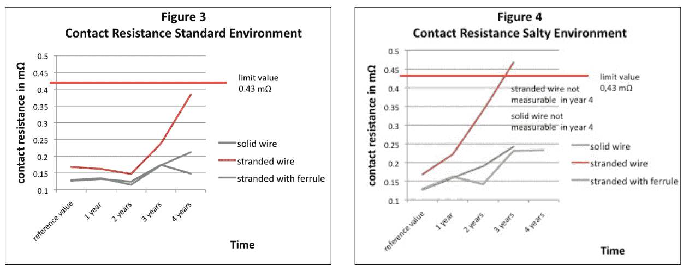

# 箍还是不箍？

> 原文：<https://hackaday.com/2018/04/12/to-ferrule-or-not-to-ferrule/>

我们最近发布了一篇关于[一场壮观的 3D 打印机火灾](https://hackaday.com/2018/03/18/3d-printer-halts-and-catches-fire-analysis-finds-a-surprising-culprit/)的文章，幸好在蔓延到黑客的房子或伤害他的家人之前被发现并扑灭。通过分析打印机的残骸，黑客确定火灾是由一个松动的平头螺钉导致挤出机的加热器筒脱落并接触 ABS 风扇护罩引起的。它全速运转，把东西都点着了。

我们中的许多人都有类似的 3D 打印机，所以这篇文章的评论很活跃是可以理解的，但是[一条评论通过列出一些布线的最佳实践而脱颖而出](https://hackaday.com/2018/03/18/3d-printer-halts-and-catches-fire-analysis-finds-a-surprising-culprit/#comment-4428437)，包括套圈的使用。特别是，许多 3D 打印机将消耗大量电流的加热床与螺丝端子连接到主板上。虽然不是最初帖子中火灾的原因，但熔化的端子板是许多 DIY 3D 打印机套件的常见投诉，其中一个原因是，简单地将粗绞线塞到螺丝端子中，并希望最好的结果会导致接头处的电阻和热量增加。在这种情况下，绝对正确的做法是压接套圈。让我们来谈谈这个。

### 一系列管子

那么套圈到底是什么？一般来说，任何一种用来连接、加固或固定物体的带子或夹子。这是一个宽泛的定义，涵盖了从鞋带两端用来防止松开的金属扣到用来连接钢丝绳的坚固金属夹的所有内容。但在电气布线领域，套圈有更具体的定义，与纯粹用于机械应用的套圈相比，用途非常不同。

电线套圈是一种软金属管，压接在绞合线的末端，以改善电线的连接特性。大多数套圈由铜制成，通常镀锡。套圈的直径和长度都适合特定规格的导线。然而，套圈不仅仅是一个简单的圆柱体，它的一端有一个唇缘或扩口，用于在电线插入套圈时收集和加固电线的单股。

Cross-section of an insulated ferrule installed on stranded wire. Source: [Weidmüller Interface GmbH & Co. KG](https://web.archive.org/web/20171026170352/http://www.weidmuller.com/bausteine.net/f/7862/Weidmuller_Ferrules_White_Paper.pdf?fd=3&sa=U&ved=0ahUKEwj_7ezh4I7XAhXDxVQKHQbcDGQQFggxMAk&usg=AOvVaw1NVeV8EoT6IVE2tC_EVQJj#expand)

大多数套圈中的喇叭口不会立即显现出来，因为它通常被包裹在圆锥形塑料电缆入口套管中。该套管充当导线绝缘和套圈本身之间的过渡，并且还用于将所有那些松散的线股收集到套圈的内腔中。与更传统的压接连接不同，套圈的塑料套管在安装过程中不会被压缩。它在绝缘层周围保持完整，并通过将电线的弯曲半径从绝缘层末端移开，在安装后提供一定程度的应变消除。在 DIN 46228 标准中，大多数套圈套管对导线尺寸进行颜色编码，对于相同的平方毫米横截面积，该标准有两种不同的编码，法国和德国，令人混淆。

### 使绞合线坚固

如果听起来套圈更像是欧洲的东西而不是美国的，那是有充分理由的。为了获得 CE 认证，电气设备必须用套圈端接进入螺钉或弹簧端子的绞合线。在美国没有这样的规定，因此在美国设备中使用套圈并不常见。但是，套圈有着不可否认的特殊优势，而且它们的应用似乎越来越广泛，因为它们具有良好的工程意义。

为了理解原理，夹一小段任何规格的绝缘绞线。绞合线很柔韧，这也是在移动应用和可能发生振动的地方使用绞合线而不是实心线的原因之一。但它仍然有些僵硬，部分原因是绝缘材料包裹了导体的股线，使它们保持紧密接触，并保持独立股线的扭曲或绞合。现在从一端剥去一点绝缘材料。你会注意到，在大多数情况下，绳股的捻度至少会受到部分干扰——它们会解开一点。剥去更多的绝缘层，线就会越来越分开。去掉所有的绝缘层，导体将失去所有的结构完整性，变成一股一股的。

这是套圈解决的基本问题:在电线被剥开后，它们保持导线中线束的紧密结合，并允许连接传导其全部额定电流。在没有套圈的情况下，挤压在螺钉端子中的剥开的绞合线易于张开，从而减少了与端子紧密接触的单股线的数量。这种终端的电阻比适当的摆渡连接高得多。  带套圈的绞线性能比不带套圈的好很多。来源:T5 魏德米勒接口有限公司&KG

### 挤出你的问题

不过，摆渡连接不仅仅是减少阻力。像其他[卷曲连接](http://hackaday.com/2017/02/09/good-in-a-pinch-the-physics-of-crimped-connections/)一样，正确应用的套圈内部的绞线承受巨大压力，在此过程中轴向拉伸和径向变形。拉伸作用倾向于破坏和置换线股上的表面氧化，而径向压缩倾向于去除线股之间的空气间隙。这些倾向于使压接的连接比未压接的线更好地抗氧化，增加连接的寿命。

 [https://www.youtube.com/embed/zidewfpKxu8?version=3&rel=1&showsearch=0&showinfo=1&iv_load_policy=1&fs=1&hl=en-US&autohide=2&wmode=transparent](https://www.youtube.com/embed/zidewfpKxu8?version=3&rel=1&showsearch=0&showinfo=1&iv_load_policy=1&fs=1&hl=en-US&autohide=2&wmode=transparent)

那么套圈是家庭游戏玩家的选择吗？总的来说，我会说是的。与普通绞合线相比，套圈具有明显的优势，在高电流应用中，我会坚持将套圈用于螺丝端子或任何有助于消除屏蔽应力的地方。此外，它们给项目带来了干净、专业的外观，因此即使应用程序不是关键的，我也倾向于将它们包含在我的绞合线连接中。当然，安装套圈也不是没有成本，但是一套 30 美元的套圈套件和一个合适的棘轮压接工具，还不算太差。

感谢[没有人特别]提出这个故事。

【特征图片: [KNIPEX](https://www.youtube.com/watch?v=zidewfpKxu8) ，[套圈直接](http://www.ferrulesdirect.com/terminal/3210/FD2210TW.htm)