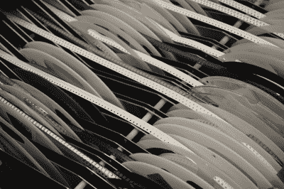
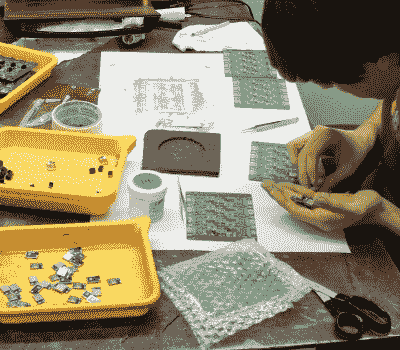
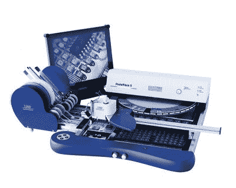
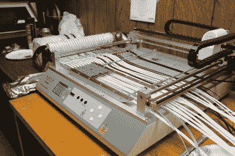
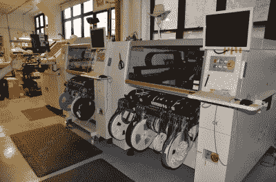

# 行业工具-元件放置

> 原文：<https://hackaday.com/2016/05/10/tools-of-the-trade-component-placing/>

最近，我们开始了一系列用于组装电路板的组件。第一个问题是关于[分配锡膏](http://hackaday.com/2016/03/10/tools-of-the-trade-solder-paste-dispensing/)。顺着装配线往下走，锡膏已经在电路板上了，下一步是把元件装到 PCB 上。本期我们只讨论 SMT 元件，因为通孔组装是在 SMT 元件完成与电路板的贴合过程后才进行的。

Reels!

SMT 元件将以卷轴形式出现。这些卷轴是纸或塑料的，顶部有一个透明的塑料条，一个卷轴上通常有几千个组件。规模经济真的在卷轴上发挥作用，尤其是被动卷轴。如果你订购 1-10 个数量的 SMT 电阻器，它们通常是每个 0.10 美元。如果你订购 5000 卷，通常是 5 美元左右。购买一卷 10 千欧 0603 电阻，并且在你的生活中再也不用订购它们，比一次订购几个要便宜。此外，卷轴可以用于许多取放机器，但切割带通常太短，无法用于自动化过程。

卷轴的重点是它将通过一个拾放机，这是一个使用真空注射器拾取零件并将其放置在正确位置的机器，然后推进卷轴并重复。理论上这很简单。在实践中，有十亿个小细节会对可靠性产生巨大影响。比如透明条的张力，它必须恰到好处，这样它不会松弛，也不会将卷轴拉出。或者胶带的粘性也是一个问题。我们有一个卷轴开始跳动；粘合剂太强，所以胶带张力器很难将抽头从卷轴上拉下来，它会以这样的方式这样做，即新暴露的组件会抽动，有时会跳出卷轴，导致真空试图捡起丢失的部分并停止。过了一会儿，湿气使胶带变得更松，问题就消失了。每天运行的生产线对每个卷轴来说都可能是不同的，因此保持一切协调是一场持续的战斗。大多数情况下，卷轴都是密封包装的，因为湿度对卷轴和其中的组件(尤其是它们的连接)有很大的影响。

有些组件装在管子里，因为它们不便于卷轴。令人惊讶的是，这不是一个问题，因为许多取放机都有附件，以一定角度固定管子，并有机械振动器，使零件一次滑出一个。但是我们现在忽略它。

因此，你有一盒卷轴和切割带(如果你没有订购完整的卷轴，该术语用于从卷轴上切割下来的条带)，你有一个上面有焊膏的 PCB，正在慢慢加热。如何将元件安装到 PCB 上？

## 镊子

小体积的，通常用旧镊子。你不要在浴室的梳妆台上使用，因为锡膏中通常含有铅，你不想让任何人生气或中毒。买一套尖端非常精细的镊子。

Manual pick and place with tweezers and fingers

事实证明，中等体积的镊子也是可行的。在生产的第一年，我开发的产品有 3000 个单元是手工组装的，每个单元大约有五个 SMT 元件。事实证明，在这种情况下，以略高于当地汉堡店的价格雇用高中学生，给了我们很大的制造灵活性，在孩子们想要的任何时间，在他们感兴趣的相关领域，给了他们体面的工资，最终比我们从中国得到的报价更便宜。

好消息是，手动放置可以摆脱相当草率。当 PCB 经过回流焊过程时，会发生一些简单的化学和机械过程，将所有东西对齐，因此元件的精确位置并不重要。实质上，焊料会熔化并流到焊盘上，离开阻焊膜，任何元件都会浮在焊料上并自动对准。尽管如此，一个元件的所有连接必须接触焊膏，否则它们不会正确对齐。

## 真空

当你在做一堆有很多组件的电路板时，用手放置所有的组件会很快变得很累。一种更简单的方法是用真空吸头代替镊子。这里的想法是得到一个水族馆泵，并设置其方向，使其吮吸。然后把一个注射器放在一根管子的末端，在拇指所在的地方开一个小洞。现在当你把手指放在孔上时，注射器针头会吸出一部分。将器件移至目的地，松开拇指，真空密封将被破坏，器件释放到 PCB 上。这有利于将镊子无法触及的部分直接从胶带中拉出。这些年来，我们已经介绍了一些这样的[水族箱泵](http://hackaday.com/2010/03/03/vacuum-pick-and-place-for-smd-parts/) [取放](http://hackaday.com/2013/09/03/a-pick-and-place-tool-from-medical-equipment/) [构建](http://hackaday.com/2010/12/09/quick-cheap-and-simple-vacuum-tweezers/)。

## 半自动拾取和放置

下一步是一个奇怪的人和机器的混合体。这是一个将 PCB 固定到位的装置，有一个可以在 X 和 Y 方向的线性轨道上移动的扶手，有时还有一个真空针，以及用于卷轴或松散元件的托盘。它没有任何大脑；这些是由运营商提供的。操作员可以将他们的手放在移动垫上，指挥它去拾取零件，然后移动放置它。这只是减轻了进行元件放置的人的体力负担，但并没有真正节省多少时间。不过，很难想到这种级别的机器有什么好的用例。也许是一个他们必须组装小批量不同电路板的车间？肯定不是为了大批量生产一块板。

## 自动化拾取和放置

The TM220A, a low-end pick-and-place.

除非你的预算在 3000 美元以上，否则你可能永远也不会用到这些东西。这是一个带有自动化机架和真空针以及一个卷轴托盘的设备。它读取一个特殊的文件，该文件详细说明了哪些组件在哪个卷轴上，以及放置它们的 XY 和旋转坐标。有很多特点需要注意。第一个是 CPH，这是一小时内可以放置多少元件。通常你会看到数以千计的数字，更贵的会达到数万。他们通过多个喷嘴来实现这一点，因此头部将移动到卷轴并拾取多个元件，然后移动到电路板，一次放置几个元件。

pick-and-place machines

另一个重要的数字是机器可以支持多少个卷轴。如果你正在开发的产品需要 30 个独特的组件，但取放机只能做 25 个，那么你要么需要两台机器，要么用 25 个电路板做几批，然后更换卷轴，再把这些电路板放入另外 5 个卷轴，然后希望它们完好无损地通过烤箱。在设计电路板时，最好尽可能少用独特的元件(如果别处有 10k 电阻，您真的需要 4.7k 电阻吗，或者可以用 10k 电阻代替？)，或者确保您获得的取放设备能够处理所需的卷轴数量。在大型的花式装配线上，每台机器的两侧都有一个带传送带的孔，这样 PCB 就可以进入左边的机器，经过处理，然后从右边出来。这允许完全自动化的生产线，并且有可能将两台取放机器堆叠在一起，因此卷轴的数量不受限制。

有些也有机器视觉。这使得机器可以自动纠正 PCB(如果对准孔中有任何倾斜)或拾取零件(有时如果一个重零件旋转 270 度，旋转的动量会导致它过度旋转，或者头部的移动会导致零件轻微移动)中的轻微偏差。这尤其适用于 BGA 或精细间距元件，因为完美的布局至关重要。

有一家名为 [VisionBot 的公司正在制作一款取放](http://visionbot.net/)产品，并将很快在 Kickstarter 上推出。它们可能值得一看。

## 开源拾取和放置

这已经被尝试过了，但是在这些机器中有如此多的挑战，并且来自社区的如此小的需求，进展是缓慢的。 [OpenPnP](http://openpnp.org/) 就是围绕这个的社区。还有一个很好的 [Hackaday.io 项目建造了一个 DIY 拾放](https://hackaday.io/project/9319-diy-pick-and-place)，另一个是 2015 年 Hackaday 奖的[半决赛选手，改装了一个数控龙门](https://hackaday.com/2015/09/28/hackaday-prize-semifinalist-cnc-becomes-pick-and-place/)。

## 3D 打印机台架

The business end of Firepick Delta

这里的想法是使用与 3D 打印机相同的技术来拾取和放置 PCB 上的元件。使用摄像头来识别切割带和 PCB 的位置，然后将切割带与适当的元件名称对齐，然后机器自动关闭，使用计算机视觉来识别需要拾取和放置每个元件的位置。这尤其适用于一次性或数量非常少的电路板。他们不能推进卷轴，所有的东西都必须放在头部够得着的地方，所以电路板的尺寸有限，元件的数量也有限。FirePick Delta 就是这样一个例子。

放置元件不应该成为阻止你进入 SMT PCBs 的障碍。即使对于新手来说，镊子也非常适合 0402 元件，但也有机器来帮助从廉价和粗糙到大批量超级花哨的大规模生产的放置，以及一些介于中小批量启动型基底生产之间的选择。