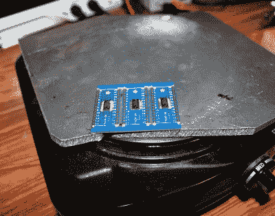
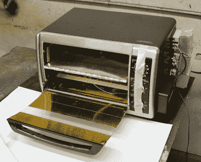
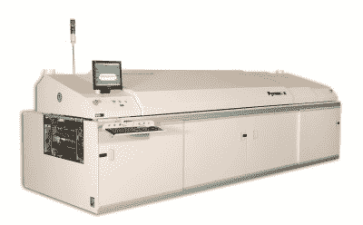

# 行业工具-回流

> 原文：<https://hackaday.com/2016/06/02/tools-of-the-trade-reflow/>

在制作电路板系列的前几期中，我们讨论了[放置焊膏](http://hackaday.com/2016/03/10/tools-of-the-trade-solder-paste-dispensing/)和[放置元件](http://hackaday.com/2016/05/10/tools-of-the-trade-component-placing/)。现在是时候烤我们的蛋糕了！

有多种方法可以回流电路板，但它们都依赖于一个原理:加热焊膏(焊剂和焊料的混合物)，直到焊剂烧尽，焊料变成液体，然后冷却。完成这一两次是容易的；一旦你玩了一个热盘子，你就会通过这个洞发誓离开。然而，扩大规模并以高产量重复进行是极具挑战性的。

## 轻便电炉

A hot plate with aluminum on top. Some breakout boards are just starting to flow.

从最基本的可用工具开始，我们有[热板法或烤盘法](https://hackaday.com/2013/07/28/electric-skillet-reflow-soldering-guide/)。这涉及到一个电热板(20 美元投资)。通常中火是大多数这些盘子的一个很好的设置，当你可以把一些焊料放在上面并且它变成液体时，你就知道它准备好了。然后你把板子放在热的盘子上，等着看，直到所有的东西都流动了，再等一会儿，直到大部分的焊剂都烧掉了，然后你把它从盘子上拿下来。一般来说，在这个过程中，你要用镊子或尖嘴钳移动 PCB，因为通常会有热点，你希望所有的东西都在大致相同的时间流动。不要使用带有磁力搅拌器的奇特的科学加热板。当锡膏开始流动时，减少的摩擦将允许某些元件，尤其是电感器，在被磁体吸引时飞过电路板，造成热混乱。回流焊后用一块木头或金属来转移 PCB 也很有帮助，因为它会很烫，你不想把它放在厨房的柜台上。最后，我喜欢在我的加热板上放一个 1/4 英寸的铝板，以使温度均匀，并提供一个光滑的表面。另一个巧妙的方法是将一小块铝或其他金属放在加热板上，只对电路板的某一部分进行回流。如果您需要从已经组装好的电路板上移除微控制器，但不想对整个电路板进行回流焊接，这一点尤其有用。

 [https://www.youtube.com/embed/ToX7aISFjsg?version=3&rel=1&showsearch=0&showinfo=1&iv_load_policy=1&fs=1&hl=en-US&autohide=2&wmode=transparent](https://www.youtube.com/embed/ToX7aISFjsg?version=3&rel=1&showsearch=0&showinfo=1&iv_load_policy=1&fs=1&hl=en-US&autohide=2&wmode=transparent)

这个过程可能很快；只有几分钟的时间让电路板完全回流。缺点是它需要持续的关注，除非你在做其他事情来预热电路板，否则你不会让它们通过任何接近适当温度的地方，这意味着它们可能会在冷却时产生应力断裂，或者焊剂不会完全燃烧掉。其他长期问题可能会大量出现。尽管如此，这是我个人的最爱。

## 吹牛

装备升级是热风法。在这里，你可以使用热空气返工站，并小心翼翼地在 PCB 上波动，直到它回流。不要在任何特定的部分停留太久，因为它可能会燃烧，也不要靠得太近，否则空气可能会把它从垫子上吹下来。真的这种方法最多只对几块板有好处。这既费时又累人，而且返工站真的只是为了返工，而不是整板。

 [https://www.youtube.com/embed/1z0IiuQ35HU?version=3&rel=1&showsearch=0&showinfo=1&iv_load_policy=1&fs=1&hl=en-US&autohide=2&start=212&wmode=transparent](https://www.youtube.com/embed/1z0IiuQ35HU?version=3&rel=1&showsearch=0&showinfo=1&iv_load_policy=1&fs=1&hl=en-US&autohide=2&start=212&wmode=transparent)

## 烤箱

下一层是烤面包机，再往下是烤面包机的改造。大多数烤面包机烤箱能够达到 450F，这是无铅焊料回流曲线的顶端，这意味着含铅焊料也有可能。对流的发生很重要，所以需要有一个风扇在里面运转以循环空气，并且这些元件需要能够足够快地升温。一些烤面包机功率不足，不能足够快地变热，这意味着焊剂会在焊料流动之前烧掉，然后它根本不会流动。

A heavily modified oven with reflect-a-gold for better performance, an extra heating element, Arduino-based PID controller, and solid state relays. This oven was used in production for a few thousand units.

有些人喜欢对烤箱做一些小的改动(比如绕过风扇的线路，让它一直开着)，然后使用“冷冻食物”这样的快速设置来近似一个配置文件，如果你要照看孩子并看着它流动，这很有用。[其他人走自动化路线](http://hackaday.com/tag/reflow-oven/)，移除电子设备或其他控制装置，并安装 PID 控制器和热电偶，以便获得一致的回流曲线。现在只需要把 PCB 放进去，按下一个按钮，然后等待它完成。由于烤面包机烤箱的顶部通常很热，这是预热下一块电路板或冷却刚完成的电路板的好表面。

## 台式烤箱

现在我们正在进入专业设备，第一种是台式回流焊炉。爱好者和小企业中最常见的是 T962A。它使用红外线作为加热方法，这意味着深色部分加热更快。它也有气流和可用性问题，这就是为什么有一个新的控制器和这台机器的[升级](https://hackaday.com/2014/11/27/improving-the-t-962-reflow-oven/)的二级市场。

还有其他型号，但它们比改良的烤面包机好不了多少。如果你不想改装烤面包机，但你没有空间或体积，那么桌面回流炉是可以的，但很难找到一个好的。

## 传送带区域烘箱

工厂使用带传送带和多个加热区的回流炉。就像花哨的抓放机有一个传送带，它从左侧接收 PCB，并从右侧将它们吐出来一样，回流炉连接到抓放输出端，并将 PCB 传送通过炉子，每个加热区代表回流曲线的不同部分，将冷却和完成的电路板从另一端吐出。拥有分区意味着可以连续运行，不需要人工持续监控，此外，机器也不必浪费能源加热，只是为了在单个周期结束时将热量全部排出。不过，请记住，这些机器通常在 10 万美元以上，占用的空间有一辆汽车那么大，此外还有相当高的电费。

## 其他考虑

之后不要用这些工具吃东西。铅和焊剂都不健康。还要确保你有足够的通风，特别是如果你正在做无铅工作。再次强调流量。

有几个因素使得可重复性具有挑战性，一些设计电路板的方法可以绕过它们。想知道为什么散热装置存在于连接到浇注的衬垫上吗？这是因为它使焊接更容易，更一致，如果两个焊盘在不同的时间流动，那么它会导致所谓的墓碑，元件粘在一边，而不是另一边，垂直向上。

浆糊是一个巨大的变量，根据人们使用的浆糊，可能会有非常不同的结果。模板也非常重要，因为不同的孔径大小和模板厚度意味着不同的锡膏分配量，这意味着当有太多的焊料时更有可能桥接。知道斜坡速度/轮廓也是有用的，尤其是当你做像热板这样的事情时，你必须盯着轮廓看。回流阶段包括以下步骤:

*   预热–将电路板从室温加热到 150 摄氏度。一两分钟。
*   浸泡——让它在低于融化温度的温度下停留一两分钟。这样可以使木板变干，使所有东西温度均匀。如果零件比其他零件更热，那么焊料就不会均匀流动，很可能会出现墓碑。
*   升温-将它升到回流温度，让它悬着，直到所有的焊料都流过，助焊剂大部分烧掉。这大约需要一分钟。
*   冷却——一旦它达到顶峰，所有的东西都流动了，通量也燃尽了，就要相当快地冷却它，但不要太快。如果你听到板冷却时的噼啪声，那是冷却得太快了，微小的应力断裂正在发生。这些断裂有可能破坏关节甚至部件本身。这大约需要一分钟。

试着去匹配它，你会没事的。

回流是一种有趣的体验，当你看着锡膏从暗灰色变成闪亮的银色，所有的组件都漂浮并咬合到位。在小批量的情况下，这是非常容易和宽容的。试试看！